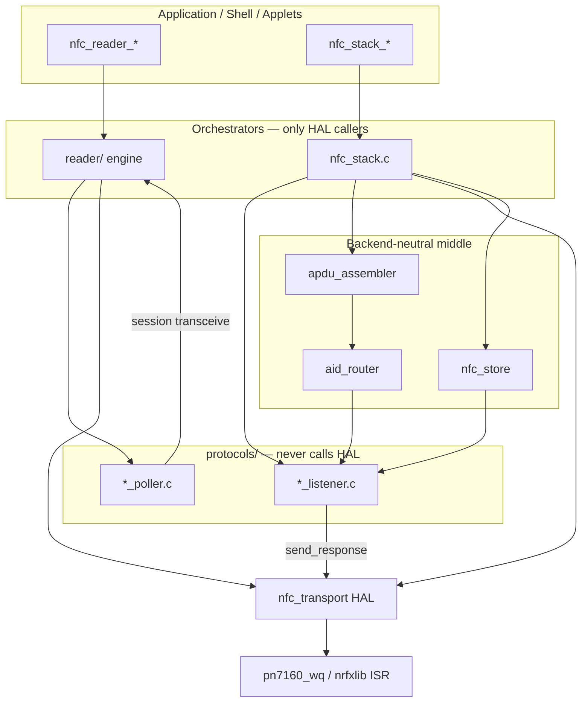

# NFC HAL — Authoring & Consumption Guide

**Status:** LOCKED — normative for `src/nfc/hal/` and for any code that calls HAL.  
**Authority:** [`NFC_STACK_CONVENTIONS.md`](NFC_STACK_CONVENTIONS.md) · [`NFC_STACK_PLAN.md`](NFC_STACK_PLAN.md) · [`specs/2026-06-13-nfc-final-design.md`](specs/2026-06-13-nfc-final-design.md).  
**Historical detail:** optional deep dive in [`archive/waves/wave1-hal.md`](archive/waves/wave1-hal.md).

---

## §1 Purpose & authority

`hal/nfc_transport` is the **vendor-clean boundary** between controller hardware and everything above it in `src/nfc/`. Layers above HAL — `reader/`, `nfc_stack/`, framing, router, `protocols/` — must compile without vendor includes.

This guide answers three questions for every contributor:

1. **What** is the HAL surface (poll + listen sub-APIs)?
2. **Who** may call it (orchestrators only — never protocols)?
3. **How** do backends implement it (PN7160, NFCT stub)?

Where this guide and `NFC_STACK_CONVENTIONS.md` disagree on NFC-specific choices, conventions win. Where conventions are silent, follow the firmware-wide creed docs listed in conventions §1.

**Out of scope here:** wave execution order, per-protocol poller logic, `.card` store format — see `NFC_STACK_PLAN.md` and final design.

---

## §2 Flipper alignment

Flipper Zero `lib/nfc` (verified against local tree at `/Users/majidfaroud/flipperzero/lib/nfc/` and `targets/furi_hal_include/furi_hal_nfc.h`) is the **architecture reference**. We re-implement; we do not ship GPL source.

**Same architecture, two intentional deltas:** dedicated stack work queue (`nfc_stack_wq`) and memory safety (static buffers, FIXED `net_buf` pools, MISRA). Everything else in the table below is structurally aligned or a deliberate product extension.

| Aspect | Flipper | Our stack | Match? | Our delta (WQ/memory only?) |
|--------|---------|-----------|--------|----------------------------|
| HAL universal reader API (discover / activate / transceive / deactivate) | `furi_hal_nfc`: `set_mode(Poller)`, `poller_field_on`, `poller_wait_event`, `poller_tx`/`poller_rx`, field off | `nfc_transport_discover_start` → `discover_wait` → `tag_transceive` → `discover_stop` on active tag | Yes | Naming + capability-gated backends; blocking on `nfc_stack_wq` (not caller thread) |
| HAL emulator API (listen, field events, RX/TX) | `furi_hal_nfc`: `listener_wait_event`, `listener_rx`/`listener_tx`, field on/off | `nfc_transport_start/stop`, ops `on_field_on/off/on_apdu`, `send_response`, `set_uid` (**planned** in header — conventions §4) | Yes | Same event model; our listen symbols not yet in `nfc_transport.h` (Gate 3) |
| Who calls HAL | Apps use `NfcPoller` / `NfcListener`; those own an `Nfc*` transport instance that wraps HAL | **`reader/`** and **`nfc_stack/`** only — dual orchestrators, same rule | Yes | Two orchestrators (reader vs card role) vs one app-owned `Nfc*` — same separation of concerns |
| Poller chain / protocol registry | `nfc_pollers_api[]` — table indexed by `NfcProtocol`; NULL = unsupported; parent→child chain (`iso14443_3a` → `iso14443_4a` → `mf_desfire`) | Technology → `*_poller.c` registry; Kconfig + NULL table for unsupported role/backend | Yes | Parent/child poller chain expressed in reader engine + session transceive, not malloc’d linked lists |
| Listener chain / router dispatch | Parent→child listener chain; ISO-DEP APDUs handled inside protocol stack (`iso14443_4a_listener` → app protocol) | ISO-DEP lane: HAL → `apdu_assembler` → **`aid_router`** → `nfc_service_t` listener | Partial | **Real delta:** AID router replaces Flipper’s in-protocol SELECT dispatch for Type-4; raw/native lane bypasses router (same as Flipper bypassing APDU for Type 2) |
| Session / transport object pollers receive | Child poller holds parent poller; transceive via `Nfc*` → `nfc_poller_trx()` (only inside callback/worker) | Poller receives **reader session** API (transceive on active tag) — **not** raw HAL; wired in `reader/` | Yes | Session object name differs; HAL access rule identical |
| Callback direction (up vs down) | Down = direct HAL/transport calls; up = event callbacks (`NfcEventCallback`, protocol `run` handlers) | Down = direct calls; up = Pattern A ops struct + service vtable (conventions §3–§4) | Yes | — |
| Threading model | `FuriThread` worker per `Nfc` instance (`nfc_worker_listener` / poller worker); HAL wait on that thread | `pn7160_wq` (driver IRQ → NCI drain) + **`nfc_stack_wq`** (stack dispatch, poll blocking, listen fifo) | Partial | **WQ delta (intentional):** single named Zephyr WQ vs Furi threads; Gate 0 scan still uses interim `reader_wq` — converge on `nfc_stack_wq` |

**Verification sources:** final design §3; archive architecture §1/§4/§10; local Flipper headers (`nfc.h`, `nfc_poller_base.h`, `nfc_listener_base.h`, `furi_hal_nfc.h`, `nfc_poller_defs.c`, `nfc.c`). `flipperzero/` and `hals_temp/` are gitignored — not in-repo; Flipper tree read from host path above. NXP examples cited in final design §2.2 only for PN7160 CE evidence, not for stack layering.

**Honest conclusion:** Layering, dual role (poll/listen), protocol module shape (data model + poller + listener + registry), and “protocols never touch HAL” match Flipper. Beyond **`nfc_stack_wq`** and **static/FIXED memory + MISRA**, real deltas are: **(a)** multi-backend capability descriptor + Kconfig enforcement, **(b)** **`aid_router`** for ISO-DEP listen dispatch instead of Flipper’s per-protocol listener hierarchy for SELECT routing, **(c)** portable **`.card` store** + dual orchestrators (`nfc_reader_*` / `nfc_stack_*`), **(d)** Gate 0 **`reader_wq`** until poll/listen share `nfc_stack_wq`.

---

## §3 Stack consumption (orchestrators + protocols)

This section is the main contract for everyone above HAL.

### Layer diagram



### Reader path

1. **`nfc_reader_scan` / `clone` / `verify`** (`reader/`) runs on **`nfc_stack_wq`** (Gate 0: interim `reader_wq` — migrate before Gate 2).
2. Orchestrator calls **`nfc_transport_discover_start(tech_mask)`** → **`discover_wait(&info, timeout)`** → tag active.
3. Reader engine selects poller from **technology → poller registry** (Flipper table-with-NULL pattern).
4. Poller performs detect/read via **session transceive** (wrapper around **`nfc_transport_tag_transceive`**) — poller never `#include`s HAL.
5. On completion: **`discover_stop()`**; serialize via store.

**HAL poll lifecycle (normative):**

```
discover_start → discover_wait (blocks on nfc_stack_wq) → [tag_transceive × N] → discover_stop
```

Single-flight: only one poll session at a time; `-EBUSY` if re-entered while discovery active.

### Listen path

1. **`nfc_stack_start(uid)`** (`nfc_stack.c`) on caller thread → HAL **`start(uid)`** (planned).
2. ISR/backend enqueues fragments → **`nfc_stack_wq`** drains fifo → **`apdu_assembler`** → **`aid_router_dispatch`** → **`nfc_service_t.on_*`**.
3. Listener calls **`nfc_transport_send_response(buf, len)`** synchronously (or deferred via **`nfc_transport_submit_work`** for Aliro).
4. **`nfc_stack_stop()`** → HAL **`stop()`**; field-off clears router selection; profile switch on field-off (conventions §8).

### Caller matrix

| HAL function | `reader/` | `nfc_stack/` | framing | router | `protocols/` |
|--------------|-----------|--------------|---------|--------|--------------|
| `init` / `shutdown` | ✓ | ✓ | — | — | — |
| `discover_*` / `tag_transceive` | ✓ | — | — | — | — |
| `register_callbacks` | — | ✓ (wires framing ops) | — | — | — |
| `start` / `stop` / `set_uid` | — | ✓ | — | — | — |
| `send_response` | — | — | — | — | ✓ (from listener vtable) |
| `submit_work` | — | — | — | — | ✓ (deferred crypto only) |
| `get_*` | ✓ | ✓ | ✓ | ✓ | — |

Cross-layer callback registration happens **only** in `nfc_stack.c` and `reader/` wiring files (conventions §3).

### Single-flight rules

- One **poll** session **or** one **listen** session at a time — never both concurrently on the same controller instance.
- `nfc_store_save` / `load` return **`-EBUSY`** while listen is STARTED.
- HAL returns **`-EBUSY`** on lifecycle/register mutation while STARTED.
- One response in flight on listen path; service static buffer borrowed until next transport event.

### Protocol registry shape

Per protocol module (mirrors Flipper `protocols/<name>/`):

```
protocols/<name>/
  <name>.h/c           — data model + serialize/deserialize
  <name>_poller.c      — READER role (CONFIG_NFC_ROLE_READER)
  <name>_listener.c    — CARD role (CONFIG_NFC_ROLE_CARD)
```

Registry tables (assembled at link time):

```c
/* Reader: technology or profile → poller vtable; NULL = unsupported on this backend */
extern const nfc_poller_entry_t nfc_pollers[];

/* Card: profile → listener services registered with aid_router */
/* Unsupported combos: NULL entries — report ENOTSUP, do not crash */
```

Kconfig `CONFIG_NFC_PROTOCOL_<X>` controls which rows exist; backend **`nfc_transport_get_capabilities()`** must cover enabled roles (BUILD_ASSERT in backend `.c`).

---

## §4 HAL public API (normative surface)

Public header: **`src/nfc/hal/nfc_transport.h`**. No vendor includes. Backend limits are transport `#define`s with **`BUILD_ASSERT`** in backend files.

### Shared types & lifecycle

```c
typedef struct {
    uint8_t roles;          /* NFC_ROLE_READER | NFC_ROLE_LISTEN */
    uint32_t technologies;  /* NFC_TECH_* bitmask */
    nfc_hal_tier_t tier;
} nfc_transport_caps_t;

int nfc_transport_init(void);
int nfc_transport_shutdown(void);
nfc_transport_state_t nfc_transport_get_state(void);
const nfc_transport_caps_t *nfc_transport_get_capabilities(void);
```

### Poll sub-API (implemented — PN7160 backend)

Used exclusively by **`reader/`**. Blocking calls run on **`nfc_stack_wq`**, not the shell/caller thread.

```c
int nfc_transport_discover_start(nfc_tech_t tech_mask);
int nfc_transport_discover_stop(void);
int nfc_transport_discover_wait(nfc_transport_tag_info_t *info, k_timeout_t timeout);

int nfc_transport_tag_transceive(const uint8_t *tx, size_t tx_len,
                               uint8_t *rx, size_t rx_max, size_t *rx_len,
                               k_timeout_t timeout);
```

| Function | Role |
|----------|------|
| `discover_start` | Begin RF discovery for `tech_mask` |
| `discover_wait` | Block until tag detected or timeout; fills `nfc_transport_tag_info_t` |
| `tag_transceive` | Exchange with **active** tag after successful wait |
| `discover_stop` | End discovery / deactivate tag |

NFCT backend: **no poll symbols** — listen-only; reader role requires PN7160 (or future reader backend).

### Listen sub-API (**planned** — conventions §4; not yet in `nfc_transport.h`)

Card emulation. Mark **planned** until Gate 3 lands in header + NFCT/PN7160 listen backends.

```c
typedef struct {
    void (*on_field_on)(void *user_ctx);
    void (*on_field_off)(void *user_ctx);
    void (*on_apdu)(struct net_buf *apdu, void *user_ctx); /* complete C-APDU; callee owns ref */
} nfc_transport_ops_t;

int nfc_transport_register_callbacks(const nfc_transport_ops_t *ops, void *user_ctx);

int nfc_transport_start(const nfc_uid_t *uid);
int nfc_transport_stop(void);
int nfc_transport_set_uid(const nfc_uid_t *uid);

int nfc_transport_send_response(const uint8_t *buf, size_t len);
int nfc_transport_submit_work(struct k_work *work); /* Aliro deferred response */
```

| Surface | Direction | Dispatch thread |
|---------|-----------|-----------------|
| Ops: `on_field_on/off`, `on_apdu` | Up (HAL → framing) | `nfc_stack_wq` |
| `send_response` | Down (listener → HAL) | caller on `nfc_stack_wq` |
| `start/stop/set_uid` | Down (orchestrator → HAL) | `@caller_sync` |

### Module contract getters

Every HAL module exposes (conventions §2):

```c
const nfc_transport_config_t *nfc_transport_get_config(void);   /* never NULL */
int nfc_transport_get_stats(nfc_transport_stats_t *out);          /* copy-out */
/* get_state() declared above */
```

Shell subcommands: `nfc_transport config|stats|state` in `nfc_transport_shell_cmds.c` (not `pn7160` — driver shell stays separate per `NFC_STACK_PLAN.md`).

---

## §5 Threading & memory (our deltas from Flipper)

### Work queues

| Queue | Owner | Runs |
|-------|-------|------|
| **`pn7160_wq`** | PN7160 Zephyr driver (`modules/nfc_pn7160/`) | IRQ → NCI RX drain, `pn7160_nci_process()` |
| **`nfc_stack_wq`** | HAL + stack (`nfc_stack`, `reader/` poll path) | Discovery wait, card-mode fifo drain, framing → router → protocol, poll transceive |
| ~~`reader_wq`~~ | Gate 0 interim only | **Remove** — merge into `nfc_stack_wq` |

Flipper uses a **`FuriThread`** per `Nfc` worker that blocks on `furi_hal_nfc_*_wait_event`. We replace that with one **`nfc_stack_wq`** for deterministic priority and MISRA-friendly static allocation.

**Rules:**

- Never call scheduler APIs while holding a spinlock (conventions §7).
- Teardown: `k_work_cancel_*_sync` + fifo drain from thread context.
- Every public function carries `@threadsafe`, `@isr_safe`, or `@caller_sync` in the header.

### Buffers

| Path | Model |
|------|--------|
| **Inbound listen** | Single shared **`nfc_apdu_pool`** (`hal/nfc_apdu_pool.c`); sized by `NFC_APDU_*` Kconfig. NFCT: ISR alloc + fifo; PN7160 Gate 3: WQ alloc after `card_mode_recv`. Framing **`net_buf_unref`** after router returns |
| **Outbound listen** | File-static service response buffer; HAL **borrows** until next event |
| **Poll transceive** | Caller-supplied `rx` buffer on WQ thread; no heap |

Pool exhaustion: increment **`dropped`** stat — never `__ASSERT`. Oversized APDU → **`6700`** + drop.

### ISR rules

- nrfxlib / PN7160 IRQ: copy fragment immediately; no sleep; no blocking alloc except FIXED pool `K_NO_WAIT`.
- `@isr_safe` getters read only `atomic_t` or spinlock-protected snapshots.

---

## §6 Backend implementation

### PN7160 checklist

- [ ] Kconfig: `NFC_HAL_BACKEND_PN7160`; requires `CONFIG_PN7160`
- [ ] Caps: `NFC_ROLE_READER | NFC_ROLE_LISTEN`; technologies per capability matrix
- [ ] Poll: map `discover_*` / `tag_transceive` → `pn7160_nci_*` on **`nfc_stack_wq`**
- [ ] Listen: card-mode recv/send loop; ops callbacks on **`nfc_stack_wq`**
- [ ] `BUILD_ASSERT(NFC_TRANSPORT_MAX_RESPONSE_LEN == <backend max payload>)`
- [ ] Full lifecycle: init/start/stop/shutdown; Pattern B `atomic_t` state
- [ ] Shell: `nfc_transport` subcmds (driver debug stays under `pn7160`)
- [ ] Stats/getters per conventions §2 + §6

**PN7160 listen — implemented (Gate 3)**

- Recv loop delivers `on_apdu` via `nfc_apdu_pool` → fifo → WQ handler (landed `cfd30b0`).
- `set_uid` live rotation returns `-EBUSY` during listen (NFCT has full impl).
- Field on/off synthetic at `start`/`stop`.
- Poll sub-API is complete for Gate 1/2.

### Overlay matrix

| Overlay | Roles | Backend | Gate | Use |
|---------|-------|---------|------|-----|
| `overlay-pn7160-stack.conf` | reader | PN7160 | 2 | `nfc scan`/`nfc read`/`nfc check` poll path |
| `overlay-pn7160-listen.conf` | + listen | PN7160 | 3–4 | layered on stack; CE `nfc emulate` (RW+CE deferred) |
| `overlay-nfct-stack.conf` | listen | NRFX `nfc_t4t_lib` | 5 | NFCT PICC emulate, multi-protocol |
| `overlay-pn7160.conf` / `-hal.conf` / `-spi.conf` | reader | PN7160 | bring-up | driver/HAL smoke + SPI variant |
| `boards/overlays/pn7160_unit_test.overlay` | — | emul | unit | QEMU DTS for `--no-sysbuild` builds |

### NFCT (nrfx) — nrfxlib choice (locked)

nrfxlib ships two CE libraries only: **`nfc_t2t_lib`** (Type-2, READ-only NDEF) and
**`nfc_t4t_lib`** (Type-4 ISO-DEP, NDEF RO/RW + raw PICC for router/listeners). Both
may **link** in one image (NCS ≥2.3); only **one** may own NFCT at runtime — stop +
`*_done()` + re-init to switch.

| Gate | Library | Why |
|------|---------|-----|
| **v1 / Gate 5** | `nfc_t4t_lib` only | Default product emulate, live persist, ISO-DEP listeners (NDEF, DeSFire, EMV, Aliro), Ultralight T4 adapter |
| **Backlog** | `nfc_t2t_lib` optional | Read-only Type-2 NDEF physical mimic for verify; native lane (not APDU) — no WRITE persist |

HAL exposes **one listen profile at a time** (capability bitmask + `nfc_stack` profile),
not concurrent T2+T4. Poller-side NCS modules (`nfc_t2t_parser`, `nfc_t4t_hl_procedure`)
are for external readers — do not use for NFCT listen backend.

### NFCT (nrfx) stub checklist

- [ ] Kconfig: `NFC_HAL_BACKEND_NRFX` → `CONFIG_NFC_T4T_NRFXLIB=y` (v1); optional `NFC_HAL_NRFX_T2T` backlog
- [ ] Caps: listen only (`NFC_ROLE_LISTEN`); poll API absent or `-ENOTSUP`
- [ ] Stub: init/shutdown + `get_capabilities()` + listen start/stop returning `-ENOTSUP` until Gate 3
- [ ] `BUILD_ASSERT(NFC_TRANSPORT_MAX_RESPONSE_LEN == NFC_T4T_MAX_PAYLOAD_SIZE)`
- [ ] ISR → **`nfc_stack_wq`** bridge skeleton (field on/off, fragment fifo)
- [ ] Runtime exclusivity: one active CE lib; profile switch requires `nfc_transport_stop()` first

---

## §7 What protocols must NOT do

Protocol modules under **`protocols/`** must **not**:

- `#include` vendor HAL or driver headers (`pn7160.h`, `nfc_t4t_lib.h`, …)
- Call **`nfc_transport_*`** — pollers use **reader session transceive**; listeners reply via **`nfc_transport_send_response`** only (invoked from their vtable, not from arbitrary code paths)
- Register cross-layer callbacks — wiring lives in **`nfc_stack.c`** / **`reader/`** only
- Allocate dynamically on hot paths — static buffers and FIXED pools only
- Spawn threads or use the system work queue

Violations break the Flipper-aligned boundary and void MISRA / buffer ownership guarantees.

---

## Quick reference

| Doc | Use |
|-----|-----|
| [`NFC_STACK_CONVENTIONS.md`](NFC_STACK_CONVENTIONS.md) | Coupling map, buffers, stats, threading law |
| [`NFC_STACK_PLAN.md`](NFC_STACK_PLAN.md) | Gated commits, source tree, threading names |
| [`specs/2026-06-13-nfc-final-design.md`](specs/2026-06-13-nfc-final-design.md) | Master topology & API traces |
| [`archive/waves/wave1-hal.md`](archive/waves/wave1-hal.md) | Historical HAL task breakdown (not execution guide) |
