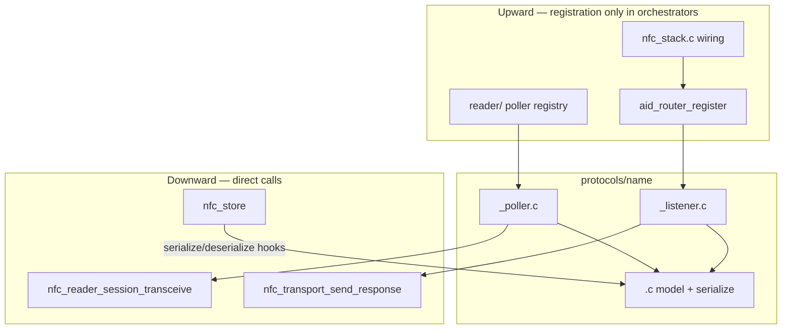

# NFC Protocols — Implementation Cookbook

**Status:** LOCKED — normative for `src/nfc/protocols/`  
**Authority:** [`NFC_STACK_CONVENTIONS.md`](NFC_STACK_CONVENTIONS.md) · [`NFC_HAL_GUIDE.md`](NFC_HAL_GUIDE.md) §2–3 · [`specs/2026-06-13-nfc-final-design.md`](specs/2026-06-13-nfc-final-design.md) §3.3 · Flipper `lib/nfc/protocols/<name>/` layout  
**Plan:** Step A (HAL unblock) **before** Gate 2; Gate 2 = NDEF poller + clone; Gate 3 = listener + router; Gate 4 = PN7160 loop; Gate 5 = NFCT ([`NFC_STACK_PLAN.md`](NFC_STACK_PLAN.md))

This document answers: **where files go**, **what each file owns**, **which APIs are locked**, **how protocols couple to HAL/reader/router/store**, **per-protocol recipes for agent dispatch**, **§14 unit test recipe** (Tiers A/B/C/D + Tier E applet mocks + fixtures), and **how to land Gate 2 then Gate 3**.

**Prerequisite:** Step A HAL gaps closed (`nfc_reader_session_end()`, PN7160 listen recv → `nfc_apdu_pool`, NFCT `NFC_T4T_EMUMODE_PICC`) — see STACK_PLAN HAL gaps table. Gate 3 PN7160 listen **requires Step A2 complete**.

### Waves authority (LOCKED)

[`archive/waves/*.md`](archive/waves/) are **normative implementation detail** for the matching §5 protocol stubs — **not obsolete** archive. Relationship:

| Artifact | Role |
|----------|------|
| **Cookbook §5.x** | Agent-facing summary — detect/read/listen/store facts, HAL gates, out-of-scope |
| **`archive/waves/wave5-<name>.md`** | Full task catalog, DECISION tables, **named ztest cases**, integration steps |
| **`archive/waves/wave1–4,6–7`** | HAL, framing, router, stack, store, PN7160 — referenced from §5 HAL cross-checks |

When §5 and a wave disagree on a **fact** (C-APDU hex, SW, chunk rule), patch the cookbook per §14.9 hiccup protocol; waves remain the drill-down for task ordering and test names.

### Development and test reference chain (LOCKED)

**Implementation and tests share the same sources** — golden TX/RX scripts, serialize layouts, and listener decision tables must not diverge between product code and `tests/fixtures/<proto>/`.

| Layer | Implementation authority | Test / fixture authority | Notes |
|-------|---------------------------|--------------------------|-------|
| 1 — Cross-stack | [`NFC_STACK_CONVENTIONS.md`](NFC_STACK_CONVENTIONS.md) | [§14](#14-protocol-unit-test-recipe-locked) universal tiers | **Wins on conflict** |
| 2 — Agent dispatch | This cookbook §5–§6, §14 | Same §5.x **Unit test matrix** + §14 tier tables | Summary layer |
| 3 — HAL / transport | [`NFC_HAL_GUIDE.md`](NFC_HAL_GUIDE.md) §2–3 | `tests/common/` mocks (`nfc_session_mock`, `nfc_response_spy`) | Poller vs listener boundary |
| 4 — Protocol algo | Per-class source (below) | **Same column as algo** — never a second golden | Static memory: §14.1 |

**Protocol-class authority (layer 4):**

| Class | Algo source | Test catalog |
|-------|-------------|--------------|
| Flipper-ported (`ultralight`, `classic`, `desfire`, `felica`, `iso15693_3`, `slix`, `st25tb`) | Flipper `lib/nfc/protocols/<name>/` + §5.x recipe | Flipper `*_save/load` + `nfc_data_generator` → fixtures; wave5-* §8 where present |
| NDEF (product-only) | NXP `RW_NDEF_T4T` table + §5.1 | [`wave5-ndef.md`](archive/waves/wave5-ndef.md) §8 |
| EMV / Aliro (product-only) | §5.x + [`wave5-emv.md`](archive/waves/wave5-emv.md) / [`wave5-aliro.md`](archive/waves/wave5-aliro.md) | Same wave §8 task / FSM test names |
| Ultralight emulate path | `protocols/ndef/` T4 adapter (§5.2) | NDEF Tier C only — native T2 listener skipped |

**Order:** Conventions → Cookbook → HAL → (Flipper **or** waves **or** spec) per protocol class.

---

## 1. File layout (LOCKED)

Flipper splits every protocol into three translation units. Use the same shape under `src/nfc/protocols/<name>/`:

```
protocols/<name>/
  <name>.h              — data model struct + shared constants
  <name>.c              — data model logic + serialize/deserialize (default)
  <name>_poller.c       — reader role (Gate 2+)
  <name>_listener.c     — card/listen role (Gate 3+)
  CMakeLists.txt
  Kconfig               — or symbols in parent protocols/Kconfig
```

Optional fourth file **only** when `<name>.c` grows unwieldy (>~400 lines of serialize + model):

```
  <name>_serialize.c    — move serialize/deserialize here; keep model in <name>.c
```

**Default:** merge serialize into `<name>.c`. Do not create `_serialize.c` preemptively.

**Partial-protocol doctrine (LOCKED):** each protocol lands as **native RF lane** OR **T4 adapter** OR **clone-only** — never a 1:1 Flipper listener where NFCT cannot emulate (see §4 index). **PICC** = raw ISO-DEP above transport (EMV, Aliro, DeSFire partial listen). **Ultralight listener** = skip native T2; emulate via `ndef` T4 adapter post–Gate 2.

### Why not one `.c` with `#ifdef CONFIG_NFC_ROLE_*`?

| Problem | Consequence |
|---------|-------------|
| Reader and card code share one object file | NFCT images link listener dead code; PN7160 reader images link listener symbols you never call |
| `#ifdef` sprawl | Poller transceive paths and listener `send_response` paths interleave — easy to violate “protocols never touch HAL” on the poller side |
| Test granularity | Unit tests for serialize logic must pull in poller HAL stubs or listener router stubs |
| Flipper parity | Flipper compiles poller and listener as separate TUs gated by role — same registry NULL pattern |

Compile **role-specific objects** from CMake/Kconfig, not preprocessor walls inside one file.

### Why not a poller-only monolith (no shared `<name>.c`)?

| Problem | Consequence |
|---------|-------------|
| Duplicate data model | Clone (poller) and emulate (listener) diverge on field layout → `.card` blobs fail deserialize |
| Duplicate serialize | Store keys blobs by `persist_id`; two serializers guarantee drift |
| Gate 3 rework | Listener must share the same `ndef_data_t` (etc.) the poller populated — one header, one model |

The shared `<name>.h` + `<name>.c` pair is the **single source of truth** for the card data model and persistence format.

**No `protocols/iso14443/` module:** ISO14443 3a/4a/3b/4b activation and framing fold into HAL + reader session — see STACK_PLAN “iso14443 (HAL fold)”.

---

## 2. Per-file responsibilities

| File | Role | Gate (Kconfig) | May include | Must NOT |
|------|------|----------------|-------------|----------|
| `<name>.h` | Public data model (`<name>_data_t`), protocol constants, poller/listener entry declarations | `CONFIG_NFC_PROTOCOL_<NAME>` | `<stdint.h>`, `router/service.h` (listener types only in header if needed) | Vendor HAL, `pn7160.h`, `nfc_t4t_lib.h` |
| `<name>.c` | Model init/reset, CC/file helpers, `serialize`/`deserialize` impl, `*_get_service()` singleton state | `CONFIG_NFC_PROTOCOL_<NAME>` | `<name>.h`, `framing/apdu_types.h` (SW constants) | `nfc_transport_*`, `aid_router_*`, threads |
| `<name>_poller.c` | `detect`, `read` via **reader session** transceive | `CONFIG_NFC_PROTOCOL_<NAME>` **and** `CONFIG_NFC_ROLE_READER` | `<name>.h`, `reader/nfc_reader_engine.h` | `nfc_transport_*`, `aid_router_*`, `nfc_stack_*` |
| `<name>_listener.c` | `nfc_service_t` vtable: SELECT/APDU/field lifecycle + `send_response` | `CONFIG_NFC_PROTOCOL_<NAME>` **and** `CONFIG_NFC_ROLE_LISTEN` | `<name>.h`, `router/service.h`, `hal/nfc_transport.h` (**send_response only**) | `discover_*`, `tag_transceive`, poller registry |
| `<name>_serialize.c` | Optional: persistence only | same as `<name>.c` | `<name>.h` | Everything the base file must not |

Shell commands live in `<name>_shell_cmds.c` (creed §10) — never inside core protocol `.c` files.

---

## 3. Public API shape (LOCKED)

### 3.1 Data model — `<name>.h`

```c
typedef struct {
    /* protocol-specific fields — CC, NDEF bytes, keys, pages, etc. */
} ndef_data_t;   /* example: ndef_data_t in ndef.h */
```

One struct per protocol. Poller writes it; listener reads it; store serializes it.

### 3.2 Poller — `<name>_poller.h` (or declarations in `<name>.h`)

```c
/** @nfc_stack_wq — called from reader engine during clone/verify */
int ndef_poller_detect(const nfc_reader_session_t *session);
int ndef_poller_read(const nfc_reader_session_t *session, ndef_data_t *out);
```

| Function | Contract |
|----------|----------|
| `detect(session)` | Cheap probe (SELECT AID, GET_VERSION, READ page 0…). Return `0` if this protocol matches active tag, `-ENOTSUP` if not, other negative errno on I/O failure. |
| `read(session, model*)` | Full capture into `model`. Return `0` on success; errno on failure. Caller owns `model` storage. |

Pollers **build raw TX byte arrays** and pass them to `nfc_reader_session_transceive()`. They never parse inbound APDUs through `nfc_apdu_t`.

**Session lifecycle (Step A1):** after `discover_wait`, reader engine leaves the poll session active for `nfc_reader_session_transceive()` until **`nfc_reader_session_end()`** (stop discovery + clear session). Pollers must not call `nfc_transport_*` directly.

**255 B chunking:** `NFC_TRANSPORT_MAX_RESPONSE_LEN` is 255 B. Protocol layer must chunk READ BINARY / large reads — do not assume T4T 0xFFF0 on HAL transceive or `send_response`.

Registration: reader engine holds a **technology → poller** table (Flipper `nfc_pollers_api[]` pattern). NULL entry = unsupported combo → `-ENOTSUP`.

### 3.3 Listener — `nfc_service_t` vtable

Defined in `router/service.h`. Each `<name>_listener.c` exports a populated struct:

```c
static const nfc_service_t s_ndef_service = {
    .on_select    = ndef_on_select,
    .on_apdu      = ndef_on_apdu,
    .on_deselect  = ndef_on_deselect,
    .on_field_off = ndef_on_field_off,
    .serialize    = ndef_serialize,
    .deserialize  = ndef_deserialize,
    .persist_id   = NFC_PERSIST_ID_NDEF,   /* 0x01 — stable, from service.h table */
    .user_ctx     = NULL,
};
const nfc_service_t *ndef_service_get(void);
```

| Callback | Invoked when | Must |
|----------|--------------|------|
| `on_select(aid, len, ctx)` | Router matched registered AID | Call `nfc_transport_send_response()` with SELECT response (router sends **nothing**) |
| `on_apdu(apdu, ctx)` | Non-SELECT while selected | Handle via parsed `nfc_apdu_t`; respond with `send_response` |
| `on_deselect(ctx)` | Another AID selected | Reset per-session file/ auth state |
| `on_field_off(ctx)` | RF field lost | Clear all session state |
| `serialize` / `deserialize` | `nfc_store_save` / `load` on **caller thread** | Flat blob format owned by protocol; may be NULL if not persistable |
| `persist_id` | TLV key in `.card` envelope | Unique per protocol; `0` = skip in store |

`serialize`/`deserialize` run `@caller_sync` while stack is **not** STARTED (`-EBUSY` guard in store).

**PICC listen path:** EMV, Aliro, DeSFire partial emulation use NFCT `nfc_t4t_lib` raw PICC mode — ISO-DEP APDUs reach `aid_router` without a Flipper-style per-protocol ISO14443-4 listener module.

---

## 4. Per-protocol recipe index

Normative summary aligned with [`NFC_STACK_PLAN.md`](NFC_STACK_PLAN.md) backlog + HAL gaps. Agents expand §5 stubs into full recipes.

| Protocol | Module path | Gate / When | Poller source | Listener path | NFCT | PN7160 | Flipper port? | HAL prereqs |
|----------|-------------|-------------|---------------|---------------|------|--------|---------------|-------------|
| **ndef (Type-4)** | `protocols/ndef/` | Gate 2 | ISO-DEP SELECT/READ; NXP T4T facts | `ndef_listener.c` + router (Gate 3) | ✓ Gate 5 T4 raw | ✓ poll + listen | Reimplement (no Flipper `ndef/` folder) | Step A1 session; Step A2 listen recv for Gate 3 |
| **mf_ultralight** | `protocols/ultralight/` | post–Gate 2 | Flipper page READ | **skip native** — `ndef` T4 adapter | partial T4 NDEF RW | ✓ poll only | ✓ poller + listener facts | Session transceive; no T2 native on NFCT v1 |
| **mf_classic** | `protocols/classic/` | post–Gate 4 | TAG-CMD + crypto1 | skip (clone-only) | no | ✓ poll only | ✓ poller + listener facts | NFC-A in default discovery |
| **mf_desfire** | `protocols/desfire/` | post–Gate 5 | Flipper poller SM | partial — `desfire_auth_state_t` enum, not SMF | partial T4 raw PICC | ✓ poll + partial listen | ✓ poller facts | ISO-DEP session; 255 B chunking |
| **emv** | `protocols/emv/` | post–Gate 5 | PN7160 ISO-DEP transcript | static TLV caches; 2 AIDs | partial raw PICC | ✓ poll + listen | **no** Flipper folder | PICC + router; READ_ONLY_PARTIAL |
| **aliro** | `protocols/aliro/` | post–Gate 5 | public AUTH transcript | PSA crypto; 2 AIDs; `submit_work` | partial raw PICC + PSA | ✓ poll + listen | **no** Flipper folder | `nfc_transport_submit_work`; PICC |
| **mf_plus** | — | **skip v1** | — | — | — | ID-only | Flipper poller exists — do not port | Use ndef / desfire paths |
| **felica** | `protocols/felica/` | defer, clone-only | Flipper poller | skip | no | ✓ poll only | ✓ poller + listener facts | **open:** `NFC_TECH_TYPE3_FELICA` + custom discovery table |
| **iso15693_3** | `protocols/iso15693_3/` | defer, clone-only | raw `tag_transceive` | skip | no | ✓ poll only | ✓ poller facts | 15693 in default discovery |
| **slix** | `protocols/slix/` (child of iso15693_3) | post–Gate 5 optional | NXP SLIX detect atop 15693 | skip | no | ✓ poll only | ✓ poller facts | Parent iso15693_3 poller chain |
| **st25tb** | `protocols/st25tb/` | low priority | NFC-B poller | skip | no | ✓ poll only | ✓ poller facts | NFC-B in default discovery |
| **iso14443 (3a/4a/3b/4b)** | **no module — HAL fold** | implicit Gate 1–3 | PN7160 NCI + session transceive | 4a: nrfx T4T + router; 3b/4b clone-only | partial 4a only | both (implicit) | ✓ 3a/4a poller+listener facts | **open:** `tag_info` ATQA/SAK/ATS/ATQB; `tech_mask` ignored in discover_start |

---

## 5. Per-protocol recipe stubs

Concise LOCKED bullets — per-protocol agents expand into full recipes (§6). Placeholder tags mark handoff points.

### 5.1 ndef (Type-4)

**Module:** `src/nfc/protocols/ndef/` · **Product-only** (no Flipper `ndef/` folder) · **Lane:** ISO-DEP / NFC Forum Type 4 Tag (T4T)

| Role | Gate | Backend | Object file |
|------|------|---------|-------------|
| Poller + clone | **Gate 2** | PN7160 poll only | `ndef_poller.c` (`CONFIG_NFC_ROLE_READER`) |
| Listener + emulate | **Gate 3** | PN7160 listen + router | `ndef_listener.c` (`CONFIG_NFC_ROLE_LISTEN`) |
| Same listener on NFCT | **Gate 5** | nrfx `nfc_t4t_lib` raw PICC | same `ndef_listener.c` |

Shared model + serialize live in `ndef.h` / `ndef.c`. Shell in `ndef_shell_cmds.c` (creed §10).

#### STACK_PLAN cross-check

| Column | STACK_PLAN row | This recipe | Drift? |
|--------|----------------|-------------|--------|
| Module | `protocols/ndef/` | ✓ | — |
| Poller | ✓ Gate 2 (ISO-DEP SELECT/READ) | ✓ Gate 2 only | — |
| Listener | ✓ Gate 3 (T4 + router) | Gate 3 PN7160; Gate 5 NFCT | — |
| NFCT emulate | ✓ Gate 5 (`nfc_t4t_lib` raw) | Gate 5; PICC mode locked Step A3 | — |
| When | Gate 2 | Gate 2 poller first; listener not before Gate 3 | — |
| Flipper | Reimplement (no folder) | ✓ facts-only from `iso14443_4a` + NXP | — |

§4 index row is **aligned** — no correction needed.

#### HAL gaps cross-check

| Prereq | Status | Impact on ndef |
|--------|--------|----------------|
| Step A1 — hold poll session + `nfc_reader_session_end()` | **Closed** (`688c370`) | **Gate 2 required** — poller transceive after `discover_wait` |
| Step A2 — PN7160 listen recv → `nfc_apdu_pool` | **Closed** (`cfd30b0`); router wiring = Gate 3 | **Gate 3 required** for PN7160 CE |
| Step A3 — NFCT `NFC_T4T_EMUMODE_PICC` explicit | **Closed** (`646c5ab`) | **Gate 5 required** for NFCT listen |
| `NFC_TRANSPORT_MAX_RESPONSE_LEN` = 255 B | **Open (by design)** | **Gate 2 mandatory** — poller READ chunking; listener `send_response` cap |
| `No protocols/ tree yet` | **Open** | Gate 2 lands first module |
| `tag_info` missing ATQA/SAK/ATS/ATQB` | **Open** | **Non-blocking** for ndef — detect is AID-based on active ISO-DEP session, not SAK |
| `tech_mask` ignored in `discover_start` | **Open** | **Non-blocking** — default mask includes NFC-A ISO-DEP tags |
| FeliCa / `NFC_TECH_TYPE3_FELICA` | **Open** | **Out of scope** — T4T is NFC-A ISO-DEP only |

**Authority:** pollers never call `nfc_transport_*`; listeners call **`nfc_transport_send_response()` only** ([`NFC_HAL_GUIDE.md`](NFC_HAL_GUIDE.md) §3).

---

#### Data model — `ndef_data_t`

```c
typedef struct {
    uint8_t  cc[15];                              /* CC file from tag (Gate 2 read) */
    uint8_t  ndef_file[2U + CONFIG_NFC_NDEF_MAX_SIZE]; /* NLEN BE + message bytes */
    uint16_t cc_len;                              /* expect 15 */
    uint16_t ndef_file_len;                       /* 2 + NLEN value */
} ndef_data_t;
```

Poller **writes**; listener **reads**; store **serializes**. One struct, one serializer — no duplicate layouts.

**Persist:** `NFC_PERSIST_ID_NDEF` (`0x01`). Blob layout (service-owned, v1):

| Offset | Field |
|--------|-------|
| 0 | `format_version` (`0x01`) |
| 1–15 | CC bytes (15) |
| 16– | NDEF file bytes (`NLEN` + message, length `ndef_file_len`) |

Store envelope wraps TLV + CRC ([`NFC_STACK_PLAN.md`](NFC_STACK_PLAN.md) Gate 2). Reader clone sets `NFC_STORE_ENTRY_FLAG_READER_CAPTURED | NFC_STORE_ENTRY_FLAG_EMULATION_COMPLETE`.

---

#### Session lifecycle (Gate 2 poller)

Poll path runs on **`nfc_stack_wq`** inside reader engine work ([§7](NFC_PROTOCOLS_COOKBOOK.md)):

```
nfc_reader_scan_start / clone
  → discover_start → discover_wait (tag active)
  → s_session.active = true
  → [poller detect → read via session_transceive × N]
  → nfc_reader_session_end()  /* discover_stop + session_clear */
```

| Rule | Detail |
|------|--------|
| Transceive API | `nfc_reader_session_transceive(session, tx, tx_len, rx, rx_max, &rx_len, timeout)` |
| RX cap | `rx_max ≥ NFC_TRANSPORT_MAX_RESPONSE_LEN` (255) — never assume T4T MLe or nrfx 0xFFF0 |
| TX/RX parsing | Poller builds raw C-APDU; checks SW1/SW2 manually — **no `nfc_apdu_t`** ([§9](NFC_PROTOCOLS_COOKBOOK.md)) |
| Parent protocol | ISO14443-4a activation is **HAL fold** (PN7160 NCI ISO-DEP). `ndef_poller` assumes session already ISO-DEP — same as NXP `RW_NDEF_T4T` running after `INTF_ISODEP` |
| End session | Reader engine calls `nfc_reader_session_end()` after poller chain — poller must not stop discovery itself |

**Gate 2 vs Gate 3/5:** Gate 2 is **poll-only** — no `ndef_listener.c`, no `aid_router_register`, no `nfc_stack_start`. Clone saves blob via stub `nfc_service_t` (serialize/deserialize/persist_id only; listener callbacks NULL until Gate 3).

---

#### Flipper import map (facts only — reimplement MISRA C)

**No Flipper `ndef/` module.** ISO-DEP transport shape from parent chain:

| Flipper file | Use for ndef | Map to our API |
|--------------|--------------|----------------|
| `flipperzero/lib/nfc/protocols/iso14443_4a/iso14443_4a_poller.c` | Parent poller: ATS read, `Ready` event | **HAL fold** — reader engine + PN7160 NCI; not ported |
| `iso14443_4a_poller_i.c` — `iso14443_4a_poller_send_block()` | ISO-DEP block encode/decode, WTX | **Do not port** — `nfc_reader_session_transceive()` delivers **plain ISO7816 APDU bytes** on ISO-DEP interface |
| `iso14443_4a_poller_detect()` | SAK → supports ISO14443-4 | Reader registry: technology ISO-DEP → try `ndef_poller_detect` among ISO-DEP pollers |

Flipper child pollers (e.g. `mf_desfire`) call `iso14443_4a_poller_send_block()` with C-APDU in a `BitBuffer`. Our equivalent: **one C-APDU byte array → `session_transceive` → R-APDU byte array**.

Registry: `flipperzero/lib/nfc/protocols/nfc_poller_defs.c` — ndef has no entry; we add **`ndef_poller`** to reader engine technology table (ISO-DEP slot), NULL on listen-only builds.

---

#### NXP `RW_NDEF_T4T` import map (facts only — do not link NXP lib)

Source: SW6705 `NfcLibrary/NdefLibrary/src/RW_NDEF_T4T.c` ([`PN7160_SHELL_AND_EXAMPLES.md`](PN7160_SHELL_AND_EXAMPLES.md)).

| NXP symbol / state | C-APDU (hex) | Our poller step |
|--------------------|--------------|-----------------|
| `RW_NDEF_T4T_APP_Select20` | `00 A4 04 00 07 D2 76 00 00 85 01 01 00` | **Detect + read step 1** — SELECT NDEF Application v2.0 |
| `RW_NDEF_T4T_APP_Select10` (fallback) | `00 A4 04 00 07 D2 76 00 00 85 01 00` | If v2.0 SW ≠ `9000`, retry v1.0 AID |
| `RW_NDEF_T4T_CC_Select` | `00 A4 00 0C 02 E1 03` | SELECT CC file (`P2=0x0C`; v1.0 tags use `P2=0x00`) |
| `RW_NDEF_T4T_Read` (CC) | `00 B0 00 00 0F` | READ BINARY CC — expect 15 data + `9000` |
| CC parse | bytes 2–14 → MappingVersion, MLe, MLc, FileID, MaxSize, Rd/Wr | Store raw CC in `ndef_data_t.cc`; parse FileID (usually `E104`), MLe for chunk sizing |
| `RW_NDEF_T4T_NDEF_Select` | `00 A4 00 0C 02 E1 04` (FileID from CC) | SELECT NDEF file |
| `Reading_NDEF_Size` | `00 B0 00 00 02` | READ NLEN (2 bytes BE at offset 0) |
| `Reading_NDEF` loop | `00 B0 P1 P2 Le` offset = `2 + bytes_read` | Chunk-read message body |

NXP limits: `RW_MAX_NDEF_FILE_SIZE` = **500 B** — we use `CONFIG_NFC_NDEF_MAX_SIZE` (up to 4096). NXP chunks by **`min(remaining, MLe - 1)`**; we **also** cap each Le at **`NFC_TRANSPORT_MAX_RESPONSE_LEN - 2` (253 B data)** because PN7160 TML `rx_max` is 255 B for the **whole R-APDU** (payload + SW1/SW2). The read loop still delivers **all NLEN bytes** across multiple READs — no message truncation.

**Write path (NXP):** `RW_NDEF_T4T_Write_Next` — UPDATE BINARY, 54-byte chunks, NLEN last. **Out of scope Gate 2**; listener Gate 3+ handles UPDATE for emulate/persist.

---

#### Poller recipe — `ndef_poller_detect`

**Precondition:** Active ISO-DEP session (`session->active`, protocol ISO-DEP from `tag_info`).

1. Transceive SELECT NDEF AID v2.0 (table above).
2. If SW = `9000` → return `0` (match).
3. Else transceive SELECT v1.0 AID → `9000` → return `0`.
4. Else SW = `6A82` / wrong app → return `-ENOTSUP` (try next poller).
5. Other I/O failure → negative errno (`-EIO`, `-ETIMEDOUT`, etc.).

Cheap probe only — do not read CC/NDEF in detect.

---

#### Poller recipe — `ndef_poller_read`

Full sequence after successful detect (re-run SELECT v2.0 or v1.0 as in detect):

| Step | Command | Success check | Model update |
|------|---------|---------------|--------------|
| 1 | SELECT NDEF app (v2.0, v1.0 fallback) | SW `9000` | — |
| 2 | SELECT CC `E103` | SW `9000` | — |
| 3 | READ BINARY off=0, Le=15 | 15 bytes + `9000` | `memcpy(cc)`; parse MLe, FileID |
| 4 | SELECT NDEF file (FileID from CC, usually `E104`) | SW `9000` | — |
| 5 | READ BINARY off=0, Le=2 | 2 bytes + `9000` | NLEN = BE16; validate ≤ `CONFIG_NFC_NDEF_MAX_SIZE` |
| 6 | READ BINARY loop | see chunking below | Fill `ndef_file[0..1+NLEN]` |

**255 B READ chunking (normative):**

PN7160 TML max payload is 255 B for the **full R-APDU** (data + SW1/SW2). Poller Le must reserve 2 B for status words in that buffer.

```
chunk_le = MIN(remaining_payload, tag_mle - 1, NFC_TRANSPORT_MAX_RESPONSE_LEN - 2)
         /* tag_mle from CC bytes 3–4; if MLe < 2, treat as 2; effective max data = 253 B */
offset   = 2 + bytes_already_read   /* NDEF file byte offset */
```

Loop until `bytes_already_read == NLEN`. Each transceive: build `00 B0 (offset>>8) (offset&0xFF) chunk_le`, append `rx[0 .. rx_len-3]` to message area.

**CC read:** SELECT CC file (`E103`) then separate `00 B0 00 00 0F` READ BINARY — two transceives (NXP `RW_NDEF_T4T` table).

| Failure | Return |
|---------|--------|
| SW ≠ `9000` (non-recoverable) | `-EIO` |
| NLEN > `CONFIG_NFC_NDEF_MAX_SIZE` | `-ENOSPC` |
| Truncated read (sum < NLEN) | `-EIO` |
| `session` inactive | `-EINVAL` |

Manual SW check: `rx[rx_len-2]==0x90 && rx[rx_len-1]==0x00`.

---

#### Listener recipe — Gate 3 (PN7160) vs Gate 5 (NFCT)

Same `ndef_listener.c` + `nfc_service_t`; wiring differs by orchestrator/HAL only.

| Aspect | Gate 3 — PN7160 listen | Gate 5 — NFCT |
|--------|------------------------|---------------|
| APDU ingress | HAL fifo → assembler → **`aid_router`** → `on_select` / `on_apdu` | nrfx ISR → same router path (PICC mode, Step A3) |
| Response egress | `nfc_transport_send_response()` | same; HAL enforces ≤ 255 B |
| Registration | **`nfc_stack.c` only:** `aid_router_register(k_ndef_aid, 7, ndef_service_get())` | same after NFCT backend swap |
| Load before emulate | `nfc_stack_load` → `deserialize` → CC/NDEF into model | same `.card` blob |
| Live persist | Gate 3+: UPDATE BINARY on `E104` → `nfc_store_on_dirty` (stack wires) | Gate 5+ |

**NDEF AID (locked):** `D2 76 00 00 85 01 01` (7 bytes).

**Listener FSM** (from wave5-ndef / T4T v2.0 — implement in `ndef_listener.c`):

| Callback | Behaviour |
|----------|-----------|
| `on_select` | Respond `9000` only (no FCI) |
| `on_apdu` SELECT FILE | `E103` / `E104` → `9000` + file state; else `6A82` / `6700` / `6A86` |
| `on_apdu` READ BINARY | No file → `6986`; bad offset → `6B00`; else data + `9000` capped to **min(Ne, available, 255)** |
| `on_apdu` UPDATE BINARY | CC → `6985`; NDEF file if writable → raw write + `9000`; Gate 3 wires dirty notify |
| `on_deselect` / `on_field_off` | Clear file selection; **retain** NDEF bytes |

Inbound: parsed **`const nfc_apdu_t *`**; `apdu->data` valid only for callback duration ([§9](NFC_PROTOCOLS_COOKBOOK.md)).

**Emulated CC:** Built at init from model (MLe/MLc sized for `CONFIG_NFC_NDEF_MAX_SIZE`); cloned CC from poller used when replaying captured tag.

---

#### Registry & Kconfig

```kconfig
config NFC_PROTOCOL_NDEF
    bool "NDEF Type 4 protocol module"
    default y
    depends on NFC_STACK
```

- `CONFIG_NFC_PROTOCOL_NDEF` + `CONFIG_NFC_ROLE_READER` → `ndef_poller.c`
- `CONFIG_NFC_PROTOCOL_NDEF` + `CONFIG_NFC_ROLE_LISTEN` → `ndef_listener.c`
- NFCT image: **listen only** — poller slot NULL → `-ENOTSUP`

Reader engine: register `ndef_poller_detect` / `ndef_poller_read` for **ISO-DEP** technology after HAL activation (implicit `iso14443_4a` fold).

---

#### Unit test matrix (§14 template)

NDEF is the **reference protocol** for Tiers A/B/C. Full catalog in [§14](#14-protocol-unit-test-recipe-locked).

| Tier | Suite file | Min tests | Gate |
|------|------------|-----------|------|
| A — Model | `test_model.c` | universal §14.2 + empty, URI 5 B, max NLEN, bad NLEN, CC preserved | 2 |
| B — Poller | `test_poller.c` | detect v2/v1/enotsup/eio; read empty/uri/chunk_255/sw_error/nlen_overflow | 2 |
| C — Listener | `test_listener_*.c` | wave5-ndef §8 catalog (select/read/update/dispatch) | 3 |

Fixtures: `tests/fixtures/ndef/*.inc` (scripts), `*.bin` (golden serialize blobs). Flipper `nfc_data_generator` + NXP `RW_NDEF_T4T` table = behavioral source for scripts.

---

#### Verification matrix

| Gate | Test |
|------|------|
| 2 | `nfc reader clone tag1` → valid `.card`; ztest Tier A+B PASS; physical T4 NDEF re-read matches |
| 3 | Tier C ztest PASS; external reader SELECT/READ → SW `9000` on PN7160 CE |
| 5 | Same `.card` on NFCT emulate; PN7160 verify PASS |

---

#### Out of scope v1

- Ultralight native T2 emulate (post–Gate 2 **T4 adapter** via same `ndef` listener)
- Poller UPDATE BINARY / write tag (read-only clone Gate 2)
- NXP `NFCEE_NDEF_*` autonomous CE preload
- Linking NXP `RW_NDEF_T4T.c` or `T4T_NDEF_emu.c` (logic port only)
- Flipper `iso14443_4a_listener` 1:1 (replaced by **aid_router** + `ndef_listener`)

<!-- PROTOCOL_AGENT:ndef -->

### 5.2 mf_ultralight

- **When:** **post–Gate 2** (Backlog F1). Requires Gate 2 `protocols/ndef/` poller + `.card` store envelope; no Ultralight in Gate 2 clone path (§11).
- **Module:** `protocols/ultralight/` — poller + data model only; **no** `<name>_listener.c` in v1.

#### Detect (Flipper port)

Two-stage, after parent ISO14443-3A activation (`iso14443_3a` chain — HAL fold, not a module):

1. **Fast filter** — `mf_ultralight_detect_protocol`: ATQA = `44 00`, SAK = `00` (from session `tag_info` when HAL exposes ATQA/SAK; **open gap** per STACK_PLAN).
2. **Hard probe** — `mf_ultralight_poller_detect`: transceive `READ` (`0x30`) page `0`; accept if response is **16 B** (4 pages × 4 B). Halt after probe.

Product maps: Flipper `detect` → our `ultralight_poller_detect`; Flipper `run` read-mode SM → our `ultralight_poller_read`.

#### Type ID chain (after detect)

Port Flipper `mf_ultralight_poller.c` read-mode state order; all commands via `nfc_reader_session_transceive()` on NFC-A standard frames:

| Step | Command | Outcome |
|------|---------|---------|
| 1 | `GET_VERSION` (`0x60`) | 8 B → `mf_ultralight_get_type_by_version()` (UL11/UL21/NTAG213/215/216, NTAG I2C variants) |
| 2 (GET_VERSION fail) | Halt + Ultralight C auth probe | → `MfulC` (48 pages) |
| 3 (C fail) | `READ` page `41` | OK → `NTAG203` (42 pages); fail → `Origin` (16 pages) |
| 4 | `mf_ultralight_get_pages_total(type)` | Set `pages_total` from features table |

**Import facts** (re-express in product constants; no GPL paste): command bytes in `mf_ultralight.h` — `READ 0x30`, `GET_VERSION 0x60`, `READ_SIG 0x3C`, `READ_CNT 0x39`, `CHECK_TEARING 0x3E`, `PWD_AUTH 0x1B`; page size 4 B; max 510 pages.

**Variant page counts** (`mf_ultralight.c` `mf_ultralight_features[]`): Origin 16, UL11 20, UL21 41, NTAG203 42, NTAG213 45, NTAG215 135, NTAG216 231, MfulC 48, NTAG I2C 1K/2K/Plus 231/485/236/492.

#### Read / clone (poller only)

Port **read mode only** (`MfUltralightPollerModeRead`); skip write, dict-attack, and live WRITE paths for v1.

1. **Pages** — Loop `start_page = pages_read .. pages_total-1`: send `0x30` + `start_page`; store **first page** of 4-page response into `page[start_page]`. NTAG I2C: sector-select path via `read_page_from_sector` (Flipper `mf_ultralight_poller_ntag_i2c_addr_lin_to_tag`).
2. **Feature-gated extras** (after page loop, per `feature_set`):
   - Signature (`0x3C 0x00`, 32 B) if supported.
   - Counters (`0x39` + index) if configured and not pwd-protected.
   - Tearing flags (`0x3E` + index) if supported.
   - Password auth (`0x1B`) if `PasswordAuth` — try default pwd when `authlim == 0`; partial read OK (adjust `auth0`/`prot` in model like Flipper `TryDefaultPass`).
   - Ultralight C 3DES auth — optional; store key in page 44 on success.
3. **Completion** — `pages_read == pages_total` (+ auth completeness rules in `mf_ultralight_is_all_data_read`); emit read success to reader engine → `nfc_store_save()`.

**NDEF extraction for emulate:** Type-2 layout — CC on page 3 (`0xE1` magic), NDEF TLV from page 4 (`0x03` / long `div` `0xFF`). Poller owns full page dump; **adapter** parses TLV (do not re-read tag on load).

#### Listen / emulate — skip native T2; T4 adapter handoff (post–Gate 2)

**Do not port** `mf_ultralight_listener.c` 1:1 — NFCT v1 is ISO-DEP / T4T only (`nfc_t4t_lib`); T2 commands (`0x30`, `0xA2`, …) are unreachable on emulate path.

| Stage | Owner | Action |
|-------|-------|--------|
| Clone | `protocols/ultralight/` poller | PN7160 page READ → `.card` TLV `NFC_PERSIST_ID_ULTRALIGHT` (`0x03`) |
| Load emulate | T4 adapter (thin layer on `ndef`) | `deserialize` pages → extract NDEF TLV → `ndef_service_set_content(msg, len)` **before** `nfc_stack_start()` |
| RF listen | `protocols/ndef/` listener | `NFC_PROFILE_ULTRALIGHT` registers **same** NDEF AID (`D2 76 00 00 85 01 01`) via `ndef_service_get()` — **not** `aid_router_register` for ultralight |
| NFCT | Gate 5 `nfc_t4t_lib` PICC | Partial T4 NDEF RW; physical T2 page model **not** live-synced from reader writes |

Flipper listener files (`mf_ultralight_listener.c`, `*_listener_i.c`, `*_listener_defs.h`) — **behavioral reference only** (READ/GET_VERSION response shapes); never linked in product v1.

**PN7160 listen:** Not applicable for Ultralight v1 (poll-only on PN7160 per STACK_PLAN).

#### Store

- **`NFC_PERSIST_ID_ULTRALIGHT` (`0x03`)** — flat blob: format version, type, `pages_total` / `pages_read`, UID (3A base), page array, optional version (8 B), signature (32 B), counters (3×3 B), tearing flags (3×1 B), auth metadata. Mirror Flipper save keys conceptually (`Pages total`, `Page N`, `Mifare version`, …) in product-owned layout.
- **`serialize` / `deserialize`** on `nfc_service_t` or dedicated ultralight service vtable; `@caller_sync`, stack not STARTED.

#### Flipper files (import facts)

| File | Port? | Use |
|------|-------|-----|
| `mf_ultralight.h` | ✓ constants + `MfUltralightData` shape | Command bytes, types, feature flags |
| `mf_ultralight.c` | ✓ features table, type-by-version, detect | Page counts, config page nums |
| `mf_ultralight_poller.c` | ✓ read-mode SM | Detect probe, type chain, page loop |
| `mf_ultralight_poller_i.c` | ✓ transceive helpers | `read_page`, `read_version`, signature/counter/tearing |
| `mf_ultralight_poller_i.h`, `mf_ultralight_poller.h` | headers | State enum, event types |
| `mf_ultralight_poller_sync.c` | optional | Sync API pattern only |
| `mf_ultralight_listener*.c/h` | **skip** | T2 emulate reference only |

Cite in TU header: `/* Behavioral reference: flipperzero/lib/nfc/protocols/mf_ultralight/mf_ultralight_poller.c */`

#### HAL / backend

- **PN7160:** poll only — raw NFC-A transceive through `nfc_reader_session_transceive()` after 3A activation in reader engine.
- **NFCT:** emulate only via **ndef T4 adapter** (Gate 5); not `nfc_t2t_lib` in v1 default.
- **Prereqs:** Step A1 session transceive; `tag_info` ATQA/SAK for fast detect (HAL gap).

#### Out of scope v1

- Native T2 listener (`ultralight_listener.c` port).
- `nfc_t2t_lib` READ-only backlog path.
- Physical T2 WRITE / live page persist from reader UPDATE BINARY.
- Poller write mode, dict attack, NTAG I2C full register map unless explicitly scoped.
- Ultralight in Gate 2 `nfc reader clone` (NDEF Type-4 only until F1 lands).

#### Unit test matrix (§14 template)

Universal patterns: [§14.2–14.4](#14-protocol-unit-test-recipe-locked). Full TLV/parser catalog: [`wave5-ultralight.md`](archive/waves/wave5-ultralight.md) §8.

| Tier | Suite | Extensions | Gate |
|------|-------|------------|------|
| A — Model | `test_model.c` | page array round-trip; type enum; signature/counter optional fields | post–Gate 2 |
| B — Poller | `test_poller.c` | ATQA/SAK fast filter; `READ 0x30` detect; GET_VERSION chain; page loop TX order | post–Gate 2 |
| C — Listener | — | **skip native T2** — cover via `ndef` T4 adapter Tier C only (§14.4) | Gate 3+ |

Fixtures: `tests/fixtures/ultralight/*.inc` from Flipper `.nfc` + `nfc_data_generator`; TLV cases from wave5-ultralight `test_ultralight_tlv.c`.

- <!-- PROTOCOL_AGENT:ultralight -->

### 5.3 mf_classic

- **When:** **post–Gate 4** (Backlog **F2** in sequential plan) — after Gate 5 NDEF emulate→verify is green. Classic is **not** in the Gate 4 product loop; it is an independent clone path on PN7160 only.
- **Detect:**
  - Parent chain: NFC-A activation (reader engine / iso14443_3a fold) → Classic poller slot.
  - Primary: SAK `0x08` (1K) / `0x18` (4K) from session `tag_info` when HAL exposes ATQA/SAK (open gap).
  - Fallback (today): auth-probe — TAG-CMD TX `[0x60, 0x00]` (AUTH Key A, block 0); success if RX is 4-byte encrypted NT (Flipper: `Iso14443_3aErrorWrongCrc` + 4 B — map PN7160/NCI status to same predicate).
  - Type sizing (1K / 4K / Mini): probe auth on block **254** then **62** with default Key A (`FFFFFFFFFFFF`); see `mf_classic_poller_handler_detect_type` in Flipper `mf_classic_poller.c`.
- **Read/clone — TAG-CMD + Crypto1 transceive pattern:**
  - **HAL lane:** discovery selects `PROT_MIFARE` + `INTF_TAGCMD` (`PN7160_NCI_PROT_MIFARE` / `PN7160_NCI_INTF_TAGCMD`). Poller calls **`nfc_reader_session_transceive()`** only (→ `nfc_transport_tag_transceive` → `pn7160_nci_reader_tag_cmd`). No ISO-DEP, no `nfc_apdu_t` (§9).
  - **Crypto1 on host:** port Flipper `lib/nfc/helpers/crypto1.c` + `crypto1.h` into `protocols/classic/` (fresh MISRA C, cite source). NCI does **not** implement Crypto1.
  - **Auth (two-step, per-sector):**
    1. **NT collection:** TX plain `[0x60\|0x61, block_num]` → RX 4 B encrypted nonce (`MfClassicNt`).
    2. **NR\|AR:** `crypto1_encrypt_reader_nonce(key, cuid, nt, nr, …)` → TX 8 B encrypted frame → RX 4 B `AT`; then `crypto1_word(crypto, 0, 0)` to sync session.
    3. **PN7160 note:** UM11495 §7.1.3 — split authenticate; insert **≥ 1 ms** delay between step 1 and step 2 if NCI returns timeout (NXP `PCD_MIFARE_scenario` pattern).
  - **Authenticated READ:** build `[0x30, block_num]` + ISO14443-A CRC → `crypto1_encrypt` TX → transceive → `crypto1_decrypt` RX → trim CRC → 16 B block → `mf_classic_set_block_read()`.
  - **Sector loop (v1):** port Flipper **`MfClassicPollerModeRead`** SM only — `MfClassicPollerStateRequestReadSector` → auth → `ReadSectorBlocks`; fill `mf_classic_data_t`. Callback-driven key supply: start with transport default-key table; emit **`MfClassicErrorPartialRead`** when keys missing (do not block clone on full dump).
  - **Out of poller v1:** dict attack, nested, hardnested, backdoor auth (`mf_classic_poller_defs.h` write/attack modes), `mf_classic_poller_sync.c` (Furi thread RPC — not ported).
- **Listen/emulate:** **skip** — clone-only. No `classic_listener.c`, no `aid_router_register`, NULL in listener registry. NFCT cannot emulate Crypto1 ([capability matrix](specs/2026-06-13-nfct-pn7160-capability-matrix.md)). Stored dump is for **PN7160 reader replay** (future external emulator out of scope v1).
- **Store — `persist_id` proposal:**
  - Assign **`NFC_PERSIST_ID_CLASSIC` (`0x06U`)** in `router/service.h` — next free ID after `NFC_PERSIST_ID_ALIRO` (`0x05`). Stable; do not renumber (wave3 table discipline).
  - **Store flags:** `NFC_STORE_ENTRY_FLAG_HAND_AUTHORED` only — **no** `EMULATION_COMPLETE` (no listener/NFCT path). Set `READ_ONLY_PARTIAL` when `MfClassicErrorPartialRead` / incomplete `block_read_mask`.
  - **Blob (service-owned, binary — not FlipperFormat text):**
    - `format_version` (`u8`, start at `1`)
    - `type` (`u8`: Mini / 1K / 4K — maps Flipper `MfClassicType`)
    - `iso14443_3a` base: UID, SAK, ATQA (when known)
    - `block_read_mask` (`u32[8]`, 256 bits)
    - `key_a_mask`, `key_b_mask` (`u64` each, per-sector found bits)
    - `blocks[]`: only **read** blocks (`16` B each, sparse or dense by mask)
    - optional `keys_a[]` / `keys_b[]`: 6 B per sector where `key_*_mask` bit set
  - **Hooks:** `classic_serialize` / `classic_deserialize` in `classic.c`; exposed via poller-only stub `nfc_service_t` (`serialize`, `deserialize`, `persist_id` populated; listener callbacks NULL) for `nfc_store_save` from reader clone — same Gate 2 pattern as NDEF.
  - Behavioral reference for field completeness: Flipper `mf_classic_save` / `mf_classic_load` (`data_format_version = 2`).
- **Flipper import map:**

  | Flipper file | Port? | Maps to |
  |--------------|-------|---------|
  | `mf_classic.h` / `mf_classic.c` | ✓ model | `classic.h` / `classic.c` — `MfClassicData` → `mf_classic_data_t`; sector/block helpers; serialize |
  | `mf_classic_poller.c` | ✓ poller SM | `classic_poller.c` — `detect` + read-mode state machine; strip dict/nested/backdoor handlers |
  | `mf_classic_poller_i.c` | ✓ transceive | `classic_poller_i.c` — `auth`, `read_block`, `write_block`, `halt`; replace `iso14443_3a_poller_txrx_*` with `nfc_reader_session_transceive` |
  | `mf_classic_poller_i.h` | ✓ internal | poller context, command constants, auth state |
  | `mf_classic_poller.h` | partial | public poller API surface → `classic_poller_detect` / `classic_poller_read` |
  | `../helpers/crypto1.c` | ✓ | `protocols/classic/crypto1.c` |
  | `mf_classic_poller_sync.c` | **skip** | Furi cross-thread sync; single `nfc_stack_wq` replaces |
  | `mf_classic_listener.c` | **skip** | behavioral reference only (access-bit checks) |
  | `mf_classic_poller_defs.h` | cite | mode enum — v1 uses `MfClassicPollerModeRead` only |

  **Symbol map:** Flipper `mf_classic_poller_detect` → `classic_poller_detect`; run-loop read path → `classic_poller_read`; `get_data` → `classic_get_data()` on shared model; parent `Iso14443_3aPoller` → reader-engine NFC-A session (no separate 3a module).

- **HAL/backend:** PN7160 **poll only** (`nfc_transport_tag_transceive` / TAG-CMD). NFC-A in default discovery table. Session lifecycle: Step A1 — poller holds session until `nfc_reader_session_end()`.
- **Verify (exit tests):** `nfc reader clone <classic-tag>` → `.card` TLV with `persist_id=0x06`; reload → sector/block round-trip via `classic_deserialize`; optional `pn7160 reader mifare auth/read` shell cross-check against Flipper dump of same tag.
- **Out of scope v1:** NFCT emulation; `classic_listener.c`; nested / hardnested / enhanced dict attack; MIFARE Plus crossover; live WRITE to physical tag from clone applet; NXP `RW_NDEF_MIFARE` simplified NDEF-only path (sector 1 contiguous — insufficient for full dump).

#### Unit test matrix (§14 template)

Universal patterns: [§14.2–14.3](#14-protocol-unit-test-recipe-locked). Crypto1 vectors: port offline from Flipper `crypto1.c` tests.

| Tier | Suite | Extensions | Gate |
|------|-------|------------|------|
| A — Model | `test_model.c` | `block_read_mask` sparse serialize; `format_version` 1; sector key masks | post–Gate 4 |
| B — Poller | `test_poller.c` | SAK detect; auth-probe NT; two-step auth TX gap; encrypted READ block golden; partial-read flag | post–Gate 4 |
| C — Listener | — | **skip** — clone-only (§14.4) | — |

Fixtures: `tests/fixtures/classic/*.inc` from Flipper generator + `.nfc` dumps; TAG-CMD scripts mirror `classic_poller_i` auth/read sequence.

- <!-- PROTOCOL_AGENT:classic
  **F2 status (2026-06-14):** scaffold landed (`protocols/classic/`, `tests/unit/nfc_classic/`).
  **Blocker:** no Flipper `.nfc` golden in `tests/fixtures/nfc/flipper/` — capture
  `MfClassic_1K` (or generator output) before Tier B goldens / store roundtrip.
  **Skip Step 4 (E+ loopback)** — clone-only per §14.13.
  -->

### 5.4 mf_desfire

**STACK_PLAN cross-check (LOCKED — no drift):**

| Column | Value |
|--------|-------|
| Module | `protocols/desfire/` |
| When | post–Gate 5 |
| Poller | ✓ Flipper poller SM; **partial without keys** |
| Listener | **partial** — `desfire_auth_state_t` **enum, not SMF** |
| NFCT | partial T4 raw PICC |
| PN7160 | ✓ poll + partial listen |

**Convention note:** `NFC_STACK_CONVENTIONS.md` §2 still lists SMF for legacy `services/desfire` wave text. **`protocols/desfire/` v1 uses Pattern A lifecycle + a plain `desfire_auth_state_t` enum with `switch`/`if` dispatch** — no `struct smf_ctx`. STACK_PLAN row + this cookbook override the wave-era SMF sketch.

---

- **Detect:** Child of ISO14443-4A in reader engine (no standalone `iso14443` module). After 4A activation, probe per Flipper `mf_desfire_poller_detect()`: `GET_KEY_VERSION` (key 0) then `GET_VERSION` (`0x60`, CLA `0x90`); both must succeed. Parent chain: `iso14443_3a` → `iso14443_4a` → desfire poller slot in reader registry.

- **Read/clone (Flipper poller SM — keyless, partial by design):**
  - Port the handler table in `mf_desfire_poller.c` as a **plain enum** `desfire_poller_state_t` (not SMF):  
    `Idle` → `ReadVersion` → `ReadFreeMemory` → `ReadMasterKeySettings` → `ReadMasterKeyVersion` → (`ReadApplicationIds` if `is_free_directory_list`) → `ReadApplications` → `ReadSuccess` / `ReadFailed`.
  - **Flipper does not authenticate.** On `MfDesfireErrorAuthentication`:
    - Master key settings: force `is_free_directory_list = false`, continue (`mf_desfire_poller.c` ~L106–110).
    - Application IDs: log and transition to **`ReadSuccess`** with partial PICC metadata only (~L147–149).
    - Per-app reads (`mf_desfire_poller_read_application`): auth on key settings → partial app shell, no files (~L487–491).
    - Per-file reads (`mf_desfire_poller_read_file_data_multi`): skip files whose access rights lack free read (`0x0E` in read or read-write nibble); log *"Can't read file … without authentication"* (~L450–459).
  - **Partial-without-keys clone:** persist whatever the poller captured (version, UID, optional free memory, key settings/versions, app IDs if directory is open, plain-readable file bytes). Set store envelope flags **`NFC_STORE_ENTRY_FLAG_READER_CAPTURED | NFC_STORE_ENTRY_FLAG_READ_ONLY_PARTIAL`** — secret AES keys are never extracted from a physical card. Hand-provisioned blobs with known keys may carry `HAND_AUTHORED | EMULATION_COMPLETE` instead.
  - All TX/RX via `nfc_reader_session_transceive()`; never touch HAL directly.

- **255 B chunking (mandatory — two layers):**
  1. **HAL cap:** `NFC_TRANSPORT_MAX_RESPONSE_LEN` = **255 B** (STACK_PLAN HAL gaps). Every poll transceive and listen `nfc_transport_send_response()` is bounded; do not assume T4T `0xFFF0`.
  2. **DeSFire ADDITIONAL_FRAME (`0xAF`):** Port `mf_desfire_send_chunks()` from `mf_desfire_poller_i.c` — loops on status byte `0xAF`, sends `0xAF` continuation APDUs, reassembles multi-frame card responses (GetVersion, large reads).
  3. **File READ_DATA offset loops:** Port `mf_desfire_poller_read_file()` — split requested size by **`min(remaining, transceive_capacity)`**; Flipper uses 512 B `result_buffer`; product must use **≤ 255 B** per transceive. On listen, mirror with `PENDING_READ_DATA` / `PENDING_READ_RECORDS` pending-chunk state and `0x91AF` between chunks (ref. `archive/waves/wave5-desfire.md` DECISION-E); final chunk ends `0x9100`.

- **Listen/emulate (partial PICC — product-only, no Flipper listener):**
  - Flipper registers **`NULL`** for `NfcProtocolMfDesfire` in `nfc_listener_defs.c` — **do not port** a Flipper ISO14443-4 listener module.
  - Product **`desfire_listener.c`** exports `nfc_service_t`; AID **`D2 76 00 00 85 01 00`** (7 B) registered in `nfc_stack.c` → `aid_router`.
  - **Lane:** NFCT `nfc_t4t_lib` **raw PICC** (Gate 5) and PN7160 ISO-DEP CE (Gate 3+) — ISO-DEP APDUs (CLA `0x90`) reach router; `on_select` returns plain ISO **`9000`** (not `9100`).
  - **Auth session:** track per-session state with **`desfire_auth_state_t`**: `IDLE` → `STEP1` → `STEP2` → `AUTHENTICATED`. Reset on `on_field_off`, `on_deselect`, and every `SELECT_APPLICATION`. EV1 (`0xAA`) + EV2First (`0x71`) supported when blob contains keys; otherwise return `0x91AE` / `0x9140` as appropriate.
  - **Read-only command subset v1:** GetVersion (3× chained), GetFreeMemory, GetKeySettings, GetKeyVersion, GetApplicationIDs, SelectApplication, GetFileIDs, GetFileSettings, ReadData, GetValue, ReadRecords, Authenticate*, AdditionalFrame. Writes / CreateFile / ChangeKey → `0x911C`.
  - **Partial replay:** emulate only data present in deserialized model (plain files + metadata). Missing keys → auth fails honestly; do not invent key material.

- **Store:** `NFC_PERSIST_ID_DESFIRE` (`0x02`); blob = static `desfire_data_t` (apps, file settings, captured file bytes, optional provisioned keys) + completeness implied by envelope flags. Serialize **card model only**, not live auth session.

- **Flipper import map** (`/Users/majidfaroud/flipperzero/lib/nfc/protocols/mf_desfire/`):

  | Flipper file | Port to | Symbols / facts |
  |--------------|---------|-----------------|
  | `mf_desfire_poller.c` | `desfire_poller.c` | `detect` → `desfire_poller_detect()`; `run` + handler table → `desfire_poller_read()` state machine; `get_data` → filled `desfire_data_t` |
  | `mf_desfire_poller_i.c` | same TU or `desfire_poller_i.c` | `mf_desfire_send_chunks`, `mf_desfire_poller_read_*` command sequences |
  | `mf_desfire_poller_i.h` | poller internal header | `MfDesfirePollerState` → `desfire_poller_state_t` |
  | `mf_desfire_poller.h` | poller public API shape | transceive helper signatures (adapt to session, not `Iso14443_4aPoller`) |
  | `mf_desfire_poller_defs.h` | registry export | `NfcPollerBase` → reader-engine poller vtable slot |
  | `mf_desfire.h` | `desfire.h` | command codes, `MfDesfireData` → static `desfire_data_t` (drop `SimpleArray`/malloc) |
  | `mf_desfire.c` | `desfire.c` | alloc/reset/copy/serialize facts; replace FlipperFormat with project store hooks |
  | `mf_desfire_i.h` / `mf_desfire_i.c` | `desfire_i.c` or merged | status bytes (`0x91xx`), `*_parse()` helpers for GET_VERSION, file settings, etc. |
  | *(none)* | `desfire_listener.c` | **greenfield** — wave5-desfire command table + enum auth; no Flipper source |

- **HAL/backend:** PN7160 poll (post–Gate 4 reader clone path); partial listen on PN7160 (Gate 3+, Step A2 recv) + NFCT PICC (Gate 5, Step A3 `NFC_T4T_EMUMODE_PICC`). **Closed prereqs:** Step A1 session end, A2 listen recv, A3 PICC mode. **Open:** none blocking desfire beyond Gate 5 NFCT port and greenfield `protocols/` tree.

- **Out of scope v1:** Full DeSFire command-set / write path; Zephyr SMF auth engine; Flipper `mf_desfire_listener` (does not exist); key extraction from physical cards; random UID rotation mid-session; MIFARE Plus crossover (use ndef/desfire ID path).

#### Unit test matrix (§14 template)

Universal patterns: [§14.2–14.4](#14-protocol-unit-test-recipe-locked). Frame/auth catalog: [`wave5-desfire.md`](archive/waves/wave5-desfire.md) Tasks 1.3, 3.1, 4.1.

| Tier | Suite | Extensions | Gate |
|------|-------|------------|------|
| A — Model | `test_desfire_frame.c` | `0x91xx` status framing; `rot_left_16`; EV1 session key; app/file find; serialize round-trip | post–Gate 5 |
| B — Poller | `test_poller.c` | GET_VERSION `0xAF` reassembly; file READ offset loop ≤255 B; partial-without-keys paths | post–Gate 5 |
| C — Listener | `test_listener.c` | enum `desfire_auth_state_t` STEP1/2; AdditionalFrame chunking; read-only command subset | Gate 3+ |

Fixtures: `tests/fixtures/desfire/*.inc` — APDU scripts from Flipper poller_i + wave5 DECISION-E chunk cases.

- <!-- PROTOCOL_AGENT:desfire -->

### 5.5 emv

- **Module:** `protocols/emv/` — product-only; **no Flipper folder** (`flipperzero/lib/nfc/protocols/emv/` does not exist). Command-shape refs: EMVCo Book B Annex B/D; NXP `RW_Debug` / `nfc_example_RW.c` PPSE flow (facts only, not linked).
- **Detect (poll):** ISO-DEP session after Type-4 activation; **SELECT PPSE** DF Name `2PAY.SYS.DDF01` (`32 50 41 59 2E 53 59 53 2E 44 44 46 30 31`, 14 B) → SW `9000`; enumerate candidate app AID from PPSE FCI; **SELECT app AID** → **GET PROCESSING OPTIONS** → **READ RECORD** per AFL (SFI / record range). Detection = successful PPSE + at least one AFL-driven record read.
- **Read/clone (poll):** PN7160 `nfc_reader_session_transceive()` transcript into `emv_card_image_t` (PAN, track2, expiry, name, AIP, AFL, app AID, pre-built tag-`70` records). Completeness **`READ_ONLY_PARTIAL`** — static public data only; no CDOL1/ARQC, no ICC keys, no PIN, no issuer scripts. Future poller blob flags: `READER_CAPTURED | READ_ONLY_PARTIAL`.
- **Listen/emulate:** **2 AIDs** registered with `aid_router` (exact-length match):
  - PPSE: `32 50 41 59 2E 53 59 53 2E 44 44 46 30 31` (14 B) → `on_select` sends pre-built **PPSE FCI** + `9000`
  - Payment app AID: from card image (default Visa test RID `A0 00 00 00 03 10 10`, 7 B) → `on_select` sends **App FCI** + `9000`
  - Non-SELECT path: GPO (`80 A8`) → static Format-1 (`80` + AIP + AFL); READ RECORD (`00 B2`, P2 = `(SFI<<3)|04`) → cached tag-`70` record + `9000` / `6A83` / `6985` per session state
  - Session state: plain enum (`IDLE` → `PPSE_SELECTED` → `APP_SELECTED` → `GPO_DONE`); reset on `on_deselect` / `on_field_off`; no SMF
  - **PICC lane:** NFCT `nfc_t4t_lib` **raw PICC** (`NFC_T4T_EMUMODE_PICC`, Step A3) — ISO-DEP APDUs reach router; service owns all SELECT responses (router sends nothing on match).
- **Static TLV cache model (listener):** At `init()` and every `deserialize()`, `emv_rebuild_caches()` builds wire blobs once via bounds-checked `tlv_writer_t` (no TLV math on `nfc_work_q` dispatch):
  - `s_ppse_fci_buf` — FCI template `6F` → `84` (PPSE DF Name) → `A5` → `BF0C` → directory `61` → `4F` (app AID) + `50` (label) + `87` (priority)
  - `s_app_fci_buf` — FCI `6F` → `84` (app AID) → `A5` → `50` + `87` (no PDOL; GPO accepts any PDOL data)
  - `s_gpo_buf` — Format-1: `80 06` + 2-byte AIP (`00 00` = no SDA/DDA/CDA) + 4-byte AFL
  - `record_data[i]` — pre-built tag-`70` TLVs (track2 `57`, PAN `5A`, expiry `5F24`, name `5F20`, static ATC `9F36`)
  - Dispatch: `memcpy` cached blob → append SW → `nfc_transport_send_response()`; AIP fixed `00 00` (protocol-walk only, not a payment instrument).
- **Store:** `NFC_PERSIST_ID_EMV` (`0x04`). Two-layer layout:
  1. **Card-file envelope** (store v0x02): `[magic NF][version 0x02][payload_len]` + TLV entry `[persist_id=0x04][flags][entry_len LE][body]` + CRC16-CCITT. Default `k_persist_flags[0x04]` = `HAND_AUTHORED | EMULATION_COMPLETE`; reader capture overrides to `READER_CAPTURED | READ_ONLY_PARTIAL`.
  2. **EMV body** (serialize format **v0x01**, fixed fields + variable records; max ≈ `84 + CONFIG_NFC_EMV_MAX_RECORDS × (1 + CONFIG_NFC_EMV_RECORD_SIZE)` bytes at Kconfig defaults ≈ 214 B):

     | Offset | Size | Field |
     |--------|------|-------|
     | 0 | 1 | format version (`0x01`) |
     | 1 | 1 | `pan_len` |
     | 2 | 8 | `pan[8]` (BCD, right-nibble `0xF` pad) |
     | 10 | 3 | `expiry[3]` (BCD YYMMDD) |
     | 13 | 26 | `name[26]` (space-padded) |
     | 39 | 1 | `track2_len` |
     | 40 | 19 | `track2[19]` |
     | 59 | 2 | `aip[2]` |
     | 61 | 4 | `afl[4]` (one SFI entry) |
     | 65 | 1 | `app_aid_len` |
     | 66 | 16 | `app_aid[16]` (must match compile-time `EMV_SERVICE_APP_AID` or `-EBADMSG`) |
     | 82 | 1 | `record_count` |
     | 83+ | 1 + `CONFIG_NFC_EMV_RECORD_SIZE` per record | `record_len[i]` + `record_data[i][]` (tag-`70` bytes, not rebuilt TLV on disk) |

  `deserialize()` validates version, lengths, and app-AID match, reloads `s_card_image`, then calls `emv_rebuild_caches()` to refresh PPSE/App FCI/GPO/record transmit buffers. `serialize`/`deserialize` run `@caller_sync` while stack **not** STARTED.
- **Flipper files:** **none** — no `protocols/emv` in Flipper tree; `applications/main/nfc/helpers/nfc_emv_parser.c` is a reader-side name lookup (Storage/FuriString) — **not portable**, do not port.
- **HAL/backend:** PN7160 poll transcript (Gate 5+); NFCT partial **PICC** listen (Gate 5); short APDU path sufficient (`CONFIG_NFC_APDU_EXTENDED_SUPPORT` optional trim).
- **Out of scope v1:** Live payment; CDOL1/ARQC/GENERATE AC; SDA/DDA/CDA; dynamic ATC; PIN / CVM; issuer scripts; PSE (`1PAY.SYS.DDF01`); extended APDU-only builds beyond short Case 3S/4S needs.

#### Unit test matrix (§14 template)

Universal patterns: [§14.2–14.4](#14-protocol-unit-test-recipe-locked). PPSE/GPO catalog: [`wave5-emv.md`](archive/waves/wave5-emv.md) §8 (product-only — no Flipper folder).

| Tier | Suite | Extensions | Gate |
|------|-------|------------|------|
| A — Model | `test_model.c` | fixed v0x01 body layout; `emv_rebuild_caches()` idempotent; app-AID compile-time match | post–Gate 5 |
| B — Poller | `test_poller.c` | PPSE SELECT + app SELECT + GPO + READ RECORD script; `READ_ONLY_PARTIAL` capture | post–Gate 5 |
| C — Listener | `test_listener.c` | 2-AID SELECT; static FCI/GPO/record `memcpy` dispatch; session enum reset on field-off | Gate 5 |

Fixtures: `tests/fixtures/emv/*.inc` — pre-built tag-`70` records + PPSE directory TLVs from §5.5 cache table.

- <!-- PROTOCOL_AGENT:emv -->

### 5.6 aliro

**Module:** `protocols/aliro/` · **When:** post–Gate 5 (Backlog F3) · **Lane:** ISO-DEP / partial PICC (same as EMV/DeSFire — §1 partial-protocol doctrine). **Product-only** — no Flipper folder; behavioral ref: [`archive/waves/wave5-aliro.md`](archive/waves/wave5-aliro.md).

#### Detect

- Parent chain: ISO14443-4a activation (HAL fold) → ISO-DEP session active.
- **Expedited AID** SELECT (`A0 00 00 08 58 01 01 01 00`, 9 B) via `nfc_reader_session_transceive()`; SW `9000` ⇒ Aliro expedited match.
- Optional probe: **step-up AID** (`A0 00 00 08 58 01 01 02 00`) — detect-only in v1; step-up listen is stub (SW `6A81`).
- Parse SELECT response TLVs into `aliro_data_t`: protocol version, supported-features flags, credential static P-256 pubkey (65 B uncompressed). Capability flags drive poller completeness metadata.

#### Read / clone — public AUTH transcript (READ_ONLY_PARTIAL)

Poller role: PN7160 acts as **Aliro reader** against a physical credential. Capture is **public-half only** — credential private key is **not key-cloneable** (mutual-auth design).

| Step | Poller action | Capture into model |
|------|---------------|-------------------|
| 1 | SELECT expedited AID | SELECT response bytes; static credential pubkey; version/flags |
| 2 | AUTH0 (`CLA 0x80`, `INS 0x80`) — reader nonce (16 B) + reader ephemeral P-256 pubkey (65 B) | Full C-APDU / R-APDU transcript; card nonce + card ephemeral pubkey from response |
| 3 | (Optional) AUTH1 / EXCHANGE observation | Additional public transcript bytes if reader completes exchange on-tag |

**Transcript rules:**

- Build raw C-APDU bytes; parse R-APDU manually (SW1/SW2) — **no `nfc_apdu_t`** on poller path (§9).
- Append each TX/RX pair to a fixed transcript buffer in `aliro_data_t` (bounded by Kconfig; no heap).
- AUTH1 signing transcript (listener-side reference, for verify/replay docs):  
  `reader_nonce(16) ‖ card_nonce(16) ‖ reader_eph_pubkey(65) ‖ card_eph_pubkey(65)` = 162 B — **verify field order against Aliro 0.9.4 spec** before hardware test (`CONFIG_NFC_ALIRO_PROTOCOL_VERIFIED`).
- Poller blob completeness: **`NFC_STORE_ENTRY_FLAG_READ_ONLY_PARTIAL`** — cannot emulate without separate credential provisioning.
- Return `-ENOTSUP` if tag is not ISO-DEP or SELECT fails; I/O errno on transceive failure.

**Dual provisioning paths (final-design §3):**

| Path | Source | Store flags | Emulate on NFCT? |
|------|--------|-------------|------------------|
| **Clone** | `aliro_poller_read()` | `READ_ONLY_PARTIAL` + public transcript | Partial replay only (no private key) |
| **Hand** | Shell `aliro provision` → PSA import | `HAND_AUTHORED` / `EMULATION_COMPLETE` (pubkey + config in blob) | Full listener if private key in PSA slot |

#### Listen / emulate — 2 AIDs, PSA, deferred `submit_work`

**Registration (`nfc_stack.c` only):** one `nfc_service_t` registered twice — expedited + step-up AIDs → same vtable (wave5 pattern).

**PICC path:** NFCT `nfc_t4t_lib` **raw PICC mode** (`NFC_T4T_EMUMODE_PICC`, Step A3) — ISO-DEP APDUs → fifo → assembler → `aid_router` → listener. PN7160 listen replay possible post–Gate 3 but **product loop** is clone on PN7160 → emulate on NFCT → verify on PN7160.

**Session FSM (per-session, SMF):**  
`IDLE → AWAIT_AUTH0 → AWAIT_AUTH1 → AWAIT_EXCHANGE → DONE | ERROR`  
Reset on `on_field_off`, `on_deselect`, or protocol error (conventions §2).

| Callback | Sync vs deferred | Behavior |
|----------|------------------|----------|
| `on_select` | **Sync** | Generate `card_nonce`; build SELECT response in static `s_resp_buf`; `nfc_transport_send_response()` |
| `on_apdu` (AUTH0 / AUTH1 / EXCHANGE) | **Deferred** | Copy `apdu->data` to session static buffers (**must copy** — `net_buf` invalid after return); **no** inline `send_response` |
| `on_apdu` (wrong state / crypto in-flight) | Sync | SW `6985`; → ERROR |
| `on_deselect` / `on_field_off` | Sync | `session_reset()`; destroy volatile PSA ephemeral/session keys |

**Deferred listen path (`nfc_transport_submit_work`) — binding for AUTH0/AUTH1/EXCHANGE:**

P-256 ECDH + HKDF + ECDSA + AES-GCM via **PSA** (CRACEN on nRF54L) ≈ 6–17 ms per step — exceeds synchronous `on_apdu` budget (conventions §4; HAL guide §3 caller matrix).

```
on_apdu (nfc_stack_wq, from apdu drain work item)
  ├─ atomic crypto_inflight?  → SW 6985, ERROR
  ├─ FSM state valid?         → else SW 6985, ERROR
  ├─ copy APDU payload → s_session; pending_ins = apdu->ins
  ├─ atomic_set(crypto_inflight, 1)
  ├─ nfc_transport_submit_work(&s_crypto_work)   ← re-queues on nfc_stack_wq
  └─ return (no send_response)

s_crypto_work_handler (next nfc_stack_wq item)
  ├─ AUTH0:   psa_generate_key (card eph) → export pubkey → AUTH0 response
  ├─ AUTH1:   ECDH → HKDF → verify reader ECDSA on transcript → sign card side
  ├─ EXCHANGE: AES-256-GCM decrypt/encrypt session payload
  ├─ nfc_transport_send_response(s_resp_buf, len)
  └─ atomic_set(crypto_inflight, 0)
```

**Self-submit on single WQ:** `on_apdu` runs inside the APDU drain work item; `submit_work` schedules crypto as the **next** queue item — AUTH0 response completes before AUTH1 can be dispatched (normal readers); `crypto_inflight` guard is defensive against sequence violations.

**PSA scope (pure C in `aliro_listener.c` — do not link `aliro/` C++ tree):** `psa_generate_key`, `psa_export_public_key`, `psa_raw_key_agreement`, `psa_key_derivation` (HKDF-SHA-256), `psa_sign_message` / verify, `psa_aead_*` (AES-256-GCM). Credential static private key: persistent PSA slot (`CONFIG_NFC_ALIRO_CREDENTIAL_PSA_KEY_BASE`); ephemeral keys volatile, destroyed on session reset.

**Command bytes (verify before HW test):** `CLA 0x80`; `INS` AUTH0=`0x80`, AUTH1=`0x81`, EXCHANGE=`0x82`.

#### Store

- **`NFC_PERSIST_ID_ALIRO`** (`0x05`).
- **Hand-provisioned blob (~70–128 B):** format version, feature flags, protocol version, credential **public** key only — private key **never** serialized (PSA slot).
- **Poller blob:** public transcript + pubkey/config metadata; **`READ_ONLY_PARTIAL`** flag in `.card` envelope.
- `serialize` / `deserialize` `@caller_sync`; `-EBUSY` while stack STARTED.

#### Flipper files

**None** — product-only. Cite EMVCo/NXP ISO-DEP shapes only where overlapping; Aliro wire format from [`archive/waves/wave5-aliro.md`](archive/waves/wave5-aliro.md) + Aliro 0.9.4 spec (DECISIONs 9–12 unverified until `CONFIG_NFC_ALIRO_PROTOCOL_VERIFIED=y`).

#### HAL / backend

| Backend | Role | Notes |
|---------|------|-------|
| **PN7160** | Poll / clone | ISO-DEP session transceive; AUTH transcript capture |
| **NFCT** | Listen / emulate | PICC raw + PSA deferred crypto |
| **Both** | `nfc_transport_submit_work` | Submits to `nfc_stack_wq` (PN7160 + nrfx backends implemented) |

**Prereqs:** Gate 5 green; Step A2 listen recv; Step A3 PICC mode. **Not applicable:** 255 B READ BINARY chunking (Aliro uses proprietary AUTH APDUs, not T4 file READ).

#### Out of scope v1

- Full wallet / credential provisioning flows beyond shell `provision`.
- Non-PSA crypto backends; linking `aliro/` C++ (`crypto.cpp`, RFAL transport).
- Step-up AID full protocol; Kpersistent / fast-path auth.
- Live Aliro transaction semantics beyond static replay.
- Private-key clone or `READER_CAPTURED` full-fidelity without hand provisioning.

#### Unit test matrix (§14 template)

Aliro is the **deferred-crypto reference** for Tier C (PSA mocks + `nfc_transport_submit_work`). Full FSM catalog: [`wave5-aliro.md`](archive/waves/wave5-aliro.md) §8 Decision Table + Tasks 3–10.

| Tier | Suite file | Min tests | Gate |
|------|------------|-----------|------|
| A — Model | `test_model.c` | universal §14.2 + pubkey-only serialize (no privkey in blob); `test_deserialize_bad_version`; provision → export pubkey match | 5 |
| B — Poller | `test_poller.c` | expedited AID detect `9000`; step-up detect-only; AUTH0 transcript append; `READ_ONLY_PARTIAL` flags; `-ENOTSUP` on non-ISO-DEP | 5 |
| C — Listener | `test_listener_*.c` | wave5-aliro Task 3 FSM set (`test_select_expedited_*`, `test_auth0_in_await_auth0_submits_work`, `test_inflight_guard_rejects`, `test_field_off_resets_*`, `test_error_state_*`) + Tasks 6–8 crypto-work (`test_auth0_work_*`, `test_auth1_*`, `test_exchange_*`) + Task 10 shell hex parser | 5 |

**Tier C named cases (wave5-aliro §8):** `test_init_state_idle` · `test_select_expedited_transitions_to_await_auth0` · `test_select_stepup_stays_idle` · `test_auth0_in_idle_rejects_6985` · `test_auth0_in_await_auth0_submits_work` · `test_auth1_in_await_auth0_rejects` · `test_exchange_in_await_auth1_rejects` · `test_inflight_guard_rejects` · `test_field_off_resets_any_state` · `test_deselect_resets_session` · `test_unknown_ins_cla80_rejects_6d00` · `test_unknown_cla_rejects_6e00` · `test_error_state_all_apdus_reject_6985` · `test_done_state_rejects_6985` · `test_auth0_work_builds_response_83bytes` · `test_auth1_reader_sig_fail_sends_6982` · `test_exchange_decrypts_and_responds_done` · `test_provision_cmd_parser_valid_64char_hex`.

Fixtures: `tests/fixtures/aliro/*.inc` (AUTH0/AUTH1/EXCHANGE C-APDU scripts); PSA test shims (no heap). Behavioral source: wave5-aliro §8 + Aliro 0.9.4 spec (DECISION 9–12 gated by `CONFIG_NFC_ALIRO_PROTOCOL_VERIFIED`).

#### STACK_PLAN alignment

Row matches backlog table exactly (poller transcript + READ_ONLY_PARTIAL · listener PSA + 2 AIDs + `submit_work` · NFCT partial PICC + PSA · post–Gate 5). No §4 index correction needed.

<!-- PROTOCOL_AGENT:aliro -->

### 5.7 felica

**Status:** defer (F4 backlog) · **clone-only** — poll + persist snapshot; no listen path in v1.

#### STACK_PLAN cross-check

| Column | STACK_PLAN row | §5.7 alignment |
|--------|----------------|----------------|
| Module | `protocols/felica/` | ✓ |
| When | defer, clone-only | ✓ — after Gates 4–5; paired with `iso15693_3` (F4) |
| Poller | ✓ Flipper poller | ✓ — port `felica_poller` SM + `felica_poller_i` transceive |
| Listener | skip | ✓ — no `felica_listener.c` port |
| NFCT emulate | no | ✓ — NFCT cannot NFC-F; replay → `-ENOTSUP` |
| PN7160 | poll only | ✓ — raw `tag_transceive` lane, not ISO-DEP |

No index-row drift vs [`NFC_STACK_PLAN.md`](NFC_STACK_PLAN.md) backlog table.

#### HAL gaps cross-check (blocks FeliCa until F5)

| Gap | State | FeliCa impact |
|-----|-------|---------------|
| **`NFC_TECH_TYPE3_FELICA` missing** | **open** | No tech bit in `nfc_transport.h`; `NFC_TECH_ALL_READER` = NFC-A + NFC-B + 15693 only (`BIT(4)` unused; wave1 had `TYPE3_FELICA`). Poller registry cannot gate on FeliCa tech. |
| **`tech_mask` ignored in `discover_start`** | **open** | `nfc_transport_pn7160.c` `ARG_UNUSED(tech_mask)`; always calls `pn7160_nci_discovery_start(dev, NULL, 0)` → driver **default** table (NFC-A, NFC-B, 15693 — **no NFC-F**). |
| **NFC-F not in default discovery** | **open** | Driver already defines `default_rw_ce_discovery_tech[]` with `PN7160_NCI_TECH_PASSIVE_NFCF`, but transport never passes it. FeliCa tags invisible to `nfc reader scan` today. |
| **NFC-F UID not in `tag_info`** | **open** | `pn7160_nci_fill_interface_info()` fills UID only for NFC-A and 15693; NFC-F activations leave `uid_len = 0`. Detect must use post-activation Poll response IDm, not `tag_info.uid`. |
| `tag_info` ATQA/SAK/ATS/ATQB | open | N/A for NFC-F (not ISO14443). |
| 255 B transceive cap | open | FeliCa frames fit; large multi-block reads stay under 256 B TX buffer (`FELICA_POLLER_MAX_BUFFER_SIZE`). |
| Step A1 session lifecycle | **closed** | Poll session stays active for `nfc_reader_session_transceive()` until `nfc_reader_session_end()`. |
| Step A2 listen recv | **closed** | Irrelevant — no FeliCa listen in v1. |

**HAL work before poller (F5):** add `NFC_TECH_TYPE3_FELICA` (`BIT(4)`), honor `tech_mask` in `discover_start`, map that bit to `PN7160_NCI_MODE_POLL | PN7160_NCI_TECH_PASSIVE_NFCF`, optionally extend UID fill for NFC-F. NXP `RW_NDEF_T3T` covers T3T NDEF only — not system-code / service poller logic.

#### Discovery requirements

FeliCa is **not ISO-DEP**. Detection is two-stage:

1. **RF discovery (HAL)** — NCI poll must include **NFC-F passive** (`TECH_PASSIVE_NFCF`). Without it, `discover_wait` never activates a FeliCa tag; protocol `detect()` never runs.
2. **Protocol activation (poller)** — after NFC-F RF interface is active, Flipper sends **Polling** (`cmd 0x00`, resp `0x01`) with `system_code = 0xFFFF`, `request_code = 0`, `time_slot = 1` (`FELICA_TIME_SLOT_1`). Success → **IDm** (8 B) + **PMm** (8 B). This is the normative protocol detect, not SYSCODE alone at discovery.

Reader orchestration for FeliCa-only scan:

- `nfc_transport_discover_start(NFC_TECH_TYPE3_FELICA)` (once bit exists), **or** explicit NFC-F discovery table via HAL — not `NFC_TECH_ALL_READER` until mask is wired.
- `discover_wait` → NFC-F `mode_tech` in `tag_info` (UID may be empty until HAL fix).
- Poller chain: `felica` `detect(session)` → Poll transceive → match; then `read(session, model*)` runs full SM.

Flipper poller timing (port to session config or pre-transceive setup): `guard_time_us = 20000`, `fdt_poll_fc = 10000`, `fdt_poll_poll_min_us = 1280` (`felica.h`).

#### Clone-only doctrine

Per [`specs/2026-06-13-nfc-final-design.md`](specs/2026-06-13-nfc-final-design.md) and capability matrix:

- **Read/clone:** capture `FelicaData` snapshot into `.card` via `serialize` — sufficient for PN7160 re-verify (re-poll same tag).
- **Listen/emulate:** **skip** — NFCT has no NFC-F CE; PN7160 NXP examples have no FeliCa card emulation. Optional Wave 7b PN7160 listen for clone blobs is **out of scope v1**.
- **NFCT replay:** register poller slot; `emulate` / listen replay returns **`-ENOTSUP`** gracefully (wave7 §3.8).
- **Flipper `felica_listener.c`:** behavioral reference only (polling response, read/write MAC paths) — **do not port** 1:1.

#### Detect

- **HAL gate:** NFC-F in discovery table (`NFC_TECH_TYPE3_FELICA` + custom `discover_start` mapping).
- **Probe:** `felica_poller_activate()` — Poll `0x00` / resp `0x01`, SYSCODE `0xFFFF`; validate IDm/PMm + FeliCa CRC on RX (`felica_crc_check`).
- **Workflow class:** `felica_get_workflow_type()` from PMm byte 1 → `FelicaStandard` vs `FelicaLite` vs `FelicaUnknown` (Link etc. → incomplete / skip extended read).
- **Return:** `detect()` → `0` on Poll success; `-ENOTSUP` if RF is not NFC-F; negative errno on I/O/CRC failure.

#### Read/clone

Port Flipper `felica_poller.c` state machine via `nfc_reader_session_transceive()` (raw bytes + CRC — **not** `nfc_apdu_t`):

| State | Flipper handler | Action |
|-------|-----------------|--------|
| Activated | `felica_poller_state_handler_activate` | Poll → IDm/PMm; random RC block; `RequestAuthContext` event (default `skip_auth = true`) |
| ListSystem | `felica_poller_state_handler_list_system` | `REQUEST_SYSTEM_CODE` (`0x0C` / `0x0D`) |
| SelectSystemIndex | `felica_poller_state_handler_select_system_idx` | Patch IDm high nibble with system index |
| AuthInternal / AuthExternal | optional | 3DES session key + MAC read/write — only if `skip_auth = false` and card key provided |
| TraverseStandardSystem | `felica_poller_state_handler_traverse_standard_system` | `LIST_SERVICE_CODE` (`0x0A` / `0x0B`) cursor walk |
| ReadStandardBlocks | `felica_poller_state_handler_read_standard_blocks` | `READ_WITHOUT_ENCRYPTION` (`0x06`) per service with `UNAUTH_READ` attr |
| ReadLiteBlocks | `felica_poller_state_handler_read_lite_blocks` | Lite block sweep via `FELICA_SERVICE_RO_ACCESS` (`0x000B`) |
| ReadSuccess / ReadFailed | terminal | `Ready` / `Incomplete` / `Error` → populate `FelicaData` |

**Commands (Flipper `felica.h`):** `READ_WITHOUT_ENCRYPTION 0x06`, `WRITE_WITHOUT_ENCRYPTION 0x08`, `LIST_SERVICE_CODE 0x0A/0x0B`, `REQUEST_SYSTEM_CODE 0x0C/0x0D`. Service codes: `RW 0x0009`, `RO 0x000B`.

**Lite incomplete read:** if internal/external auth not completed, Flipper emits `Incomplete` — product maps to partial snapshot + flag in store metadata.

#### Listen/emulate

- **skip** — clone-only; no NFCT FeliCa v1; no `felica_listener.c` module.
- Listener facts (for future optional PN7160 CE): `felica_listener_set_sensf_res_data`, system codes `0x12FC` (NDEF), `0x88B4` (Lite-S), polling/read/write response codes `0x07`/`0x09`.

#### Store

- **persist_id:** TBD — propose `NFC_PERSIST_ID_FELICA` (`0x06`) next free after Aliro `0x05` (not yet in `service.h`).
- **Model:** `felica_data_t` mirroring Flipper `FelicaData` — IDm, PMm, `workflow_type`, Lite `blocks_total`/`blocks_read` + `FelicaBlock[]` dump, Standard `FelicaSystem[]` (system codes, services, areas, `public_blocks`).
- **Serialize:** Flipper format version **2** (`felica_data_format_version`); binary blob in `.card` TLV (not FlipperFormat keys). Lite: per-block SF1/SF2 + 16 B data; Standard: per-system service/area/public-block tree (`felica_save` / `felica_load` in `felica.c` for field layout).
- **Emulation flags:** `NFC_STORE_ENTRY_FLAG_EMULATION_COMPLETE` = **unset** (clone-only).

#### Flipper import map

| Flipper file | Port | Product mapping |
|--------------|------|-----------------|
| `felica.h` / `felica.c` | ✓ model + serialize | `felica_data_t`, `felica_serialize` / `deserialize`; drop `FlipperFormat`, `SimpleArray` → static pools per conventions |
| `felica_poller.c` | ✓ SM | `felica_detect` / `felica_read`; replace `NfcPollerBase.run` loop with reader-engine poller callbacks |
| `felica_poller_i.c` / `felica_poller_i.h` | ✓ transceive | `felica_poller_frame_exchange` → `nfc_reader_session_transceive`; CRC via `nfc/helpers/felica_crc` facts |
| `felica_poller.h` | ✓ API surface | `felica_poller_activate`, `read_blocks`, `write_blocks`, `list_*` as internal helpers |
| `felica_poller_sync.c` | skip | Sync wrapper — use `nfc_stack_wq` single-flight instead |
| `felica_listener.c` / `felica_listener_i.c` | facts only | Polling/read/write response shapes; **no listener module** |
| `felica_i.c` / `felica_i.h` | partial | MAC/session-key math if auth path enabled; mbedtls 3DES |

**Registry:** `nfc_poller_felica` → product poller table entry gated on `NFC_TECH_TYPE3_FELICA` + backend caps.

#### HAL/backend

- **PN7160 poll only** — `nfc_reader_session_transceive` → `pn7160_nci` ReaderTagCmd (DATA_PACKET).
- **Discovery:** custom table with NFC-F required (see Discovery requirements).
- **NFCT:** not used for FeliCa poll or emulate.

#### Out of scope v1

- Emulation (NFCT or PN7160 listen).
- FeliCa Link / unknown workflow types beyond Flipper parity.
- FeliCa Lite auth beyond Flipper `Incomplete` handling.
- Encrypted service read (non-`UNAUTH_READ` services).
- NDEF Type-3 shortcut only (`RW_NDEF_T3T`) — product path is full Flipper poller for clone parity.

#### Unit test matrix (§14 template)

Universal patterns: [§14.2–14.3](#14-protocol-unit-test-recipe-locked). Poll/traverse SM: Flipper `felica_poller.c` + `nfc_data_generator`.

| Tier | Suite | Extensions | Gate |
|------|-------|------------|------|
| A — Model | `test_model.c` | format version 2; Standard vs Lite trees; `EMULATION_COMPLETE` unset | defer F4 |
| B — Poller | `test_poller.c` | Poll `0x00` detect; LIST_SERVICE / READ_WITHOUT_ENCRYPTION TX order; CRC fail → `-EIO` | defer F4 |
| C — Listener | — | **skip** — clone-only (§14.4) | — |

Fixtures: `tests/fixtures/felica/*.inc` from Flipper `.nfc`; requires `NFC_TECH_TYPE3_FELICA` HAL mock for detect gate.

- <!-- PROTOCOL_AGENT:felica -->

### 5.8 iso15693_3

- **Gate / When:** defer, clone-only (STACK_PLAN backlog row). Land after Gate 2 NDEF path is green; not on critical path for clone → emulate → verify loop (NFCT cannot emulate 15693).
- **Detect:** `detect()` runs only on `PollerReady` while poller state is **Idle**. Single-step **INVENTORY** (`0x01`); success = valid response parsed to 8-byte UID. No GET SYSTEM INFO in detect — inventory alone is the protocol fingerprint (Flipper `iso15693_3_poller_detect` → `iso15693_3_poller_inventory`).
- **Inventory pattern (detect + activate step 1):**
  - Build TX (pre-CRC): `[flags][0x01][AFI=0x00]`.
  - **Flags:** `SUBCARRIER_1 | DATA_RATE_HI | INVENTORY_T5 | N_SLOTS_1` → `0x26` (1-slot, high data rate, ISO15693-3 inventory).
  - Append **ISO13239 CRC** (type default); send via session transceive; verify RX CRC; trim CRC from response.
  - Parse: `[resp_flags][dsfid][uid×8]` — UID bytes **reversed** vs on-air order (Flipper `iso15693_3_inventory_response_parse`). Stored UID byte 0 must be `0xE0` (manufacturer namespace).
  - FWT: `ISO15693_3_FDT_POLL_FC` (4202 carrier cycles) per frame.
- **Read/clone (`read` = Flipper `iso15693_3_poller_activate`):** Mandatory inventory, then optional steps with **non-fatal degradation** (`NotSupported` / `Timeout` → continue; inventory failure is fatal):
  1. **GET SYSTEM INFO** (`0x2B`) — flags `0x02` (subcarrier_1 + hi rate); non-addressed (single tag in field). Parse `info_flags` → DSFID, AFI, memory (`block_count = byte+1`, `block_size = (byte&0x1F)+1`), IC ref.
  2. **READ BLOCK loop** — **not** READ MULTIPLE BLOCKS (`0x23`; listener-only in Flipper). For `i = 0 … block_count-1`: TX `[0x02][0x20][block_num]` → parse `[flags][block_data×block_size]` into flat `block_data[]`.
  3. **GET BLOCKS SECURITY** (`0x2C`) — batched **32 blocks/query**: TX `[0x02][0x2C][start_block][count-1]` (count byte is *one less than* desired); fill `block_security[]` (`0x00` unlocked, `0x01` locked).
  - Populate `iso15693_3_data_t`: `uid[8]`, `system_info`, `settings.lock_bits`, `block_data`, `block_security`.
- **Transceive lane:** Poller never `#include`s HAL. Each frame: build bit/byte buffer → CRC → `nfc_reader_session_transceive()` (wrapper around `nfc_transport_tag_transceive`) on **`nfc_stack_wq`**. Flipper equivalent: `iso15693_3_poller_send_frame` → `nfc_poller_trx`.
- **Timing (port from Flipper poller alloc):** guard time 5000 µs; FDT poll 4202 fc; poll–poll min 1500 µs. PN7160 maps these via NCI tag-cmd / RF params — verify on hardware, do not assume ST25R3916 defaults.
- **Listen/emulate:** **skip** — clone-only; no NFCT 15693 CE; Flipper `iso15693_3_listener.c` is behavioral reference only, not ported v1.
- **Store:** `persist_id` TBD in `service.h`; blob mirrors Flipper `.nfc` keys: UID (outer envelope) + `DSFID`, `AFI`, `IC Reference`, `Block Count`, `Block Size`, `Data Content` (hex flat blocks), `Security Status`, `Lock DSFID`/`Lock AFI` bools. `serialize`/`deserialize` follow `iso15693_3_save`/`iso15693_3_load` field order. Store flags: `READER_CAPTURED | EMULATION_COMPLETE` (full block dump when optional steps succeed).
- **NDEF overlap:** Type 5 NDEF tags may also match Gate 2 `protocols/ndef/` via NXP `RW_NDEF_T5T`. **iso15693_3** owns **raw block clone** for non-NDEF / diagnostic dumps and verify against physical tag; reader engine should prefer NDEF poller when T5T NDEF detected, fall through to iso15693_3 for bare 15693.
- **Flipper import map:**

  | Flipper symbol | Port to |
  |----------------|---------|
  | `nfc_poller_iso15693_3` (`.detect`/`.run`/`.get_data`) | `iso15693_3_poller` vtable: `detect` / `read` / `get_data` |
  | `iso15693_3_poller_detect` | `detect` — inventory only |
  | `iso15693_3_poller_run` → `iso15693_3_poller_activate` | `read` — full activate sequence |
  | `iso15693_3_poller_inventory` | shared detect + activate step 1 |
  | `iso15693_3_poller_get_system_info` | activate step 2 |
  | `iso15693_3_poller_read_block` / `_read_blocks` | activate step 3 (per-block `0x20` loop) |
  | `iso15693_3_poller_get_blocks_security` | activate step 4 (32-block batches) |
  | `iso15693_3_poller_send_frame` | thin wrapper over session transceive + CRC |
  | `Iso15693_3Data` + `iso15693_3_save`/`load` | `iso15693_3_data_t` + serialize hooks |
  | `iso15693_3_i.c` parsers | keep as private helpers in `iso15693_3_poller_i.c` |

- **Flipper files:** `flipperzero/lib/nfc/protocols/iso15693_3/iso15693_3_poller.c`, `iso15693_3_poller_i.c`, `iso15693_3_poller_i.h`, `iso15693_3_poller.h`, `iso15693_3.c`, `iso15693_3.h`, `iso15693_3_i.c`, `iso15693_3_i.h`, `iso15693_3_device_defs.h`; `iso15693_3_listener*.c` facts only (skip port).
- **HAL/backend:** PN7160 poll only — `TECH_PASSIVE_15693` in default discovery table; raw tag cmd via `tag_transceive` after `discover_wait`. NXP ref: `nfc_example_RW.c` block R/W demo (transport shape only; Flipper owns command sequence).
- **Child protocol:** **slix** (§5.9) registers after parent detect; extends transceive path, does not replace inventory.
- **Out of scope v1:** Listener port; addressed/selected command variants; WRITE/LOCK/SELECT; READ MULTIPLE BLOCKS optimization; multi-VICC inventory (16-slot); custom vendor commands (`0xA0+`); PN7160 listen replay; SLIX privacy (§5.9).

#### Unit test matrix (§14 template)

Universal patterns: [§14.2–14.3](#14-protocol-unit-test-recipe-locked). Inventory/CRC parsers: Flipper `iso15693_3_i.c` facts.

| Tier | Suite | Extensions | Gate |
|------|-------|------------|------|
| A — Model | `test_model.c` | UID byte-reverse; `block_security[]`; system_info optional fields | defer |
| B — Poller | `test_poller.c` | INVENTORY `0x26` detect; per-block `0x20` loop; GET SYSTEM INFO degrade; 32-block security batch | defer |
| C — Listener | — | **skip** — clone-only (§14.4) | — |

Fixtures: `tests/fixtures/iso15693_3/*.inc` — pre-CRC TX/RX frames from Flipper poller_i.

- <!-- PROTOCOL_AGENT:iso15693_3 -->

### 5.9 slix

- **When / STACK_PLAN:** `protocols/slix/` — **child of `iso15693_3`**; **post–Gate 5 optional** (after `protocols/` tree + parent 15693 poller land). Poller ✓, listener **skip**, NFCT **no**, PN7160 poll only. Index row §4 matches STACK_PLAN backlog — no drift.
- **Parent poller chain:** Flipper registers SLIX as the sole child of ISO15693-3 (`nfc_protocol_iso15693_3_children_protocol[]` → `NfcProtocolSlix` in `nfc_protocol.c`). Allocating the SLIX poller builds a linked chain **iso15693_3 (head) → slix (tail)** (`nfc_poller.c`): parent `alloc(Nfc*)`, child `alloc(Iso15693_3Poller*)`, parent callback wired to child `run`. Product reader engine must mirror this — SLIX never talks to HAL directly; all frames go through parent `iso15693_3_poller_send_frame` → session transceive.
- **Detect:** Runs on parent **`Iso15693_3PollerEventTypeReady`** (parent has already inventory + optional get-system-info + block read during `iso15693_3_poller_activate`). SLIX `detect` copies parent `Iso15693_3Data`, then classifies via **`slix_get_type()`** — **UID decode, not GET_RANDOM**:
  - NXP manufacturer code `0x04` (`SLIX_NXP_MANUFACTURER_CODE`) in UID
  - `icode_type` / `type_indicator` bytes → `SlixTypeSlix` | `SlixS` | `SlixL` | `Slix2`; else `SlixTypeUnknown` → not SLIX
  - Detect passes iff `slix_get_type() < SlixTypeCount`
  - Scanner path: base 15693 detected → child list includes SLIX → `nfc_poller_detect` runs head (parent activate) then tail `slix_poller_detect`
- **Read / clone:** Parent owns generic 15693 block dump in embedded `iso15693_3_data`. Child poller SM (`slix_poller.c`) on each parent Ready:
  1. **Idle** — copy parent data; resolve `SlixType`; unsupported → Error
  2. **GetNxpSysInfo** — custom `0xAB` GET_NXP_SYSTEM_INFORMATION (addressed, mfg `0x04`) → protection pointer/condition, lock bits, feature flags into `SlixSystemInfo` — **SLIX2 only** (`SLIX_TYPE_FEATURE_NFC_SYSTEM_INFO`)
  3. **ReadSignature** — custom `0xBD` READ_SIGNATURE → 32 B `SlixSignature` — **SLIX2 only**
  4. **CheckPrivacyPassword** — if type has privacy (`SLIX-S`, `SLIX-L`, `SLIX2`): emit **`SlixPollerEventTypePrivacyUnlockRequest`**; if app supplies password → **`0xB2` GET_RANDOM_NUMBER** (non-addressed) + **`0xB3` SET_PASSWORD** (XOR with doubled RN); success stores `passwords[SlixPasswordTypePrivacy]`. No password → proceed with partial read (privacy may block parent block data)
  5. **PrivacyUnlock** — on parent **Error** event (typical privacy-mode inventory failure): retry unlock via GET_RANDOM + SET_PASSWORD; success resets to Idle for re-read
  6. **Ready** — emit **`SlixPollerEventTypeReady`**; model = `SlixData` (parent blocks + SLIX extensions)
  - All SLIX TX: req flags `SUBCARRIER_1 | DATA_RATE_HI`, optional `ADDRESSED`, command byte, mfg `0x04`, UID — then CRC via parent send path (`slix_poller_i.c`)
  - **Not in Flipper poller SM:** read/write/destroy/EAS custom commands (`0xA2`–`0xBE` beyond sysinfo/signature/random/password); counter lives in parent block 79 (`SLIX_COUNTER_BLOCK_NUM`)
- **Listen / emulate:** **skip** — clone-only; `slix_listener.c` + extension handler table not ported; NFCT has no 15693 lane.
- **Store:** `persist_id` TBD; blob = nested **`iso15693_3` save** + SLIX fields: `Capabilities`, per-type passwords (`Password Read/Write/Privacy/Destroy/EAS`), `Signature`, `Privacy Mode`, `Protection Pointer/Condition`, `Lock EAS`/`Lock PPL`. UID via parent. Default privacy/destroy password in model: `0x0F0F0F0F`.
- **Type feature matrix (porting guard):**

  | Type | Features (Flipper) |
  |------|-------------------|
  | SLIX | EAS |
  | SLIX-S | read, write, privacy, destroy, EAS |
  | SLIX-L | privacy, destroy, EAS |
  | SLIX2 | read, write, privacy, destroy, EAS, signature, page protection, NXP system info |

- **Flipper import map** (`flipperzero/lib/nfc/protocols/slix/`):

  | File | Port | Maps to product |
  |------|------|-----------------|
  | `slix_poller.c` | ✓ poller facts | `detect`/`read` SM; `nfc_poller_slix` vtable |
  | `slix_poller_i.c`, `slix_poller_i.h` | ✓ | Command builders + SET_PASSWORD FWT (`100000` FC) |
  | `slix_poller.h` | ✓ | Public poller helpers (send_frame, get_nxp_system_info, …) |
  | `slix.c`, `slix.h` | ✓ | `SlixData` model, `slix_get_type`, load/save, protection helpers |
  | `slix_i.c`, `slix_i.h` | ✓ | Response parsers, command constants, type feature flags |
  | `slix_device_defs.h` | ref | `nfc_device_slix` registry shape |
  | `slix_listener*.c/h` | **skip** | Emulation / ISO15693 extension handlers |

  Parent dependency: `iso15693_3_poller.c`, `iso15693_3_poller_i.c`, `iso15693_3.c`, `iso15693_3.h` (§5.8) — must register and run before SLIX child.

- **HAL / backend:** PN7160 poll only; 15693 in default discovery table. Depends on **`iso15693_3` poller registration** in reader engine child table. Run on **`nfc_stack_wq`** (§7). Session transceive for all frames; no `NFC_TRANSPORT_MAX_RESPONSE_LEN` issue (15693 frames ≪ 255 B).
- **HAL gaps (blocking / satisfied):**
  - **Satisfied:** Step A1 session lifecycle; 15693 in default PN7160 discovery.
- **Open:** parent `iso15693_3` deferred clone-only — SLIX poller ships after parent; **`protocols/ndef/` reference landed** (Gate 2–3).
  - **Non-blocking:** `tech_mask` ignored (15693 already polled); no ATQA/SAK needed (15693 lane).
- **Product hooks:** Privacy unlock is **callback-driven** in Flipper (`SlixPollerEventTypePrivacyUnlockRequest`) — product needs optional password provider or accept partial clone when privacy active. No brute-force loop.
- **Out of scope v1:** SLIX2 password brute force; `slix_listener.c` emulation; EAS/destroy/write-password custom commands beyond Flipper poller read path; NFCT replay.

#### Unit test matrix (§14 template)

Universal patterns: [§14.2–14.3](#14-protocol-unit-test-recipe-locked). Child-poller pattern: parent `iso15693_3` mock must run before SLIX tail.

| Tier | Suite | Extensions | Gate |
|------|-------|------------|------|
| A — Model | `test_model.c` | nested parent blob + SLIX passwords/signature; `slix_get_type()` UID matrix | post–Gate 5 opt |
| B — Poller | `test_poller.c` | `0xAB` NXP sysinfo (SLIX2); `0xBD` signature; GET_RANDOM + SET_PASSWORD privacy unlock mock | post–Gate 5 opt |
| C — Listener | — | **skip** — clone-only (§14.4) | — |

Fixtures: `tests/fixtures/slix/*.inc` from Flipper generator; parent inventory script reused from `iso15693_3/`.

- <!-- PROTOCOL_AGENT:slix -->

### 5.10 st25tb

- **Gate / When:** **low priority** — defer post–Gate 5 ([`NFC_STACK_PLAN.md`](NFC_STACK_PLAN.md) §4 index). PN7160 poll-only; no NFCT path. Same scheduling tier as felica / iso15693_3.
- **Detect:** Parent chain = PN7160 default discovery includes `TECH_PASSIVE_NFCB` → session activates NFC-B tag (iso14443_3b anticollision is **HAL fold**, not this module). **Protocol detect** on `PollerReady`: send **Initiate** `06 00` (+ ISO14443-B CRC); success = 1-byte **chip_id** RX. Non-ST25TB NFC-B tags fail Initiate → poller skipped. **Full select** (read path): Initiate → **Select** `0E <chip_id>` (RX must echo chip_id) → **Get_UID** `0B` (8 B, byte-swapped in Flipper) → **type** from `uid[2] >> 2` (`st25tb_get_type_from_uid`).
- **Data model:** `st25tb_data_t` mirrors Flipper `St25tbData` — `uid[8]`, `St25tbType type`, `blocks[128]` (each 4 B / `uint32_t`), `system_otp_block` (`uint32_t`, block addr `0xFF`). Constants: `ST25TB_UID_SIZE=8`, `ST25TB_BLOCK_SIZE=4`, `ST25TB_SYSTEM_OTP_BLOCK=0xFF`, `ST25TB_MAX_BLOCKS=128`. Types + block counts (Flipper `st25tb_features[]`):

  | Type enum | Flipper type string | Blocks | OTP flag |
  |-----------|---------------------|--------|----------|
  | `St25tbType512At` | `512AT` | 16 | no |
  | `St25tbType512Ac` | `512AC` | 16 | yes |
  | `St25tbTypeX512` | `X512` | 16 | yes |
  | `St25tbType02k` | `2K` | 64 | yes |
  | `St25tbType04k` | `4K` | 128 | yes |
  | `St25tbTypeX4k` | `X4K` | 128 | yes |

  UID nibble map (`uid[2] >> 2`): `0x0/0x3`→X4k, `0x4`→X512, `0x6`→512AC, `0x7`→04k, `0xc`→512AT, `0xf`→02k.

- **Read/clone:** Port Flipper `st25tb_poller` SM — states `Select → RequestMode(Read) → Read → Success|Failure`. Per-block **Read_block** `08 <addr>` → 4 B data. Loop `addr = 0 .. st25tb_get_block_count(type)-1`, then read **system OTP** at addr `0xFF`. All frames via `nfc_reader_session_transceive()` with **ISO14443-B CRC** append/check/trim (Flipper `iso14443_crc`, type B). RF timing from Flipper alloc: guard **5000 µs**, FDT **8494 fc**, poll interval **≥1280 µs** (`ST25TB_*` in `st25tb.h`). Flipper **write_block** `09 <addr> <4 B>` + read-back verify exists for restore; v1 product scope = **read dump + persist** (write optional parity, not Gate 2).
- **Listen/emulate:** **skip** — clone-only. Flipper listener slot NULL (`nfc_listener_defs.c`); no NFCT NFC-B CE v1 ([`specs/2026-06-13-nfct-pn7160-capability-matrix.md`](specs/2026-06-13-nfct-pn7160-capability-matrix.md)).
- **Store:** `persist_id` TBD (`NFC_PERSIST_ID_ST25TB` in `service.h`). Binary blob = **`st25tb_data_t` serialized**:

  ```
  [u8 type]              — St25tbType enum (0..5)
  [u8 uid[8]]            — post-swap UID from Get_UID
  [u32 blocks[N]]        — N = block count for type (16 | 64 | 128), little-endian each
  [u32 system_otp_block] — block 0xFF dump, little-endian
  ```

  Flipper `.nfc` import parity (`st25tb_save` / `st25tb_load`): comment `"ST25TB specific data"`; string key `"ST25TB Type"` → type name; hex keys `"Block %d"` for `d ∈ [0, N-1]`; hex key `"System OTP Block"`. Flipper save omits UID at protocol layer (UID lives in unified envelope) — product blob **must include uid[8]** for clone identity. Deserialize rejects unknown type or short block array.
- **Flipper files:** `flipperzero/lib/nfc/protocols/st25tb/st25tb.c`, `st25tb.h` (model + persist); `st25tb_poller.c`, `st25tb_poller_i.c`, `st25tb_poller_i.h` (detect SM + transceive); `st25tb_poller.h` (public poller API); `st25tb_poller_defs.h` (registry); `st25tb_poller_sync.c`, `st25tb_poller_sync.h` (sync wrappers — reference only, do not port thread model). Registry: `nfc_poller_defs.c` → `nfc_poller_st25tb`; listener NULL.
- **HAL/backend:** PN7160 poll only; NFC-B in default discovery table. Raw tag transceive (not ISO-DEP / NXP high-level READ_NDEF). **iso14443_3b/4b** remain HAL fold for anticollision/session — st25tb agent owns command bytes only.
- **HAL prereqs:** NFC-B passive in default PN7160 discovery (already true). **Open:** `tag_info` lacks ATQB — do not gate detect on ATQB fields; rely on Initiate probe after B-type activation.
- **Out of scope v1:** NFCT emulation; NFC-B listen on PN7160; `st25tb_poller_sync_*` port; collision resolution beyond Flipper's single-tag assumption; write-to-tag restore unless explicitly requested later.

#### Unit test matrix (§14 template)

Universal patterns: [§14.2–14.3](#14-protocol-unit-test-recipe-locked). Initiate/Select SM: Flipper `st25tb_poller.c`.

| Tier | Suite | Extensions | Gate |
|------|-------|------------|------|
| A — Model | `test_model.c` | per-type block count; `system_otp_block`; UID included in blob | defer |
| B — Poller | `test_poller.c` | Initiate `06 00` detect; Select + Get_UID; Read_block loop + OTP `0xFF`; ISO14443-B CRC trim | defer |
| C — Listener | — | **skip** — clone-only (§14.4) | — |

Fixtures: `tests/fixtures/st25tb/*.inc` from Flipper `.nfc` + `st25tb_save/load` field order.

- <!-- PROTOCOL_AGENT:st25tb -->

### 5.11 Skipped / folded (not agent stubs)

- **mf_plus:** skip v1 — ID-only; use ndef/desfire. Flipper `mf_plus_poller.c` not ported.
- **iso14443:** no `protocols/` module — HAL fold. Flipper refs: `iso14443_3a/`, `iso14443_4a/`, `iso14443_3b/`, `iso14443_4b/` poller+listener for session/transceive facts only; wired in `reader/` + HAL, not per-protocol agents.

---

## 6. Agent dispatch contract

Each per-protocol agent receives **one** §5 stub tag (e.g. `<!-- PROTOCOL_AGENT:desfire -->`) and must deliver:

1. **Expanded recipe** — replace the stub subsection with a full protocol recipe (detect/read/listen/store sequences, error codes, chunking rules). **No `src/` code** unless explicitly requested.
2. **STACK_PLAN cross-check** — confirm the agent's row matches backlog Poller/Listener/NFCT/When columns; call out any drift.
3. **HAL gaps cross-check** — list open prereqs from STACK_PLAN HAL gaps that block this protocol; note closed Step A items only as dependencies satisfied.
4. **Import map (by protocol class):**
   - **Flipper port protocols** (ultralight, classic, desfire, felica, iso15693_3, slix, st25tb): **MUST** include full Flipper import map (exact files under `flipperzero/lib/nfc/protocols/<name>/` with symbol mapping `detect`/`run`/`get_data` → `detect`/`read` + shared model), **registry NULL check** against `nfc_poller_defs.c` / `nfc_listener_defs.c`, and **TU header cite** (`/* Behavioral reference: flipperzero/lib/nfc/protocols/<name>/<file>.c */`).
   - **Product-only** (ndef, emv, aliro): cite NXP / EMVCo / [`archive/waves/wave5-*.md`](archive/waves/) as primary behavioral refs; **Flipper `iso14443_4a` facts only for ndef** (ISO-DEP transceive shape — no Flipper `ndef/` folder).
5. **Output format** — markdown patch **only** for that protocol's §5 subsection (and index row correction if backlog was wrong). Do not rewrite unrelated cookbook sections.

**Authority chain:** `NFC_STACK_CONVENTIONS.md` > this cookbook > agent expansion. HAL coupling rules in [`NFC_HAL_GUIDE.md`](NFC_HAL_GUIDE.md) §2–3 override Flipper where deltas are documented (AID router, `nfc_stack_wq`, 255 B cap).

**Registry discipline:** unsupported backend/role combos = NULL table slot → `-ENOTSUP`; never crash.

6. **Unit tests (post–NDEF template green):** copy `tests/unit/nfc_ndef/` layout; reuse `tests/common/` mocks only — add protocol fixtures per §14. Do **not** extend mock framework without cookbook revision.

**Parallel unlock:** do not dispatch F1+ protocol agents until §14 exit criteria met for NDEF.

---

## 7. Run context

| Rule | Detail |
|------|--------|
| **Single WQ** | All protocol dispatch runs on **`nfc_stack_wq`** (`run/nfc_stack_workq.h`) |
| **No threads** | No `k_thread_create`, no Furi-style worker per protocol |
| **Poller context** | `detect`/`read` run inside the reader engine work item on `nfc_stack_wq` while a poll session is active |
| **Listener context** | Vtable callbacks invoked from fifo drain → framing → router on `nfc_stack_wq` |
| **Caller thread** | `nfc_stack_start/stop`, `nfc_stack_load/save`, `nfc_reader_scan_start` queue work — they do not block in protocol code |
| **Session end** | Reader calls `nfc_reader_session_end()` after poller chain completes (Step A1) |

PN7160 driver IRQ drains on **`pn7160_wq`** — protocols never run there.

### 7.1 Product applets and DK primitives (LOCKED)

**Applets** are end-to-end user commands under the top-level `nfc` shell. **DK primitives** are developer-kit sub-trees used by applets and HIL scripts — not product applets themselves.

| Applet | Behavior | Gate | DK primitive / alias |
|--------|----------|------|----------------------|
| `nfc scan` | Type-agnostic discover + print tag info (UID, tech, interface) | 1 | `nfc reader scan` |
| `nfc read <slot>` | One-shot scan + poller walk + `nfc_store_save` | 2 | **`nfc reader clone`** (alias — both names registered) |
| `nfc emulate <slot> [profile]` | `nfc_store_load` + `nfc_stack_start` + listen | 3–4 (PN7160 CE); 5 (NFCT) | `nfc stack start` |
| `nfc verify <slot>` | Poll emulated tag + diff vs stored `.card` | 4 | — |
| `nfc loop <slot>` | `read` → `emulate` → `verify` HIL sign-off | 4 | — |

**NOT applets (LOCKED):** `unlock`, `attack`, extra actions, per-protocol shells. **Exception:** `aliro provision` stays a protocol shell under `nfc aliro *`, not an applet.

**DK primitive trees (LOCKED):** `nfc reader *`, `nfc stack *`, `nfc store *`, `nfc_transport *` — wired in `reader/`, `nfc_stack/`, `store/`, `hal/` respectively. Applets call into these; CI HIL may invoke primitives directly for debugging.

**Gate alignment:** Gate 4 = PN7160 CE loop (`emulate` + `verify` + `loop` on same chip). Gate 5 = NFCT `emulate` with PN7160 `verify`. Classic post–Gate 5; Ultralight emulate via NDEF T4 adapter (no native T2 listener). Summary: [NFC_APPLETS_AND_TESTING.md](NFC_APPLETS_AND_TESTING.md).

---

## 8. Coupling cheat sheet

### 8.1 Diagram



### 8.2 Table

| Direction | From | To | Mechanism | Wired in |
|-----------|------|----|-----------|----------|
| Down | Poller | Active tag | `nfc_reader_session_transceive(session, tx, …)` | Poller only |
| Down | Listener | HAL | `nfc_transport_send_response(buf, len)` | Listener vtable |
| Down | Store | Model | `svc->serialize` / `svc->deserialize` | `nfc_store.c` |
| Up | Reader engine | Poller | Technology table → `detect`/`read` | `reader/nfc_reader_engine.c` |
| Up | Stack | Router | `aid_router_register(aid, len, svc)` | **`nfc_stack.c` only** |
| Up | Stack | Store | `nfc_store_load/save/on_dirty` | **`nfc_stack.c`** + reader clone |

**Hard rule:** protocols do **not** call `aid_router_register`, `nfc_transport_register_callbacks`, or `nfc_transport_discover_*`. Cross-layer wiring lives in `nfc_stack.c` and `reader/` only ([`NFC_STACK_CONVENTIONS.md`](NFC_STACK_CONVENTIONS.md) §3).

---

## 9. APDU handling — poller vs listener

| Role | TX | RX | Parsing |
|------|----|----|---------|
| **Poller** | Builds raw C-APDU bytes (CLA INS P1 P2 Lc data Le) in a stack or static buffer | Raw R-APDU bytes from `session_transceive` | Manual: check SW1/SW2 (`0x9000`), slice data field — **no `nfc_apdu_t`** |
| **Listener** | Via `nfc_transport_send_response` (R-APDU) | N/A (inbound) | **`const nfc_apdu_t *`** from router — fields already parsed (`apdu->ins`, `apdu->p1`, `apdu->data`, `apdu->lc`) |

`apdu->data` points into the inbound `net_buf` — valid **only for the duration of `on_apdu`**. Copy bytes if the model must retain them past return.

---

## 10. Kconfig / CMake pattern

Parent `src/nfc/protocols/Kconfig`:

```kconfig
config NFC_PROTOCOL_NDEF
    bool "NDEF Type 4 protocol module"
    default y
    depends on NFC_STACK
```

Per-module `CMakeLists.txt`:

```cmake
zephyr_library_sources_ifdef(CONFIG_NFC_PROTOCOL_NDEF ndef.c)

zephyr_library_sources_ifdef(CONFIG_NFC_ROLE_READER
  $<IF:$<BOOL:${CONFIG_NFC_PROTOCOL_NDEF}>,ndef_poller.c,>)

zephyr_library_sources_ifdef(CONFIG_NFC_ROLE_LISTEN
  $<IF:$<BOOL:${CONFIG_NFC_PROTOCOL_NDEF}>,ndef_listener.c,>)
```

| Symbol | Effect |
|--------|--------|
| `CONFIG_NFC_PROTOCOL_<NAME>` | Master switch — data model + shared `.c` |
| `CONFIG_NFC_ROLE_READER` | Compiles `<name>_poller.c`; requires reader-capable HAL |
| `CONFIG_NFC_ROLE_LISTEN` | Compiles `<name>_listener.c` (card role; docs may say `ROLE_CARD`) |

`BUILD_ASSERT` in HAL backend: enabled roles ⊆ `nfc_transport_get_capabilities()->roles`. NFCT backend must not enable `CONFIG_NFC_ROLE_READER`.

Add `protocols/` to `src/nfc/CMakeLists.txt` when the first module lands.

---

## 11. Gate 2 recipe — NDEF Type-4 poller + clone

Goal: `nfc reader clone <tag>` produces a valid `.card` blob for **Type-4 NDEF only**. **No listener yet.** Ultralight and other protocols are **post–Gate 2** (§4 index).

1. **Scaffold** `src/nfc/protocols/ndef/` — `ndef.h`, `ndef.c`, `ndef_poller.c`, Kconfig, CMakeLists.txt.
2. **Model** — Define `ndef_data_t` (CC file + NDEF file buffer). Implement `ndef_serialize` / `ndef_deserialize` in `ndef.c`; assign `NFC_PERSIST_ID_NDEF` (`0x01`).
3. **Poller** — In `ndef_poller.c`:
   - `ndef_poller_detect`: transceive SELECT NDEF AID (`D2 76 00 00 85 01 01`); success if SW=9000.
   - `ndef_poller_read`: SELECT → READ BINARY CC (`E103`) → READ BINARY NDEF file (`E104`); fill `ndef_data_t`; **chunk at 255 B**.
   - All transceive via `nfc_reader_session_transceive(session, …)`; end with `nfc_reader_session_end()` from reader engine.
4. **Reader hook** — In `reader/nfc_reader_engine.c`: after `discover_wait`, walk technology → poller table; call `detect` then `read`; on success call `nfc_store_save(tag, &svc, 1)` with a stub `nfc_service_t` whose only populated hooks are `serialize`/`deserialize`/`persist_id` (listener callbacks NULL until Gate 3).
5. **Store minimal** — Gate 2 store envelope (header + TLV + CRC); `-EBUSY` while stack started.
6. **Kconfig** — Enable `CONFIG_NFC_PROTOCOL_NDEF`, `CONFIG_NFC_ROLE_READER`, PN7160 backend.
7. **Verify** — `nfc reader clone tag1` → hex blob; unit-test serialize round-trip; MISRA + `@nfc_stack_wq` annotations on poller APIs.

Behavioral refs: NXP `RW_NDEF_T4T`, Flipper `iso14443_4a/iso14443_4a_poller.c` (ISO-DEP transceive only) — reimplement fresh MISRA C.

---

## 12. Gate 3 addendum — add listener

Type-4 CE responds to SELECT / READ BINARY (PN7160 listen, then NFCT). **Requires Step A2** (PN7160 listen recv → `nfc_apdu_pool` + router wiring).

1. Add `ndef_listener.c` (`CONFIG_NFC_ROLE_LISTEN`).
2. Implement full `nfc_service_t` — CC/NDEF file FSM, static `s_response_buf`, `send_response` (conventions §5); respect 255 B response cap.
3. Wire **`nfc_stack.c` only**: `aid_router_register(ndef_aid, …, ndef_service_get())`.
4. `nfc_stack_load` → `deserialize` before `nfc_stack_start`.
5. UPDATE BINARY → `nfc_store_on_dirty(svc, tag)` (stack wires).
6. Do not register listeners from poller or reader code.
7. PN7160 listen path: HAL ops → fifo → assembler → router (Step A2); NFCT: `nfc_t4t_lib` + Step A3 PICC mode.

---

## 13. Flipper porting discipline

1. **Reimplement** fresh MISRA C — no GPL paste.
2. **Cite source** in file comment: `/* Behavioral reference: flipperzero/lib/nfc/protocols/<name>/<name>_poller.c */`
3. **Map symbols** — Flipper `detect`/`run`/`get_data` → our `detect`/`read` + shared model; Flipper listener → `nfc_service_t` (or **skip** per §4 doctrine).
4. **Session rule** — transceive only through session object on `nfc_stack_wq`; end session via `nfc_reader_session_end()` (Flipper: `Nfc*` on worker thread).
5. **NULL registry slots** → `-ENOTSUP`, never crash.
6. **Registry sources:** `flipperzero/lib/nfc/protocols/nfc_poller_defs.c`, `nfc_listener_defs.c` — NULL entries define what we skip.

---

## 14. Protocol unit test recipe (LOCKED)

Every `protocols/<name>/` module ships with **three QEMU ztest tiers** before HIL sign-off. **NDEF first** — other protocols copy this template after §14.10 exit criteria.

**Authority:** [`2026-06-14-nfc-sequential-execution.md`](plans/2026-06-14-nfc-sequential-execution.md) · Flipper `nfc_data_generator` + `<name>_save/load` + `nfc_test.c` loopback (behavioral refs) · [`archive/waves/wave5-ndef.md`](archive/waves/wave5-ndef.md) §8 (NDEF Tier C catalog).

### 14.1 Static memory (normative)

All test and protocol code uses **fixed compile-time bounds** — no heap in protocol unit suites.

| Area | Rule |
|------|------|
| Fixtures | `static const uint8_t` arrays in `tests/fixtures/<proto>/` or `*.inc` |
| `nfc_session_mock` | `static const nfc_session_mock_step_t script[]`; RX into caller `rx[]` capped at `NFC_TRANSPORT_MAX_RESPONSE_LEN` |
| `nfc_response_spy` | `static uint8_t s_last[NFC_TRANSPORT_MAX_RESPONSE_LEN]` + `s_last_len` |
| `nfc_test_apdu` | Stack or file-static `uint8_t buf[]`; `nfc_apdu_t` points into that buffer |
| Models | Same `*_data_t` as product (`CONFIG_*_MAX_SIZE` arrays) |
| ztest | No `k_malloc`, no `net_buf` pool in protocol tiers (HAL `nfc_apdu_asm` excepted) |

### 14.2 Tier A — Model

**Compile:** `<name>.c` only. **Flipper map:** `*_save` / `*_load` field order + `nfc_data_generator` variants.

| Test pattern | Assert |
|--------------|--------|
| `test_model_reset` | Known empty state after reset |
| `test_serialize_empty` | Minimal valid blob |
| `test_serialize_roundtrip` | `serialize → deserialize → memcmp` |
| `test_serialize_roundtrip_generated` | Generator fill → round-trip |
| `test_deserialize_bad_version` | Unknown `format_version` → `-EBADMSG` |
| `test_deserialize_truncated` | Short input → `-EBADMSG` |
| `test_deserialize_oversize_field` | Length > Kconfig max → `-EBADMSG` |
| `test_serialize_enospc` | `out_max` too small → `-ENOSPC` |
| `test_serialize_null_out` / `test_deserialize_null_in` | `-EINVAL` |
| `test_persist_id_stable` | `NFC_PERSIST_ID_*` matches `service.h` |

Per-protocol extensions: see §5.x data model tables (ndef CC+NLEN; ultralight pages; classic block mask; etc.).

### 14.3 Tier B — Poller

**Compile:** `<name>_poller.c` + model + `nfc_session_mock` (replaces Flipper `*_poller_sync_*` + RF loopback).

| Test pattern | Assert |
|--------------|--------|
| `test_detect_success` | Happy script → `0` |
| `test_detect_enotsup` | Wrong tag / SW → `-ENOTSUP` |
| `test_detect_eio` / `test_detect_timeout` | Mock `err` propagated |
| `test_detect_inactive_session` | → `-EINVAL` |
| `test_read_full` | Full script → model matches golden |
| `test_read_partial_sw_error` | Mid-sequence bad SW → `-EIO` |
| `test_read_enospc` | Payload > max → `-ENOSPC` |
| `test_read_truncated` | RX sum < expected → `-EIO` |
| `test_read_tx_sequence` | Mock TX order matches recipe |
| `test_read_no_session_end` | Poller does not call `nfc_reader_session_end()` |

**NDEF-specific:** AID v2 + v1 fallback; CC 15 B; NLEN; **255 B READ chunking**; scripts from NXP table (§5.1).

**Flipper fixtures:** convert `.nfc` golden tags to `tests/fixtures/<proto>/*.inc` or `.bin` offline; never parse FlipperFormat in CI.

### 14.4 Tier C — Listener

**Compile:** `<name>_listener.c` + model + `nfc_response_spy` + `nfc_test_apdu`. **Gate 3** for NDEF; infra lands with Gate 2 prep.

| Test pattern | Assert |
|--------------|--------|
| `test_on_select_success` | Expected R-APDU + SW |
| `test_on_apdu_bad_cla` | `6E00` |
| `test_on_apdu_unknown_ins` | `6D00` |
| `test_on_deselect` / `test_on_field_off` | File state cleared; model bytes retained |
| `test_response_capped_255` | `len ≤ NFC_TRANSPORT_MAX_RESPONSE_LEN` |
| Protocol handlers | SELECT hierarchy, READ/UPDATE BINARY, buffer limits per §5.x / wave5 |

**NDEF catalog:** `test_listener_select.c`, `test_listener_read.c`, `test_listener_update.c`, `test_listener_dispatch.c` — names and cases from [`wave5-ndef.md`](archive/waves/wave5-ndef.md) §8 Tasks 5–12. Cross-tier: `test_deserialize_then_read`.

Protocols with **skip native listener** (ultralight, classic, felica, …): Tier C = ndef T4 adapter tests only.

### 14.5 Shared infrastructure

```
tests/
  common/
    include/  nfc_session_mock.h, nfc_response_spy.h, nfc_test_apdu.h
    src/      matching .c files (INTERFACE lib nfc_test_common)
  fixtures/
    nfc/flipper/  # 12 GPL .nfc references (offline only)
    ndef/         # *.inc (TX/RX scripts), *.bin (Tier A goldens)
    <proto>/      # per backlog agent — CI links .inc/.bin only
  unit/
    nfc_apdu_asm/     # HAL framing (exists)
    nfc_ndef/         # Tier A/B/C template — copy per protocol
    nfc_reader/       # Tier E + E+ applet tests (13 ztests)
```

**`nfc_session_mock`:** load `static const` script; test build links mock as `nfc_reader_session_transceive()` (no `reader_engine.c` in unit app).

**`nfc_response_spy`:** captures `nfc_transport_send_response()`; assert SW + data.

**Twister:** `qemu_cortex_m3`, tag `ci_unit` + `writable_ndef.nfc.<name>`. Split `prj_model.conf` / `prj_poller.conf` / `prj_listener.conf` per role.

```bash
west twister -T "$REPO/tests/unit/nfc_ndef" -p qemu_cortex_m3 --no-sysbuild \
  -t ci_unit -t writable_ndef.nfc.ndef -v
```

### 14.6 Tier D — HIL (not QEMU ABC)

| Gate | HIL |
|------|-----|
| 2 | `nfc reader clone` → `.card` |
| 3 | PN7160 CE external reader READ |
| 4 | clone → emulate → verify |
| 5 | NFCT emulate → PN7160 verify |

Flipper `nfc_test.c` RF loopback ≈ Tier D, not unit Tier B/C.

### 14.6a Tier E — Applet (store / verify QEMU)

**Compile:** `store/` + reader orchestration + `tests/unit/nfc_reader/` (13 ztests green on QEMU).

| Test | Assert |
|------|--------|
| `test_store_save_envelope` | TLV header + CRC valid for mock `.card` |
| `test_store_load_roundtrip` | save → load → `memcmp` model |
| `test_store_load_golden_empty_card` | load committed golden |
| `test_store_save_matches_golden_empty_card` | save matches golden |
| `test_store_peek_golden_empty_card` | peek API |
| `test_store_peek_missing_slot` | missing slot error |
| `test_store_peek_rejects_read_only_partial` | partial blob rejected |
| `test_verify_diff_pass` | mock read matches stored blob → PASS |
| `test_verify_diff_fail` | intentional model drift → FAIL |
| `test_verify_diff_uid_fail` | UID mismatch → FAIL |
| `test_virtual_loopback_empty_card` | E+ load → emulate → poller → save → compare |
| `test_virtual_loopback_uri_5byte` | same (URI golden) |
| `test_virtual_loopback_chunk_255` | same (chunk golden) |

**TODO:** `test_reader_clone_slot` — poller walk invokes `nfc_store_save` for named slot (Gate 2 HIL companion).

Not a substitute for Tier D HIL (`nfc loop`). See §14.11 applet matrix and [NFC_APPLETS_AND_TESTING.md](NFC_APPLETS_AND_TESTING.md).

### 14.7 Flipper → tier quick map

| Protocol | Tier A | Tier B | Tier C |
|----------|--------|--------|--------|
| ndef | product blob §5.1 | NXP RW_NDEF_T4T | wave5-ndef §8 |
| ultralight | save/load + generator | poller SM + `.nfc` | skip (T4 adapter) |
| classic | save/load v2 | poller + generator | skip |
| desfire | save/load | poller SM | greenfield listener |
| emv / aliro | product | wave5 transcript | wave5 + router |
| felica / 15693 / slix / st25tb | save/load | poller + `.nfc` | skip |

### 14.8 Implementation order

| Step | Deliverable |
|------|-------------|
| 1 | `tests/common/*` mocks |
| 2 | `tests/unit/nfc_ndef` Tier A/B/C | **done** — 14/17/31 ztests |
| 3 | `protocols/ndef/ndef.c` → Tier A green |
| 4 | Tier B + `ndef_poller.c` → Gate 2 |
| 5 | Tier C + `ndef_listener.c` → Gate 3 |
| 6 | Cookbook §5.x patch on hiccups (same commit or immediate follow-up) |
| 7 | Parallel §6 agents — copy template only |

### 14.9 Hiccup protocol

On ndef (or template) mismatch: fix code → patch cookbook facts (C-APDU hex, SW, chunk rule) → update §14 only if mock pattern changes.

### 14.10 Exit criteria (parallel unlock)

- [x] `tests/common/` mocks merged
- [x] NDEF Tier A ≥12 tests PASS (14)
- [x] NDEF Tier B ≥12 tests PASS (17)
- [x] NDEF Tier C ≥25 tests PASS (31; Gate 3 listener code landed)
- [ ] Gate 2 HIL: one successful `nfc reader clone`
- [ ] Gate 3 HIL: one PN7160 CE READ (optional for CI merge gate)

Do **not** start backlog F1+ protocol implementation until all boxes checked.

### 14.11 Per-protocol registration checklist (LOCKED)

Normative checklist for landing any `protocols/<name>/` module **and** its derived fixtures. Copy after NDEF §14.10 exit criteria. Standalone summary: [NFC_APPLETS_AND_TESTING.md](NFC_APPLETS_AND_TESTING.md).

#### Fixture layout (LOCKED)

```
tests/
  fixtures/
    nfc/flipper/          # 12 upstream .nfc copies (GPL reference only)
    <proto>/              # CI-consumed artifacts only
      *.inc               # Tier B TX/RX mock scripts (nfc_session_mock)
      *.bin               # Tier A serialize goldens
      *.h                 # optional shared constants (e.g. ndef_fixture.h)
  common/                 # nfc_session_mock, nfc_response_spy, nfc_test_apdu
  unit/
    nfc_<proto>/          # Tier A/B/C ztest (copy nfc_ndef template)
    nfc_reader/           # Tier E + E+ (13 ztests)
```

**CI rule (LOCKED):** Twister and ztest link **`tests/fixtures/<proto>/*.inc` and `*.bin` only** — never parse FlipperFormat at runtime. Source `.nfc` files live under `tests/fixtures/nfc/flipper/` for offline conversion only.

#### Flipper `.nfc` catalog (12 files)

**Canonical copy:** `tests/fixtures/nfc/flipper/` (manifest in `README.md`).

**Upstream (GPL-3.0):** `flipperzero/applications/debug/unit_tests/resources/unit_tests/nfc/`

| Basename | Tier B protocol | Notes |
|----------|-----------------|-------|
| `Ultralight_11.nfc` | ultralight | 11-page EV1 |
| `Ultralight_21.nfc` | ultralight | 21-page EV1 |
| `Ultralight_C.nfc` | ultralight | MIFARE Ultralight C |
| `Ntag213_locked.nfc` | ultralight / NTAG | locked NTAG213 |
| `Ntag215.nfc` | ultralight / NTAG | |
| `Ntag216.nfc` | ultralight / NTAG | |
| `Felica.nfc` | felica | NFC-F poller scripts |
| `Slix_cap_default.nfc` | slix | default CAP |
| `Slix_cap_missed.nfc` | slix | missed CAP |
| `Slix_cap_accept_all_pass.nfc` | slix | accept-all CAP |
| `nfc_nfca_signal_short.nfc` | HAL / framing | NFC-A signal capture |
| `nfc_nfca_signal_long.nfc` | HAL / framing | NFC-A signal capture |

**Regen workflow:** re-copy basenames from upstream → `python3 scripts/nfc/flipper_nfc_to_fixture.py --all --card-bin` (or `--input … --out-dir tests/fixtures/<proto>/ --card-bin`) → commit derived `.inc`/`.bin`/`.card.bin` only.

#### Golden policy (LOCKED)

| Artifact | Owner | Rule |
|----------|-------|------|
| `.nfc` | `tests/fixtures/nfc/flipper/` | GPL reference; not linked by ztest |
| `.bin` | `tests/fixtures/<proto>/` | Tier A round-trip goldens; `memcmp` after serialize |
| `.inc` | `tests/fixtures/<proto>/` | Tier B `nfc_session_mock_step_t` scripts; TX order locked |
| Listener R-APDU | inline in `test_listener_*.c` or `.inc` | Tier C; SW + payload asserted via `nfc_response_spy` |
| `.card` envelope | store tests / Tier E | TLV + CRC; same layout as product `nfc_store_save` |

On mismatch: fix code → patch cookbook §5.x facts → update fixture in same commit (§14.9 hiccup). **Never** maintain a second golden outside `tests/fixtures/<proto>/`.

#### Per-protocol registration checklist

Complete **before** marking a protocol module done or dispatching the next §6 agent.

| # | Item | Tier | Exit |
|---|------|------|------|
| 1 | `protocols/<name>/` scaffold per §1 (`.h`, `.c`, `_poller.c`, optional `_listener.c`) | — | CMake + Kconfig compile |
| 2 | `NFC_PERSIST_ID_*` in `service.h`; serialize round-trip | A | ≥8 universal §14.2 tests + §5.x extensions |
| 3 | Poller `detect`/`read` vs Flipper or wave5 facts | B | ≥8 §14.3 tests; fixtures from `.nfc` via converter |
| 4 | Listener vtable (or **skip** + T4 adapter note in §5.x) | C | ≥ wave5 §8 count for NDEF; skip row for clone-only |
| 5 | `tests/fixtures/<proto>/` committed `.inc` + `.bin` | A/B | No `.nfc` parser in unit app |
| 6 | `tests/unit/nfc_<name>/` Twister green | A/B/C | See Twister tags below |
| 7 | Cookbook §5.x **Unit test matrix** row filled | — | Named ztest cases listed |
| 8 | HIL row in §14.6 / applet matrix (if gate applies) | D | Manual or tagged HIL job |
| 9 | Shell alias documented in §7.1 if applet touches protocol | E | `nfc read` ↔ `nfc reader clone` for NDEF |

**Clone-only protocols** (classic, felica, iso15693, slix, st25tb): checklist rows 4 and Tier C = **skip** (§14.4); emulate path via NDEF T4 adapter for ultralight only.

#### Applet test matrix (Tier E)

Tier E exercises **store + reader orchestration** in QEMU where mocks suffice; complements Tier D HIL.

| Applet / alias | Tier | QEMU scope | HIL (Tier D) |
|----------------|------|------------|--------------|
| `nfc scan` | — | DK only (`nfc reader scan` compile) | UID + tech printed |
| `nfc read <slot>` / `nfc reader clone` | E | `tests/unit/nfc_reader/` — save envelope, slot naming | Gate 2: valid `.card` |
| `nfc emulate <slot>` | — | stack load/start mocked | Gate 3–4: PN7160 CE |
| `nfc verify <slot>` | E | diff stored vs mock-read model | Gate 4: PASS on PN7160 |
| `nfc loop <slot>` | — | not QEMU | Gate 4: read → emulate → verify |

Scaffold: ~~placeholder~~ **`tests/unit/nfc_reader/` — 13 ztests** (7 store + 3 verify + 3 loopback); `test_reader_clone_slot` TODO.

#### Twister tags (LOCKED)

| Tag | Scope |
|-----|-------|
| `ci_unit` | All protocol + applet unit suites on `qemu_cortex_m3` |
| `nfc` | Any NFC ztest under `tests/unit/nfc_*` |
| `writable_ndef.nfc.<name>` | Per-protocol filter (e.g. `writable_ndef.nfc.ndef`) |
| `writable_ndef.nfc.reader` | Tier E applet suite (when enabled) |

**Example (protocol):**

```bash
west twister -T "$REPO/tests/unit/nfc_ndef" -p qemu_cortex_m3 --no-sysbuild \
  -t ci_unit -t writable_ndef.nfc.ndef -v
```

**Example (Tier E):**

```bash
west twister -T "$REPO/tests/unit/nfc_reader" -p qemu_cortex_m3 --no-sysbuild \
  -t ci_unit -t writable_ndef.nfc.reader -v
```

Split `prj_model.conf` / `prj_poller.conf` / `prj_listener.conf` per role (§14.5). Tier E uses a single `prj.conf` until applet tiers split.

### 14.12 Protocol golden chain workflow (LOCKED)

Repeatable checklist for **every** new protocol. NDEF is the reference walkthrough (no Flipper `protocols/ndef/` — see worked example below). Flipper-ported protocols use the same phases with `.nfc` as Phase 0 input.

#### Phase 0 — Discover goldens

- [ ] Find Flipper test in `nfc_test.c` + matching `.nfc` in `flipperzero/applications/debug/unit_tests/resources/unit_tests/nfc/`, **or** a generator type, **or** NXP / vendor doc (NDEF case).
- [ ] Copy `.nfc` to `tests/fixtures/nfc/flipper/` when Flipper-ported (GPL reference only).
- [ ] Record Flipper test function name + asserted fields in the §5.x unit-test matrix row.

#### Phase 1 — Offline compile

- [ ] Run converter: `.nfc` → `tests/fixtures/<proto>/<variant>_model.bin` + `<variant>_read.inc`  
  (NDEF: `python3 scripts/nfc/ndef_to_fixture.py` — no `.nfc` input.)
- [ ] Run store golden: model → `tests/fixtures/store/<variant>.card.bin`  
  (`python3 scripts/nfc/ndef_to_card_bin.py --model … --output …`)
- [ ] Commit all three artifact types (`.bin`, `.inc`, `.card.bin`); CI never parses `.nfc`.

#### Phase 1b — Virtual loopback (QEMU) (REQUIRED)

Software loopback chains **load → emulate (listener) → poller read → save → compare** on QEMU without RF hardware. Flipper analogue: `mf_ultralight_reader_test` (`listener_start` + `poller_sync_read` + data equal). NDEF cites cookbook §5.1 / NXP `RW_NDEF_T4T` when no Flipper `.nfc` exists.

Per-protocol checklist:

- [ ] Golden `.card.bin` committed under `tests/fixtures/store/`
- [ ] `test_virtual_loopback.c` case in `tests/unit/nfc_reader/` (or `tests/unit/nfc_<proto>/`): load golden → `nfc_virtual_rf_enable` → poller read → save → compare
- [ ] Flipper test function cited in file comment (or NDEF/NXP cite if no Flipper `.nfc`)
- [ ] **Clone-only** protocols: SKIP virtual loopback — Tier B scripted poller + store save/load only
- [ ] Twister tag `writable_ndef.nfc.<proto>` includes loopback test (`nfc_reader` or `nfc_<proto>` suite)

Shared harness (`tests/common/`):

| File | Role |
|------|------|
| `nfc_virtual_rf.c/h` | `nfc_virtual_rf_enable(listener_svc)` hooks `nfc_reader_session_transceive`: TX → `nfc_test_apdu` parse → listener `on_select` / `on_apdu` → `nfc_response_spy` capture → RX |
| `nfc_session_mock.c` | Delegates to virtual RF when enabled; otherwise scripted Tier B steps |
| `nfc_response_spy.c` | Captures `nfc_transport_send_response()` from listener |

NDEF worked example (loopback):

| Step | API / file |
|------|------------|
| Golden | `tests/fixtures/store/ndef_empty.card.bin`, `ndef_uri_5byte.card.bin`, `ndef_chunk_255.card.bin` → `store_fixture.h` |
| Load → emulate | `nfc_store_load` + `ndef_listener_get()` |
| Virtual RF | `nfc_virtual_rf_enable(ndef_listener_get())` |
| Poller read | `ndef_poller_detect` + `ndef_poller_read` |
| Save + compare | `nfc_store_save("cloned")` + `nfc_applet_verify_compare` + blob `memcmp` vs golden |
| Test | `tests/unit/nfc_reader/src/test_virtual_loopback.c` (`test_virtual_loopback_{empty,uri_5byte,chunk_255}`) |

Per-card parity policy (every emulatable variant): [NFC_APPLETS_AND_TESTING.md](NFC_APPLETS_AND_TESTING.md) — **Per-card Flipper parity for offline sim**.

#### Phase 2 — Implement

- [ ] Scaffold `tests/unit/nfc_<proto>/` from `tests/unit/nfc_ndef/` (Tier A/B/C split).
- [ ] Implement `protocols/<proto>/` citing `flipperzero/lib/nfc/protocols/<proto>/` in file headers.
- [ ] Tier A/B/C minimum counts per §14.2–§14.4 and §5.x matrix.

#### Phase 3 — Applet eligibility

- [ ] Add row to §14.11 applet matrix: read / emulate / verify / loop per capability matrix.
- [ ] Register poller in reader engine walk; listener in `nfc_stack` if emulatable.

#### Phase 4 — Sign-off

- [ ] QEMU: `west twister` green for `tests/unit/nfc_<proto>/` and Tier E if applicable.
- [ ] HIL: `nfc read` → `nfc emulate` → `nfc verify` when full round-trip applies; otherwise **clone-only** note in §5.x.
- [ ] Mark protocol done in [sequential execution plan](plans/2026-06-14-nfc-sequential-execution.md).

#### NDEF worked example (reference chain)

| Pillar | Path | Role |
|--------|------|------|
| Goldens (Tier A/B) | `tests/fixtures/ndef/` (`empty.inc`, `empty.bin`, `ndef_fixture.h`) | Poller scripts + model serialize golden |
| Store golden (Tier E) | `tests/fixtures/store/ndef_empty.card.bin` | `nfc_store_load` roundtrip without RF |
| Tier A/B/C tests | `tests/unit/nfc_ndef/` | Template for all protocols |
| Tier E tests | `tests/unit/nfc_reader/` | Store envelope + verify diff + **virtual loopback** |

**Regen:**

```bash
python3 scripts/nfc/ndef_to_fixture.py --variant all
# or per variant:
# python3 scripts/nfc/ndef_to_card_bin.py --model tests/fixtures/ndef/uri_5byte.bin \
#       --output tests/fixtures/store/ndef_uri_5byte.card.bin
```

**Provenance:** cookbook §5.1 + NXP `RW_NDEF_T4T` + existing `tests/fixtures/ndef/` — not Flipper unit_tests `.nfc` set.

**Twister:**

```bash
west twister -T "$REPO/tests/unit/nfc_ndef" -p qemu_cortex_m3 --no-sysbuild \
  -t ci_unit -t writable_ndef.nfc.ndef -v
west twister -T "$REPO/tests/unit/nfc_reader" -p qemu_cortex_m3 --no-sysbuild \
  -t ci_unit -t writable_ndef.nfc.reader -v
```

Cross-ref: [NFC_APPLETS_AND_TESTING.md](NFC_APPLETS_AND_TESTING.md) (three representations, Tier E inputs).

### 14.13 Landing a new protocol (4 steps) (LOCKED)

Concise recipe for backlog F1+ agents. **NDEF is the canonical example** — copy paths, not NDEF-special-case logic in the reader engine.

#### Step 1 — C poller/model in `src/nfc/protocols/<name>/`

Create the module per §1 and cookbook §5.x:

| File (NDEF reference) | Role |
|-----------------------|------|
| `src/nfc/protocols/ndef/ndef.h`, `ndef.c` | Model serialize/deserialize, `NFC_PERSIST_ID_*` |
| `src/nfc/protocols/ndef/ndef_poller.c` | `detect` / `read` against `nfc_reader_session_transceive` |
| `src/nfc/protocols/ndef/ndef_listener.c` | vtable for emulatable protocols (skip for clone-only) |
| `CMakeLists.txt`, `Kconfig` | `CONFIG_NFC_PROTOCOL_<NAME>` |

Host goldens: `python3 scripts/nfc/flipper_nfc_to_fixture.py --input … --out-dir tests/fixtures/<name>/ --card-bin` (or NDEF: `ndef_to_fixture.py`).

#### Step 2 — Generic clone wiring in `nfc_reader_pollers_run`

Register in `src/nfc/reader/nfc_reader_poller_registry.c` — **not** an NDEF-only code path:

```c
{
    .name = "ndef",
    .persist_id = NFC_PERSIST_ID_NDEF,
    .detect = ndef_poller_detect,
    .read = nfc_reader_poller_ndef_read,
    .listener_get = ndef_listener_get,  /* NULL for clone-only */
    .clone_fn = nfc_reader_poller_ndef_clone,
},
```

`nfc_reader_pollers_run()` walks `s_pollers[]`, calls `detect`, then the matched entry's `clone_fn(session, tag)` (read → listener bind → `nfc_store_save`). Add one row per protocol; set `clone_fn` NULL until Step 1 lands.

#### Step 3 — `tests/unit/nfc_<name>/` from `nfc_ndef` template

Copy layout from `tests/unit/nfc_ndef/`:

| Tier | Files (NDEF) | Minimum |
|------|--------------|---------|
| A | `src/test_model.c` | ≥12 ztests + §5.x extensions |
| B | `src/test_poller.c` + `tests/fixtures/<name>/*_read.inc` | ≥12 ztests |
| C | `src/test_listener_*.c` | ≥25 for emulatable; **skip** for clone-only |

Twister: `testcase.yaml` with `ci_unit` + `writable_ndef.nfc.<name>`; split `prj_model.conf` / `prj_poller.conf` / `prj_listener.conf` per §14.5.

#### Step 4 — One `nfc_virtual_loopback_run()` case per emulatable `.card.bin`

For each emulatable variant, add a case in `tests/unit/nfc_reader/src/test_virtual_loopback.c` (or protocol suite if preferred):

1. Load golden via `nfc_store_load("golden", …)` from `tests/fixtures/store/<stem>.card.bin`
2. `nfc_virtual_rf_enable(<listener_get>())`
3. Poller `detect` + `read`
4. `nfc_store_save("cloned", …)` + `nfc_applet_verify_compare` vs golden

NDEF examples: `test_virtual_loopback_{empty,uri_5byte,chunk_255}`. Harness: `tests/common/src/nfc_virtual_loopback.c`.

**Clone-only protocols** (classic, felica, iso15693, slix): complete Steps 1–3 Tier B + store roundtrip in `nfc_reader`; **SKIP Step 4 (E+)**. Tier C = skip; emulate via NDEF T4 adapter for ultralight only.

Complete §14.11 checklist + §14.12 golden chain before marking the protocol done.

