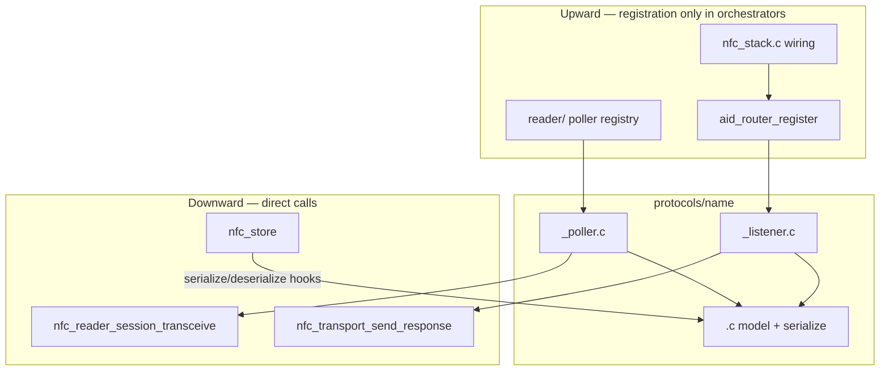

# NFC Protocols — Implementation Cookbook

**Status:** LOCKED — normative for `src/nfc/protocols/`  
**Authority:** [`NFC_STACK_CONVENTIONS.md`](NFC_STACK_CONVENTIONS.md) · [`NFC_HAL_GUIDE.md`](NFC_HAL_GUIDE.md) §3 · [`specs/2026-06-13-nfc-final-design.md`](specs/2026-06-13-nfc-final-design.md) §3.3 · Flipper `lib/nfc/protocols/<name>/` layout  
**Plan:** Gate 2 = poller + clone; Gate 3 = listener + stack listen path ([`NFC_STACK_PLAN.md`](NFC_STACK_PLAN.md))

This document answers: **where files go**, **what each file owns**, **which APIs are locked**, **how protocols couple to HAL/reader/router/store**, and **how to land Gate 2 then Gate 3**.

---

## 1. File layout (LOCKED)

Flipper splits every protocol into three translation units. Use the same shape under `src/nfc/protocols/<name>/`:

```
protocols/<name>/
  <name>.h              — data model struct + shared constants
  <name>.c              — data model logic + serialize/deserialize (default)
  <name>_poller.c       — reader role (Gate 2+)
  <name>_listener.c     — card/listen role (Gate 3+)
  CMakeLists.txt
  Kconfig               — or symbols in parent protocols/Kconfig
```

Optional fourth file **only** when `<name>.c` grows unwieldy (>~400 lines of serialize + model):

```
  <name>_serialize.c    — move serialize/deserialize here; keep model in <name>.c
```

**Default:** merge serialize into `<name>.c`. Do not create `_serialize.c` preemptively.

### Why not one `.c` with `#ifdef CONFIG_NFC_ROLE_*`?

| Problem | Consequence |
|---------|-------------|
| Reader and card code share one object file | NFCT images link listener dead code; PN7160 reader images link listener symbols you never call |
| `#ifdef` sprawl | Poller transceive paths and listener `send_response` paths interleave — easy to violate “protocols never touch HAL” on the poller side |
| Test granularity | Unit tests for serialize logic must pull in poller HAL stubs or listener router stubs |
| Flipper parity | Flipper compiles poller and listener as separate TUs gated by role — same registry NULL pattern |

Compile **role-specific objects** from CMake/Kconfig, not preprocessor walls inside one file.

### Why not a poller-only monolith (no shared `<name>.c`)?

| Problem | Consequence |
|---------|-------------|
| Duplicate data model | Clone (poller) and emulate (listener) diverge on field layout → `.card` blobs fail deserialize |
| Duplicate serialize | Store keys blobs by `persist_id`; two serializers guarantee drift |
| Gate 3 rework | Listener must share the same `ndef_data_t` (etc.) the poller populated — one header, one model |

The shared `<name>.h` + `<name>.c` pair is the **single source of truth** for the card data model and persistence format.

---

## 2. Per-file responsibilities

| File | Role | Gate (Kconfig) | May include | Must NOT |
|------|------|----------------|-------------|----------|
| `<name>.h` | Public data model (`<name>_data_t`), protocol constants, poller/listener entry declarations | `CONFIG_NFC_PROTOCOL_<NAME>` | `<stdint.h>`, `router/service.h` (listener types only in header if needed) | Vendor HAL, `pn7160.h`, `nfc_t4t_lib.h` |
| `<name>.c` | Model init/reset, CC/file helpers, `serialize`/`deserialize` impl, `*_get_service()` singleton state | `CONFIG_NFC_PROTOCOL_<NAME>` | `<name>.h`, `framing/apdu_types.h` (SW constants) | `nfc_transport_*`, `aid_router_*`, threads |
| `<name>_poller.c` | `detect`, `read` via **reader session** transceive | `CONFIG_NFC_PROTOCOL_<NAME>` **and** `CONFIG_NFC_ROLE_READER` | `<name>.h`, `reader/nfc_reader_engine.h` | `nfc_transport_*`, `aid_router_*`, `nfc_stack_*` |
| `<name>_listener.c` | `nfc_service_t` vtable: SELECT/APDU/field lifecycle + `send_response` | `CONFIG_NFC_PROTOCOL_<NAME>` **and** `CONFIG_NFC_ROLE_LISTEN` | `<name>.h`, `router/service.h`, `hal/nfc_transport.h` (**send_response only**) | `discover_*`, `tag_transceive`, poller registry |
| `<name>_serialize.c` | Optional: persistence only | same as `<name>.c` | `<name>.h` | Everything the base file must not |

Shell commands live in `<name>_shell_cmds.c` (creed §10) — never inside core protocol `.c` files.

---

## 3. Public API shape (LOCKED)

### 3.1 Data model — `<name>.h`

```c
typedef struct {
    /* protocol-specific fields — CC, NDEF bytes, keys, pages, etc. */
} ndef_data_t;   /* example: ndef_data_t in ndef.h */
```

One struct per protocol. Poller writes it; listener reads it; store serializes it.

### 3.2 Poller — `<name>_poller.h` (or declarations in `<name>.h`)

```c
/** @nfc_stack_wq — called from reader engine during clone/verify */
int ndef_poller_detect(const nfc_reader_session_t *session);
int ndef_poller_read(const nfc_reader_session_t *session, ndef_data_t *out);
```

| Function | Contract |
|----------|----------|
| `detect(session)` | Cheap probe (SELECT AID, GET_VERSION, READ page 0…). Return `0` if this protocol matches active tag, `-ENOTSUP` if not, other negative errno on I/O failure. |
| `read(session, model*)` | Full capture into `model`. Return `0` on success; errno on failure. Caller owns `model` storage. |

Pollers **build raw TX byte arrays** and pass them to `nfc_reader_session_transceive()`. They never parse inbound APDUs through `nfc_apdu_t`.

Registration: reader engine holds a **technology → poller** table (Flipper `nfc_pollers_api[]` pattern). NULL entry = unsupported combo → `-ENOTSUP`.

### 3.3 Listener — `nfc_service_t` vtable

Defined in `router/service.h`. Each `<name>_listener.c` exports a populated struct:

```c
static const nfc_service_t s_ndef_service = {
    .on_select    = ndef_on_select,
    .on_apdu      = ndef_on_apdu,
    .on_deselect  = ndef_on_deselect,
    .on_field_off = ndef_on_field_off,
    .serialize    = ndef_serialize,
    .deserialize  = ndef_deserialize,
    .persist_id   = NFC_PERSIST_ID_NDEF,   /* 0x01 — stable, from service.h table */
    .user_ctx     = NULL,
};
const nfc_service_t *ndef_service_get(void);
```

| Callback | Invoked when | Must |
|----------|--------------|------|
| `on_select(aid, len, ctx)` | Router matched registered AID | Call `nfc_transport_send_response()` with SELECT response (router sends **nothing**) |
| `on_apdu(apdu, ctx)` | Non-SELECT while selected | Handle via parsed `nfc_apdu_t`; respond with `send_response` |
| `on_deselect(ctx)` | Another AID selected | Reset per-session file/ auth state |
| `on_field_off(ctx)` | RF field lost | Clear all session state |
| `serialize` / `deserialize` | `nfc_store_save` / `load` on **caller thread** | Flat blob format owned by protocol; may be NULL if not persistable |
| `persist_id` | TLV key in `.card` envelope | Unique per protocol; `0` = skip in store |

`serialize`/`deserialize` run `@caller_sync` while stack is **not** STARTED (`-EBUSY` guard in store).

---

## 4. Run context

| Rule | Detail |
|------|--------|
| **Single WQ** | All protocol dispatch runs on **`nfc_stack_wq`** (`run/nfc_stack_workq.h`) |
| **No threads** | No `k_thread_create`, no Furi-style worker per protocol |
| **Poller context** | `detect`/`read` run inside the reader engine work item on `nfc_stack_wq` while a poll session is active |
| **Listener context** | Vtable callbacks invoked from fifo drain → framing → router on `nfc_stack_wq` |
| **Caller thread** | `nfc_stack_start/stop`, `nfc_stack_load/save`, `nfc_reader_scan_start` queue work — they do not block in protocol code |

PN7160 driver IRQ drains on **`pn7160_wq`** — protocols never run there.

---

## 5. Coupling cheat sheet

### 5.1 Diagram



### 5.2 Table

| Direction | From | To | Mechanism | Wired in |
|-----------|------|----|-----------|----------|
| Down | Poller | Active tag | `nfc_reader_session_transceive(session, tx, …)` | Poller only |
| Down | Listener | HAL | `nfc_transport_send_response(buf, len)` | Listener vtable |
| Down | Store | Model | `svc->serialize` / `svc->deserialize` | `nfc_store.c` |
| Up | Reader engine | Poller | Technology table → `detect`/`read` | `reader/nfc_reader_engine.c` |
| Up | Stack | Router | `aid_router_register(aid, len, svc)` | **`nfc_stack.c` only** |
| Up | Stack | Store | `nfc_store_load/save/on_dirty` | **`nfc_stack.c`** + reader clone |

**Hard rule:** protocols do **not** call `aid_router_register`, `nfc_transport_register_callbacks`, or `nfc_transport_discover_*`. Cross-layer wiring lives in `nfc_stack.c` and `reader/` only ([`NFC_STACK_CONVENTIONS.md`](NFC_STACK_CONVENTIONS.md) §3).

---

## 6. APDU handling — poller vs listener

| Role | TX | RX | Parsing |
|------|----|----|---------|
| **Poller** | Builds raw C-APDU bytes (CLA INS P1 P2 Lc data Le) in a stack or static buffer | Raw R-APDU bytes from `session_transceive` | Manual: check SW1/SW2 (`0x9000`), slice data field — **no `nfc_apdu_t`** |
| **Listener** | Via `nfc_transport_send_response` (R-APDU) | N/A (inbound) | **`const nfc_apdu_t *`** from router — fields already parsed (`apdu->ins`, `apdu->p1`, `apdu->data`, `apdu->lc`) |

`apdu->data` points into the inbound `net_buf` — valid **only for the duration of `on_apdu`**. Copy bytes if the model must retain them past return.

---

## 7. Kconfig / CMake pattern

Parent `src/nfc/protocols/Kconfig`:

```kconfig
config NFC_PROTOCOL_NDEF
    bool "NDEF Type 4 protocol module"
    default y
    depends on NFC_STACK
```

Per-module `CMakeLists.txt`:

```cmake
zephyr_library_sources_ifdef(CONFIG_NFC_PROTOCOL_NDEF ndef.c)

zephyr_library_sources_ifdef(CONFIG_NFC_ROLE_READER
  $<IF:$<BOOL:${CONFIG_NFC_PROTOCOL_NDEF}>,ndef_poller.c,>)

zephyr_library_sources_ifdef(CONFIG_NFC_ROLE_LISTEN
  $<IF:$<BOOL:${CONFIG_NFC_PROTOCOL_NDEF}>,ndef_listener.c,>)
```

| Symbol | Effect |
|--------|--------|
| `CONFIG_NFC_PROTOCOL_<NAME>` | Master switch — data model + shared `.c` |
| `CONFIG_NFC_ROLE_READER` | Compiles `<name>_poller.c`; requires reader-capable HAL |
| `CONFIG_NFC_ROLE_LISTEN` | Compiles `<name>_listener.c` (card role; docs may say `ROLE_CARD`) |

`BUILD_ASSERT` in HAL backend: enabled roles ⊆ `nfc_transport_get_capabilities()->roles`. NFCT backend must not enable `CONFIG_NFC_ROLE_READER`.

Add `protocols/` to `src/nfc/CMakeLists.txt` when the first module lands.

---

## 8. Gate 2 recipe — first protocol (NDEF poller + clone)

Goal: `nfc reader clone <tag>` produces a valid `.card` blob. **No listener yet.**

1. **Scaffold** `src/nfc/protocols/ndef/` — `ndef.h`, `ndef.c`, `ndef_poller.c`, Kconfig, CMakeLists.txt.
2. **Model** — Define `ndef_data_t` (CC file + NDEF file buffer). Implement `ndef_serialize` / `ndef_deserialize` in `ndef.c`; assign `NFC_PERSIST_ID_NDEF` (`0x01`).
3. **Poller** — In `ndef_poller.c`:
   - `ndef_poller_detect`: transceive SELECT NDEF AID (`D2 76 00 00 85 01 01`); success if SW=9000.
   - `ndef_poller_read`: SELECT → READ BINARY CC (`E103`) → READ BINARY NDEF file (`E104`); fill `ndef_data_t`.
   - All transceive via `nfc_reader_session_transceive(session, …)`.
4. **Reader hook** — In `reader/nfc_reader_engine.c`: after `discover_wait`, walk technology → poller table; call `detect` then `read`; on success call `nfc_store_save(tag, &svc, 1)` with a stub `nfc_service_t` whose only populated hooks are `serialize`/`deserialize`/`persist_id` (listener callbacks NULL until Gate 3).
5. **Store minimal** — Gate 2 store envelope (header + TLV + CRC) per wave6 spec; `-EBUSY` while stack started.
6. **Kconfig** — Enable `CONFIG_NFC_PROTOCOL_NDEF`, `CONFIG_NFC_ROLE_READER`, PN7160 backend.
7. **Verify** — `nfc reader clone tag1` → hex blob; unit-test serialize round-trip; MISRA + `@nfc_stack_wq` annotations on poller APIs.

Flipper `ndef_poller.c` / NXP `RW_NDEF_T4T` — facts only; reimplement.

---

## 9. Gate 3 addendum — add listener

Type-4 CE responds to SELECT / READ BINARY (PN7160 listen, then NFCT).

1. Add `ndef_listener.c` (`CONFIG_NFC_ROLE_LISTEN`).
2. Implement full `nfc_service_t` — CC/NDEF file FSM, static `s_response_buf`, `send_response` (conventions §5).
3. Wire **`nfc_stack.c` only**: `aid_router_register(ndef_aid, …, ndef_service_get())`.
4. `nfc_stack_load` → `deserialize` before `nfc_stack_start`.
5. UPDATE BINARY → `nfc_store_on_dirty(svc, tag)` (stack wires).
6. Do not register listeners from poller or reader code.

---

## 10. Flipper porting discipline

1. **Reimplement** fresh MISRA C — no GPL paste.
2. **Cite source** in file comment: `/* Behavioral reference: flipperzero/lib/nfc/protocols/ndef/ndef_poller.c */`
3. **Map symbols** — Flipper `detect`/`run`/`get_data` → our `detect`/`read` + shared model; Flipper listener → `nfc_service_t`.
4. **Session rule** — transceive only through session object on `nfc_stack_wq` (Flipper: `Nfc*` on worker thread).
5. **NULL registry slots** → `-ENOTSUP`, never crash.
