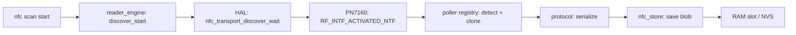
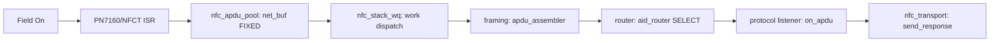
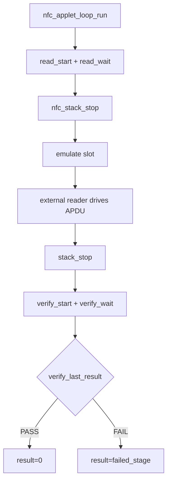

# NFC Stack Architecture

**Branch:** `nfc-stack` · **Version:** 1.0 (P7 assembly)  
**Assembled from:** P2–P4b `CONTEXT.md` files · Phase A deconvolution  
**Companion guides:** [`NFC_SHELL_APPLETS.md`](NFC_SHELL_APPLETS.md) · [`NFC_HIL_PROTOCOL_GUIDE.md`](NFC_HIL_PROTOCOL_GUIDE.md)

---

## Contents

1. [Block Diagram](#1-block-diagram-l0l3)
2. [Data Flow](#2-data-flow)
3. [HAL Profiles Table](#3-hal-profiles-table)
4. [Protocol Registry](#4-protocol-registry)
5. [Store Envelope](#5-store-envelope)
6. [Applet L1/L2/L3 Split](#6-applet-l1l2l3-split)
7. [Test Pyramid](#7-test-pyramid-kconfig-gated)
8. [Overlay × Profile Matrix](#8-overlay--profile-matrix)
9. [HIL Pointer](#9-hil-pointer)

---

## 1. Block Diagram (L0→L3)

```
┌─────────────────────────────────────────────────────────────────────────────────┐
│ L3: App / SMF / Product consumers                                               │
│     └── BLE · LVGL · HIL bench · unit test harnesses                            │
│         (consume L1 headless API: errno + result structs)                       │
├─────────────────────────────────────────────────────────────────────────────────┤
│ L2: Shell adapters (*_shell_cmds.c)                                             │
│     └── ONLY place `struct shell *` lives                                       │
│         nfc_applet_shell_cmds  nfc_reader_shell_cmds  nfc_stack_shell_cmds      │
│         nfc_store_shell_cmds   nfc_transport_shell_cmds  pn7160_shell           │
├─────────────────────────────────────────────────────────────────────────────────┤
│ L1: Applets (headless)  →  nfc_applet_service.h                                 │
│     ├── Scan applet    — continuous discovery + per-tag callback                │
│     ├── Read applet    — one-shot scan + poller clone → store slot              │
│     ├── Emulate applet — load slot + policy + stack start                       │
│     ├── Loop applet    — orchestrate read→emulate→check                         │
│     ├── Check applet   — field diff vs stored slot (internal + DK)              │
│     └── Policy applet  — clone-only vs emulatable gate (internal)               │
├─────────────────────────────────────────────────────────────────────────────────┤
│ L0: Engines / HAL / Store / Protocols                                           │
│                                                                                 │
│  ┌────────────────────┐    ┌─────────────────────┐    ┌─────────────────────┐   │
│  │  modules/nfc_pn7160│    │    src/nfc/hal/     │    │    src/nfc/store/   │   │
│  │  PN7160 NCI driver │───►│  nfc_transport      │    │    envelope, RAM    │   │
│  │  TML I2C/SPI       │    │  (PN7160 / NRFX)    │    │    goldens          │   │
│  └────────────────────┘    │  nfc_apdu_pool/asm  │    └──────────▲──────────┘   │
│                            └──────────┬──────────┘               │              │
│                                       │                          │              │
│                                       ▼                          │ serialize/   │
│                         ┌─────────────────────────┐              │ deserialize  │
│                         │   src/nfc/framing/      │              │              │
│                         │   apdu_assembler        │              │              │
│                         └───────────┬─────────────┘              │              │
│                                     │                            │              │
│                                     ▼                            │              │
│                         ┌─────────────────────────┐              │              │
│                         │   src/nfc/router/       │              │              │
│                         │   aid_router (AID→svc)  │              │              │
│                         └───────────┬─────────────┘              │              │
│                                     │ dispatch                   │              │
│                                     ▼                            ▼              │
│    ┌──────────────────────────────────────────────────────────────────────────┐ │
│    │                    src/nfc/protocols/                                    │ │
│    │  ┌──────┐ ┌────────────┐ ┌─────────┐ ┌────────┐ ┌────────────┐ ┌───────┐ │ │
│    │  │ NDEF │ │ Ultralight │ │ Classic │ │ FeliCa │ │ ISO15693-3 │ │ SLIX  │ │ │
│    │  └──────┘ └────────────┘ └─────────┘ └────────┘ └────────────┘ └───────┘ │ │
│    │  ┌─────────┐ ┌─────┐ ┌───────┐                                           │ │
│    │  │ DESFire │ │ EMV │ │ Aliro │  ← emulatable via listener                │ │
│    │  └─────────┘ └─────┘ └───────┘                                           │ │
│    └──────────────────────────────────────────────────────────────────────────┘ │
│                                                                                 │
│  ┌────────────────────┐    ┌─────────────────────┐    ┌─────────────────────┐   │
│  │  src/nfc/reader/   │    │  src/nfc/nfc_stack/ │    │    src/nfc/run/     │   │
│  │  discovery engine  │◄──►│  listen orchestrator│◄──►│   nfc_stack_wq      │   │
│  │  poller registry   │    │  AID registration   │    │   (shared work q)   │   │
│  └────────────────────┘    └─────────────────────┘    └─────────────────────┘   │
│                                                                                 │
└─────────────────────────────────────────────────────────────────────────────────┘
```

---

## 2. Data Flow

### Reader Path (poll)



### Listen Path (card emulation)



### Loop Applet Orchestration



---

## 3. HAL Profiles Table

| Backend | Reader (poll) | Listen (CE) | Profile | Overlay | Notes |
|---------|--------------|-------------|---------|---------|-------|
| **PN7160** | ✓ | ✓ | `NFC_PROFILE_READER` | `overlay-pn7160-stack.conf` | Full reader; add `+overlay-pn7160-listen.conf` for CE |
| **PN7160** | ✓ | ✓ | READER + listen | `overlay-pn7160-stack.conf;overlay-pn7160-listen.conf` | Reader + CE (RW+CE concurrent deferred) |
| **NFCT** | — | ✓ | `NFC_PROFILE_CARD_EMULATION` | `overlay-nfct-stack.conf` | Listen-only; poll returns `-ENOTSUP` |
| **PN7160** | scaffold | — | `NFC_PROFILE_LAB` | `overlay-pn7160-hal.conf` | HAL bring-up only (no engine/store/protocols) |

**Single-flight rule:** Never poll and listen on the same controller concurrently. Use `nfc stack stop` between sessions or run Gate 5 with two boards.

---

## 4. Protocol Registry

| Protocol | Class | Poller (B) | Listener (C) | Emulatable? | Kconfig | QEMU proves | HIL must prove |
|----------|-------|------------|--------------|-------------|---------|-------------|----------------|
| **NDEF (T4T)** | emulatable | `ndef_poller.c` — ISO-DEP SELECT/READ on NDEF AID | `ndef_listener.c` — native T4T APDU | ✓ (native T4) | `NFC_PROTOCOL_NDEF` | model + poller + listener (87 cases); store roundtrip | RF poll, SELECT/READ BINARY, field on/off |
| **Ultralight (T2 poll)** | emulatable | `ultralight_poller.c` — page READ | **via T4 adapter** → `ndef_listener.c` (no native T2) | ✓ (via T4T adapter) | `NFC_PROTOCOL_ULTRALIGHT` | model + poller decode (32 cases); listener Tier C in `nfc_ndef` after F1 adapter | page read over RF, UID/SAK; emulate as T4 NDEF |
| **Classic** | clone-only | `classic_poller.c` | — | — | `NFC_PROTOCOL_CLASSIC` | model + poller, Crypto1, CRC | anticollision + auth + block read |
| **FeliCa** | clone-only | `felica_poller.c` | — | — | `NFC_PROTOCOL_FELICA` | model + poller decode | NFC-F polling + block read |
| **ISO15693-3** | clone-only | `iso15693_3_poller.c` | — | — | `NFC_PROTOCOL_ISO15693_3` | model + poller decode | NFC-V inventory + block read |
| **SLIX** | clone-only | `slix_poller.c` | — | — | `NFC_PROTOCOL_SLIX` | model + poller, CAP variants | NFC-V SLIX read |
| **DESFire** | emulatable | `desfire_poller.c` | `desfire_listener.c` | ✓ (partial) | `NFC_PROTOCOL_DESFIRE` | model + poller + listener APDU | ISO-DEP transceive, app/file SELECT |
| **EMV** | emulatable | `emv_poller.c` | `emv_listener.c` | ✓ (partial) | `NFC_PROTOCOL_EMV` | model + poller + listener decode | PPSE/AID SELECT + READ RECORD |
| **Aliro** | emulatable | `aliro_poller.c` | `aliro_listener.c` | ✓ (partial) | `NFC_PROTOCOL_ALIRO` | model + poller + listener; AID router | ISO-DEP AUTH transcript exchange |

**Clone-only:** No native listener; `nfc emulate` refused by policy applet.  
**Partial:** Public data emulatable; encrypted auth/crypto not replayed.

---

## 5. Store Envelope

### Blob Format (V2)

```
┌──────────┬─────────┬────────┬─────────────┬────────────────────────┬─────────┐
│ Magic(2) │ Ver(1)  │ Len(2) │ Entry 1...N │         ...            │ CRC(2)  │
│ 0x4E 0x46│  0x02   │        │             │                        │ CCITT   │
└──────────┴─────────┴────────┴─────────────┴────────────────────────┴─────────┘

Entry format (V2):
┌───────────┬─────────┬─────────┬───────────────────────┐
│ persist_id│  flags  │  len(2) │         body          │
│    (1)    │   (1)   │         │                       │
└───────────┴─────────┴─────────┴───────────────────────┘
```

### Key Symbols

| Symbol | Default | Purpose |
|--------|---------|---------|
| `NFC_STORE_BLOB_SIZE` | 4096 | Staging buffer capacity |
| `NFC_STORE_MAX_TAG_LEN` | 16 | Max slot name (incl NUL) |
| `NFC_STORE_RAM_SLOT_COUNT` | 4 | RAM backend slots |

### Quiescent Check

`nfc_store_save()` / `nfc_store_load()` return `-EBUSY` while `nfc_stack_get_state() == STARTED`. Stop the listen stack before serialize/deserialize operations.

### CRC Validation

- `nfc_store_read_envelope()` validates CRC → `-EBADMSG` on mismatch
- `corrupt_blob_count` stat incremented on failure

---

## 6. Applet L1/L2/L3 Split

**Authority:** [`NFC_SHELL_APPLETS.md`](NFC_SHELL_APPLETS.md) (full shell command reference)

### Layer Model

| Layer | Name | Contains | `struct shell *`? |
|-------|------|----------|-------------------|
| **L0** | Engines | reader_engine, nfc_stack, store, HAL, protocols | No |
| **L1** | Applets (headless) | Scan, Read, Emulate, Loop, Check, Policy — `nfc_applet_service.h` | **No** (forbidden) |
| **L2** | Shell adapters | `*_shell_cmds.c` — parse argv, call L1, render result | **Yes** (only here) |
| **L3** | App / SMF | Future product consumer of L1 | No |

### L1 Headless API (`nfc_applet_service.h`)

| Applet | Functions | Callback |
|--------|-----------|----------|
| **Scan** | `discover_start(cb, ctx)`, `discover_stop()`, `discover_active()`, `scan_get_result(out)` | `nfc_applet_tag_cb_t` |
| **Read** | `read_start(slot, timeout)`, `read_busy()`, `read_wait(deadline)` | — |
| **Emulate** | `emulate(slot, profile)` | — |
| **Loop** | `loop_run(slot, timeout, log_fn, ctx, &result)` | `nfc_applet_log_fn` |
| **Check** | `verify_start(slot, timeout)`, `verify_busy()`, `verify_wait()`, `verify_last_result()`, `verify_compare(...)` | — |
| **Meta** | `get_card_meta(slot, &out)` → `nfc_applet_card_meta_t` | — |

### L2 Shell Commands (mapped from L1)

| Command | L2 Adapter | L1 Call | Kconfig Gate |
|---------|------------|---------|--------------|
| `nfc scan start/stop` | `cmd_nfc_scan_*` | `discover_start/stop` | `NFC_APPLETS_SHELL` |
| `nfc read <slot>` | `cmd_nfc_read` | `read_start` + `read_wait` | `NFC_APPLETS_SHELL` |
| `nfc emulate <slot>` | `cmd_nfc_emulate` | `get_card_meta` + `emulate` | `NFC_APPLETS_SHELL` + `NFC_LISTEN_STACK` |
| `nfc loop <slot>` | `cmd_nfc_loop` | `loop_run(slot, timeout, log, sh, &result)` | `NFC_APPLETS_SHELL` + `NFC_LISTEN_STACK` |
| `nfc check <slot>` (DK) | `cmd_nfc_check` | `verify_start` + `verify_wait` + `verify_last_result` | `NFC_APPLETS_SHELL` |

---

## 7. Test Pyramid (Kconfig-Gated)

### Tiers

| Tier | Name | What it proves | Kconfig gate | Example |
|------|------|----------------|--------------|---------|
| **A** | Model | Serialize/deserialize, bounds | `NFC_PROTOCOL_*` | `nfc_ndef.model`, `pn7160_tml` |
| **B** | Poller | Reader poll + transceive mock | `+*_TEST_TIER_POLLER` | `nfc_classic.poller` |
| **C** | Listener | APDU response via loopback | `+*_TEST_TIER_LISTENER` | `nfc_ndef.listener`, `nfc_desfire.listener` |
| **D** | HIL | RF on silicon | Hardware | Gate 2–5 bench |
| **E** | Store roundtrip | `nfc_reader` 9-protocol serialize→save→load→deserialize | `NFC_STORE` | `nfc_reader.store`, `nfc_reader.store_ram` |

### Test Counts (P6 verified)

| Suite | Configs | Cases | Notes |
|-------|---------|-------|-------|
| `nfc_ndef` | 3 | 87 | model + poller + listener |
| `nfc_ultralight` | 2 | 32 | model + poller |
| `nfc_classic` | 2 | 17 | model + poller |
| `nfc_felica` | 2 | 13 | model + poller |
| `nfc_slix` | 2 | 18 | model + poller |
| `nfc_desfire` | 3 | 30 | model + poller + listener |
| `nfc_emv` | 3 | 17 | model + poller + listener |
| `nfc_aliro` | 3 | 19 | model + poller + listener |
| `nfc_reader` | 3 | 155 | store + store_ram + shell_off |
| `nfc_apdu_asm` | 1 | 4 | frag_fits, oversize drop |
| **Total** | **24** | **392** | QEMU green (P6) |

### Profile → Compiles → May-Test

| Profile | Compiles | Tests That May Run |
|---------|----------|-------------------|
| `NFC_PROFILE_READER` | reader engine, store+RAM, applets, **9 poller protocols** | Tier A/B (all 9), Tier E (store roundtrip) |
| `NFC_PROFILE_CARD_EMULATION` | listen stack, store+RAM, **5 emulatable protocols** | Tier A/C (emulate subset), Tier E |
| `NFC_PROFILE_LAB` | HAL + role scaffold only | Module/HAL tier only (`pn7160_tml`, `nfc_apdu_asm`) |

---

## 8. Overlay × Profile Matrix

| Overlay | Profile | Reader | Listen | Store | Applets | Protocols | Shell Commands |
|---------|---------|--------|--------|-------|---------|-----------|----------------|
| `overlay-pn7160-stack.conf` | `NFC_PROFILE_READER` | ✓ | — | ✓ | ✓ | 9 poller | `nfc scan/read/check`, `nfc reader *`, `nfc store *`, `pn7160 *` |
| `overlay-pn7160-stack.conf` + `overlay-pn7160-listen.conf` | READER + listen | ✓ | ✓ | ✓ | ✓ | 9 poller + 5 listener | All above + `nfc emulate/loop`, `nfc stack *` |
| `overlay-nfct-stack.conf` | `NFC_PROFILE_CARD_EMULATION` | — | ✓ | ✓ | ✓ | 5 listener | `nfc emulate/loop`, `nfc stack *`, `nfc store *` |
| `overlay-pn7160-hal.conf` | `NFC_PROFILE_LAB` | scaffold | — | — | — | — | `pn7160 *`, `nfc_transport *` |

### What Each Overlay Enables

| Overlay | Purpose |
|---------|---------|
| **`overlay-pn7160-stack.conf`** | PN7160 reader product — poll 9 protocols, store clone, no CE |
| **`overlay-pn7160-listen.conf`** | Layer on reader for PN7160 CE — adds `NFC_LISTEN_STACK`, `NFC_ROLE_LISTEN=y` |
| **`overlay-nfct-stack.conf`** | NFCT listen-only CE product — 5 emulatable protocols, no reader |
| **`overlay-pn7160-hal.conf`** | HAL bring-up scaffold — controller commands only, no engine |

---

## 9. HIL Pointer

**Status:** Bench ready — run when hardware available.

**Guide:** [`NFC_HIL_PROTOCOL_GUIDE.md`](NFC_HIL_PROTOCOL_GUIDE.md)

### Gate Ladder

| Gate | Proves | Boards |
|------|--------|--------|
| **2** | Poll session + poller walk + `.card` store on silicon | 1 (reader) |
| **3** | Listen `on_apdu` → assembler → router → NDEF listener path | 1 (reader+listen) + external reader |
| **4** | Full applet loop (read→emulate→check), sequential single-flight | 1 |
| **5** | Cross-backend: NFCT emulate ↔ PN7160 verify | 2 |

### Quick Start (Gate 2)

```bash
export REPO=/Users/majidfaroud/writable_ndef_msg
source "$REPO/scripts/env/ncs-env.sh"

west build -b nrf54l15dk/nrf54l15/cpuapp "$REPO" --sysbuild \
  -DOVERLAY_FILE="$REPO/boards/overlays/pn7160_i2c.overlay" \
  -- -DEXTRA_CONF_FILE="$REPO/overlay-pn7160-stack.conf"
west flash

# Serial console:
uart:~$ pn7160 probe          # CORE_RESET OK
uart:~$ nfc scan start        # UID/protocol/tech per tag
uart:~$ nfc scan stop
uart:~$ nfc read tag1         # clone to slot
```

**PASS criteria:** UID printed, `nfc read tag1` produces non-zero stored length.

---

## CONTEXT.md Cross-Reference

All 18 `CONTEXT.md` files are assembled from the following directories:

| Path | Layer | Purpose |
|------|-------|---------|
| `modules/nfc_pn7160/CONTEXT.md` | L0 | PN7160 NCI driver |
| `src/nfc/hal/CONTEXT.md` | L0 | HAL abstraction (transport, APDU pool) |
| `src/nfc/framing/CONTEXT.md` | L0 | APDU assembler |
| `src/nfc/router/CONTEXT.md` | L0 | AID router |
| `src/nfc/reader/CONTEXT.md` | L0 | Reader discovery engine |
| `src/nfc/nfc_stack/CONTEXT.md` | L0 | Listen orchestrator |
| `src/nfc/store/CONTEXT.md` | L0 | Envelope + RAM backend |
| `src/nfc/run/CONTEXT.md` | L0 | Shared work queue |
| `src/nfc/applets/CONTEXT.md` | L1 | Headless applets |
| `src/nfc/protocols/ndef/CONTEXT.md` | L0 | NDEF Type-4 (ISO-DEP T4T) |
| `src/nfc/protocols/ultralight/CONTEXT.md` | L0 | Ultralight/NTAG Type-2 poll; emulate via T4 adapter |
| `src/nfc/protocols/classic/CONTEXT.md` | L0 | MIFARE Classic |
| `src/nfc/protocols/felica/CONTEXT.md` | L0 | FeliCa |
| `src/nfc/protocols/iso15693_3/CONTEXT.md` | L0 | ISO15693-3 (NFC-V) |
| `src/nfc/protocols/slix/CONTEXT.md` | L0 | NXP SLIX |
| `src/nfc/protocols/desfire/CONTEXT.md` | L0 | MIFARE DESFire |
| `src/nfc/protocols/emv/CONTEXT.md` | L0 | EMV contactless |
| `src/nfc/protocols/aliro/CONTEXT.md` | L0 | Aliro credential |
