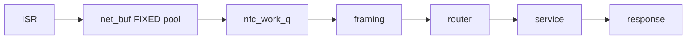

# NFC Stack Architecture

**Status:** STUB — assembled in Phase 9 of [`plans/NFC_HARMONIZATION_MASTER_PLAN.md`](plans/NFC_HARMONIZATION_MASTER_PLAN.md) from per-layer `CONTEXT.md` files. Placeholders below.

## Layering (target — master plan Part A)
```text
L3  App / UI consumers   SMF · BLE · LVGL · HIL · unit test   (errno + result structs)
L2  Shell adapter        *_shell_cmds.c (CONFIG_*_SHELL)       — only place struct shell* lives
L1  Applet service       nfc_applet_service.h (headless)       — scan/read/emulate/verify/loop
L0  Engine/stack/store/HAL  reader · nfc_stack · framing · router · protocols ↔ store · HAL
```

## Contents
1. [Block diagram](#1-block-diagram) · 2. [Data flow](#2-data-flow) · 3. [HAL profiles](#3-hal-profiles) · 4. [Protocol registry](#4-protocol-registry) · 5. [Store envelope](#5-store-envelope) · 6. [Applet service layer (L1/L2/L3)](#6-applet-service-layer) · 7. [Test pyramid (Kconfig-gated tiers)](#7-test-pyramid) · 8. [Overlay matrix](#8-overlay-matrix)

## 1. Block diagram
```text
[ TODO: ASCII — module → hal → framing → router → {protocols} ↔ store, reader sidecar, nfc_stack orchestrator ]
```

## 2. Data flow


## 3. HAL profiles
TODO — PN7160 vs NRFX capability/role-ceiling matrix.

## 4. Protocol registry
TODO — table from `protocols/*/CONTEXT.md` (poller / listener / emulatable / capacity).

## 5. Store envelope
TODO — blob layout, CRC, serialize/deserialize vtable, golden set.

## 6. Applet service layer
TODO — L1 headless `nfc_applet_service.h` (scan/read/emulate/verify/loop, errno + result structs) vs L2 shell adapter (`*_shell_cmds.c`); deconvolution = master plan Part C.

## 7. Test pyramid
TODO — Tier A/B/C/E counts **with their Kconfig gates** (each tier runs only when its profile compiles the production path; master plan Part B/E) + Tier D HIL pointer.

## 8. Overlay matrix
TODO — profiles × overlays.
