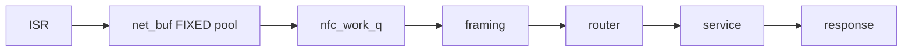

# NFC Stack Architecture

**Status:** STUB — assembled in Phase 9 of [`plans/NFC_HARMONIZATION_MASTER_PLAN.md`](plans/NFC_HARMONIZATION_MASTER_PLAN.md) from per-layer `CONTEXT.md` files. Placeholders below.

## Contents
1. [Block diagram](#1-block-diagram) · 2. [Data flow](#2-data-flow) · 3. [HAL profiles](#3-hal-profiles) · 4. [Protocol registry](#4-protocol-registry) · 5. [Store envelope](#5-store-envelope) · 6. [Applet service layer](#6-applet-service-layer) · 7. [Test pyramid](#7-test-pyramid) · 8. [Overlay matrix](#8-overlay-matrix)

## 1. Block diagram
```text
[ TODO: ASCII — module → hal → framing → router → {protocols} ↔ store, reader sidecar, nfc_stack orchestrator ]
```

## 2. Data flow


## 3. HAL profiles
TODO — PN7160 vs NRFX capability/role-ceiling matrix.

## 4. Protocol registry
TODO — table from `protocols/*/CONTEXT.md` (poller / listener / emulatable / capacity).

## 5. Store envelope
TODO — blob layout, CRC, serialize/deserialize vtable, golden set.

## 6. Applet service layer
TODO — scan/read/emulate/verify/loop; applet API separation (master plan §11).

## 7. Test pyramid
TODO — Tier A/B/C/E counts + Tier D HIL pointer.

## 8. Overlay matrix
TODO — profiles × overlays.
