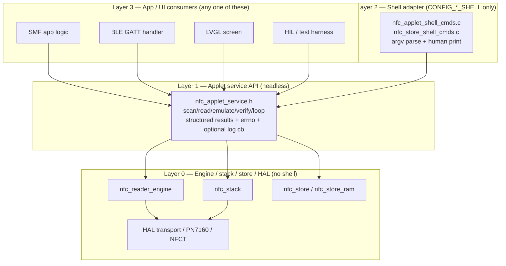

# NFC Applet API Layering Plan

**Date:** 2026-06-14
**Branch:** `nfc-stack`
**Status:** Plan only — no refactor implemented in this commit.
**Companion:** `docs/nfc/plans/NFC_SHELL_KCONFIG_AUDIT.md` (shell-gating audit findings).

---

## 1. Problem statement

Shell is currently the *first* consumer of the applet/store APIs, and in four
core files it has become the *only* consumer the code is written for. The audit
(`NFC_SHELL_KCONFIG_AUDIT.md`) found these leaks:

| File | Leak | Severity |
|------|------|----------|
| `src/nfc/store/nfc_store.c` | `nfc_store_default_save()` is the **default** save callback and calls `shell_print`/`shell_fprintf`; `user_ctx` is treated as a `struct shell *`. Core store includes `<zephyr/shell/shell.h>` unconditionally. | **High** — core persistence layer references shell as its default behavior. |
| `src/nfc/store/nfc_store_ram.c` | `#include <zephyr/shell/shell.h>` sits in the `CONFIG_NFC_STORE_RAM` block, outside the `CONFIG_NFC_STORE_RAM_SHELL` block. | Low (include only). |
| `src/nfc/applets/nfc_applet_scan.c` | `nfc_applet_scan_print(const struct shell *)` is pure shell rendering compiled under `CONFIG_NFC_APPLETS`. | Medium. |
| `src/nfc/applets/nfc_applet_loop.c` | `nfc_applet_loop(const struct shell *, ...)` interleaves orchestration (read→emulate→verify) with `shell_print` progress lines, compiled under `CONFIG_NFC_APPLETS + CONFIG_NFC_LISTEN_STACK`. | Medium. |
| `src/nfc/applets/nfc_applet.h` | Public header declares `nfc_applet_scan_print(const struct shell *)` and `nfc_applet_loop(const struct shell *, ...)` with no `CONFIG_NFC_APPLETS_SHELL` guard. | Low (header). |

**Root cause:** the applet "service" layer and the shell "adapter" layer were
written as one thing. `scan` and `loop` print directly; the store's *default*
save path renders hex over a shell. Any non-shell consumer (SMF app, BLE, LVGL,
HIL harness, unit test) cannot use these without faking a `struct shell *`.

**Good news:** `read`, `emulate`, `verify`, and `scan_start/wait` are *already*
headless (errno returns, no shell). The leak is concentrated in **scan result
rendering**, **loop orchestration+printing**, and the **store default save
callback**. The fix is mostly *extraction*, not redesign.

---

## 2. Target layering



**Rule of thumb:** a `struct shell *` may appear only in `*_shell_cmds.c` files
gated by a `*_SHELL` Kconfig. Everything below Layer 2 speaks errno + structs +
(optionally) a logging callback. Layer 1 never prints.

### How output leaves Layer 1

Layer 1 returns structured data. It never calls `shell_print`. For
long-running orchestration (`loop`), Layer 1 may emit *progress* via an optional
caller-supplied callback so the shell can echo "loop: read…" while a UI updates
a progress bar:

```c
typedef void (*nfc_applet_log_fn)(void *ctx, const char *stage, int code);
```

`NULL` callback = silent. The shell adapter passes a callback that prints; a UI
passes one that drives a state machine; a unit test passes `NULL` and asserts on
the returned result struct.

---

## 3. Per-applet API (Layer 1, headless)

New header: `src/nfc/applets/nfc_applet_service.h` (the existing `nfc_applet.h`
keeps the already-headless start/wait/result functions; shell-typed prototypes
are removed from it).

### 3.1 Result structs

```c
typedef struct {
    nfc_uid_t uid;          /* bytes[10] + len */
    uint8_t   protocol;     /* NCI protocol    */
    uint8_t   interface;
    uint8_t   mode_tech;
    bool      valid;
} nfc_applet_scan_result_t;

typedef struct {
    uint8_t     persist_id;     /* NFC_PERSIST_ID_*            */
    uint8_t     flags;          /* NFC_STORE_ENTRY_FLAG_*      */
    const char *protocol_name;  /* nfc_persist_id_name(id)     */
    bool        present;        /* peek_entry_meta succeeded   */
} nfc_applet_card_meta_t;

typedef enum {
    NFC_APPLET_LOOP_STAGE_READ = 0,
    NFC_APPLET_LOOP_STAGE_EMULATE,
    NFC_APPLET_LOOP_STAGE_VERIFY,
    NFC_APPLET_LOOP_STAGE_DONE,
} nfc_applet_loop_stage_t;

typedef struct {
    nfc_applet_loop_stage_t failed_stage; /* last stage reached  */
    int                     verify_result;/* 0 = PASS            */
} nfc_applet_loop_result_t;
```

### 3.2 Signatures (no `struct shell` anywhere)

| Applet | Headless API (Layer 1) | Result | Notes |
|--------|------------------------|--------|-------|
| **scan** | `int nfc_applet_scan_start(k_timeout_t)`<br/>`int nfc_applet_scan_wait(k_timeout_t)`<br/>**new** `int nfc_applet_scan_get_result(nfc_applet_scan_result_t *out)` | `nfc_applet_scan_result_t` | Replaces `nfc_applet_scan_print(shell)`. Reads `nfc_reader_session_get()` into the struct; no rendering. |
| **read** | `int nfc_applet_read_start(const char *slot, k_timeout_t)`<br/>`int nfc_applet_read_wait(k_timeout_t)` | errno + `nfc_applet_get_card_meta(slot, &meta)` | Already headless. Add the meta getter (thin wrapper over `nfc_store_peek_entry_meta` + `nfc_persist_id_name`) so the adapter does not reach into store naming. |
| **emulate** | `int nfc_applet_emulate(const char *slot, nfc_profile_t)` | errno + `nfc_applet_get_card_meta` | Already headless. `nfc_applet_check_emulate()` (policy) already errno-only. |
| **verify** | `int nfc_applet_verify_start(const char *slot, k_timeout_t)`<br/>`int nfc_applet_verify_wait(k_timeout_t)`<br/>`int nfc_applet_verify_last_result(void)` | errno (0 = PASS) | Already fully headless. |
| **loop** | **new** `int nfc_applet_loop_run(const char *slot, k_timeout_t, nfc_applet_log_fn log, void *ctx, nfc_applet_loop_result_t *out)` | `nfc_applet_loop_result_t` | Replaces `nfc_applet_loop(shell, ...)`. Orchestrates read→emulate→verify, emits stage progress via `log` cb, fills `out`. Silent when `log == NULL`. |
| **shared meta** | **new** `int nfc_applet_get_card_meta(const char *slot, nfc_applet_card_meta_t *out)` | `nfc_applet_card_meta_t` | One headless place for slot metadata; removes `nfc_persist_id_name`/`nfc_store_peek_entry_meta` calls from the shell layer. |

**Where printing belongs:** only `nfc_applet_shell_cmds.c`. It calls Layer 1,
takes the returned struct, and formats `UID (n): …`, `Protocol: … (persist_id=…)`,
`PASS`/`FAIL`, `loop: read…`, etc. The exact strings currently in
`nfc_applet_scan_print` and `nfc_applet_loop` move verbatim into the adapter.

---

## 4. Shell adapter mapping (command → service call → output)

| Shell command | Layer 1 calls | Adapter output |
|---------------|---------------|----------------|
| `nfc scan [t]` | `scan_start` → `scan_wait` → `scan_get_result` | `UID (n): …`, `Protocol: 0x.. Interface: 0x.. Tech: 0x..`, `Scan complete …` |
| `nfc read <slot> [t]` | (reader-only) register shell save cb → `read_start` → `read_wait` → `get_card_meta` | `Read complete for slot "…"`, `Protocol: …` |
| `nfc reader clone <slot>` | same as `read` (alias) | same |
| `nfc emulate <slot> [prof]` / `golden <name>` | `get_card_meta` + `check_emulate` → `emulate` (+ golden import via store) | `Emulating slot "…"`, `Protocol: …`, or clone-only warning |
| `nfc verify <slot> [t]` | `verify_start` → `verify_wait` → `verify_last_result` | `PASS` / `FAIL (n)` |
| `nfc loop <slot> [t]` | `loop_run(..., shell_log_cb, sh, &res)` | `loop: read…/emulate…/verify…`, `PASS`/`FAIL` (printed from cb + result) |
| `nfc store list/dump/import/save/load` | store RAM + store APIs (already headless) | unchanged |

The reader-only hex-dump path (`@@NFCDUMP@@`) stays a **shell-registered**
save callback (`nfc_applet_shell_save_cb` already exists in the adapter). It is
*never* the store default (see §7).

---

## 5. Kconfig & gating rules

Intent already encoded; this plan makes the source obey it.

| Kconfig | Means | Compiles |
|---------|-------|----------|
| `NFC_APPLETS` | headless applet **service** (Layer 1) | `nfc_applet_scan/read/emulate/verify/verify_compare/policy.c`, **new** `nfc_applet_loop.c` (headless), `nfc_applet_service.c` (meta helpers) |
| `NFC_APPLETS_SHELL` (`depends on SHELL`) | shell **adapter** only (Layer 2) | `nfc_applet_shell_cmds.c` |
| `NFC_STORE` | core envelope (Layer 0) | `nfc_store.c` — **no shell include after fix** |
| `NFC_STORE_RAM` | RAM backend | `nfc_store_ram.c` — shell include moves under `NFC_STORE_RAM_SHELL` |
| `NFC_STORE_RAM_SHELL` (`depends on SHELL`) | store shell cmds | `nfc_store_shell_cmds.c` + the `cmd_*`/`nfc_store_cmds` block in `nfc_store_ram.c` |

Rules:
1. A file containing a `struct shell *` parameter or `shell_*()` call **must**
   be gated by a `*_SHELL` Kconfig in CMake.
2. Layer 0/1 headers must compile with `CONFIG_SHELL=n` and contain no shell
   types. `nfc_applet.h` drops the shell-typed prototypes entirely.
3. `NFC_APPLETS` no longer pulls any shell symbol once `loop`/`scan` are split.

---

## 6. Migration phases

| Phase | Scope | Risk | Parallel w/ HIL? |
|-------|-------|------|------------------|
| **A** | This doc + `nfc_applet_service.h` skeleton (structs, signatures, no impl wiring). Header-only, compiles, nothing calls it yet. | Trivial | Yes — pure addition. |
| **B** | **scan + read** first (smallest). Add `scan_get_result` + `get_card_meta`; move `nfc_applet_scan_print` body into adapter; delete shell from `nfc_applet_scan.c`; guard/clean `nfc_applet.h`. | Low | Yes — scan/read have stable behavior; HIL `nfc scan`/`nfc read` output unchanged. |
| **C** | **store + loop**. Replace `nfc_store_default_save` with no-shell stub; move `#include shell.h` in `nfc_store_ram.c`; add `nfc_applet_loop_run` (headless + log cb) and reduce `cmd_nfc_loop` to a thin adapter. | Medium | Caution — `loop` is the HIL sign-off path; run after Phase B lands and HIL is green. |
| **D** | **Tests**. Ztest for Layer 1 with `log == NULL`: `scan_get_result`, `get_card_meta`, `loop_run` result struct, store save via RAM backend (no shell mock). Add a `CONFIG_SHELL=n` build of the reader profile to CI to lock the gating. | Low | Yes. |

**Effort estimate:** A ≈ 0.5 day (header). B ≈ 0.5 day. C ≈ 1 day (store
default-save change touches reader-only flow). D ≈ 0.5–1 day.

**Timing vs HIL:** Phase B can run in parallel with HIL because scan/read
externally observable output is identical (strings just relocate to the
adapter). Phase C must **not** run concurrently with a HIL `loop` sign-off — land
it between HIL cycles, because it restructures the loop orchestration and the
store default save callback that the reader-only `nfc read` path depends on.

---

## 7. What NOT to do

- **Do not** keep shell in `nfc_store.c`'s default save callback. The store's
  default must be inert (`-ENODEV` / log-only) with **no** `<zephyr/shell/shell.h>`
  include. Hex dump over a shell is an *adapter* concern: register
  `nfc_applet_shell_save_cb` from the shell command, not from `nfc_store_init`.
- **Do not** pass `struct shell *` as `user_ctx` into Layer 0 callbacks. `user_ctx`
  is for backend state (RAM table, NVS handle), never a UI handle.
- **Do not** add `shell_print` to any new Layer 1 function "just for debugging" —
  use `LOG_*` or the optional `nfc_applet_log_fn`.
- **Do not** make `NFC_APPLETS` select or depend on `SHELL`.
- **Do not** widen the trivial header-guard fix into the full refactor in the
  same commit; phase it.

---

## 8. Deferred / not in this commit

No code refactor is committed here. The `nfc_applet.h` shell-prototype guard is
**not** zero-risk in isolation (the definitions in `nfc_applet_scan.c` /
`nfc_applet_loop.c` would lose their visible prototype under `-Wmissing-prototypes`),
so it is deliberately folded into Phase B rather than applied standalone.
