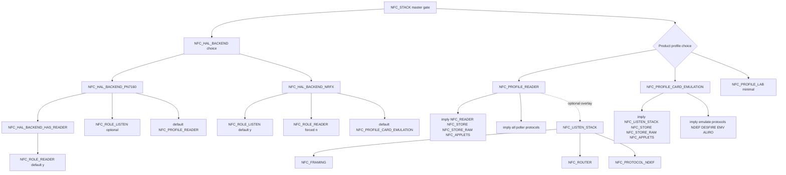

# NFC Kconfig Architecture Plan

**Branch:** `nfc-stack`  
**Status:** Phase 1 implemented (all three profiles) + partial Phase 2 (overlays slimmed in place). See [Implemented](#implemented) below.  
**Authority:** [`NFC_STACK_CONVENTIONS.md`](../NFC_STACK_CONVENTIONS.md) · [`nfc_config.h`](../../src/nfc/nfc_config.h)

---

## Implemented

Landed on `nfc-stack`. Phase 1 (`imply` chains) plus the in-place overlay trim
from Phase 2 (filenames kept; renames deferred).

### What landed

- **`NFC_PROFILE` choice** in `src/nfc/Kconfig` (under `if NFC_STACK`):
  - `NFC_PROFILE_READER` — `imply`s `NFC_READER`, `NFC_STORE`, `NFC_STORE_RAM`,
    `NFC_APPLETS`, and **all** poller protocols (NDEF, Ultralight, Classic,
    FeliCa, ISO15693-3, SLIX, DESFire, EMV, Aliro). Does **not** imply the
    listen stack.
  - `NFC_PROFILE_CARD_EMULATION` — `imply`s `NFC_LISTEN_STACK`, `NFC_STORE`,
    `NFC_STORE_RAM`, and the emulatable listener subset (NDEF, Ultralight,
    DESFire, EMV, Aliro). Implemented in full (not stubbed).
  - `NFC_PROFILE_LAB` — HAL + role scaffold only; no reader engine, store,
    applets, or protocols.
  - Smart defaults: `NFC_PROFILE_READER` if `NFC_HAL_BACKEND_PN7160 &&
    !NFC_ROLE_LISTEN`; `NFC_PROFILE_CARD_EMULATION` if `NFC_HAL_BACKEND_NRFX`;
    else `NFC_PROFILE_LAB`.
- **`NFC_STORE select CRC`** — store envelope `crc16_ccitt` dependency is now
  implicit; overlays no longer set `CONFIG_CRC=y`.
- **`nfc_config.h`** — added `NFC_IS_PROFILE_READER` / `NFC_IS_PROFILE_CE` /
  `NFC_IS_PROFILE_LAB`.
- **Overlays slimmed** (same filenames):
  - `overlay-pn7160-stack.conf` → `CONFIG_NFC_PROFILE_READER=y` (+ board deps,
    `NFC_ROLE_LISTEN=n`). Dropped 8 manual store/protocol/applet/shell lines.
  - `overlay-pn7160-hal.conf` → `CONFIG_NFC_PROFILE_LAB=y` (reader role on,
    reader engine off; added `EMUL`/`NRFXLIB=n`/`DK_LIBRARY=n` for self-contained
    QEMU builds).
  - `overlay-nfct-stack.conf` → `CONFIG_NFC_PROFILE_CARD_EMULATION=y`. Dropped
    the per-protocol + store + applet lines.
  - `overlay-pn7160-listen.conf` → unchanged role flip (`NFC_ROLE_LISTEN=y` +
    `NFC_LISTEN_STACK=y`); layers on the reader profile.
- **Pre-existing compile bugs fixed** (surfaced once profiles built standalone
  with `SHELL=y`, never compiled before):
  - `nfc_applet.h`: include `nfc_stack.h` and declare `nfc_applet_emulate`
    unconditionally (the definition already returns `-ENOTSUP` when listen off),
    so the reader-only profile compiles.
  - `nfc_applet_shell_cmds.c`: `store_flags` → `flags` typo.
  - `nfc_store_ram.h`: forward-declare `struct shell` so shell prototypes don't
    bind a prototype-scope tag when included before `<zephyr/shell/shell.h>`.

### Verification (NCS v3.2.4, Zephyr `zephyr` toolchain)

| Build / test | Platform | Result |
|--------------|----------|--------|
| `tests/unit/nfc_reader` (store + store_ram) | qemu_cortex_m3 | PASS (97 cases) |
| `tests/unit/nfc_ndef` (model/poller/listener) | qemu_cortex_m3 | PASS (87 cases) |
| `overlay-pn7160-stack.conf` (reader) | qemu_cortex_m3 | builds; all pollers implied, listen absent |
| `overlay-pn7160-stack.conf;overlay-pn7160-listen.conf` | qemu_cortex_m3 | builds; reader + listen stack |
| `overlay-pn7160-hal.conf` (lab) | qemu_cortex_m3 | builds; reader engine off, role on |
| `overlay-nfct-stack.conf` (CE) | nrf54l15dk/nrf54l15/cpuapp (sysbuild) | builds; CE protocol subset, reader off |

### Still open

- **Phase 2 renames** — overlay files keep historical names
  (`overlay-nfc-reader.conf` etc. not yet introduced); docs still reference old
  names.
- **Phase 3 test unification** — `tests/unit/nfc_reader/Kconfig` still duplicates
  the protocol/store tree instead of `rsource`-ing production Kconfig;
  `NFC_TEST_VIRTUAL_HAL` not added.
- **Optional single-toggle bundles** — `NFC_PROTOCOLS_READER_ALL` /
  `NFC_PROTOCOLS_EMULATE_ALL` not added (per-protocol `imply` used directly).

---

## Executive summary

Today, enabling NFC requires manually setting **15–20 symbols** across layered overlays (`overlay-pn7160-stack.conf`, `overlay-pn7160-listen.conf`, `overlay-nfct-stack.conf`). Roles, orchestrators, protocols, store, and applets are independent bools with `default n`, so nothing composes from HAL choice alone.

**Target:** One master gate (`NFC_STACK`) plus HAL/profile choice. Backend `select`/`imply` chains pull in roles, orchestrators, protocols, store, and shell helpers. Overlays shrink to **board/HW + one profile fragment**. Unit tests inherit production Kconfig via `rsource` instead of duplicating symbol definitions.

---

## 1. Current vs proposed

| Aspect | Current | Proposed |
|--------|---------|----------|
| Entry point | `NFC_STACK=y` + manual HAL choice + manual role/orchestrator/protocol toggles | `NFC_STACK=y`; HAL choice defaults from DT (`PN7160`, `NFC_T4T_NRFXLIB`) |
| Reader product | 12+ symbols in `overlay-pn7160-stack.conf` | `overlay-nfc-reader.conf` → ~4 symbols (stack + profile + board deps) |
| CE / emulate | `overlay-pn7160-listen.conf` or `overlay-nfct-stack.conf` with duplicated protocol list | Profile `imply` listen stack + emulate-capable protocols |
| Protocols | 9 independent `NFC_PROTOCOL_*` bools, all `default n` | Profile-gated: reader profile `imply`s all poller protocols; NFCT profile `imply`s listener-capable subset |
| Store / applets | Explicit `NFC_STORE`, `NFC_STORE_RAM`, `NFC_APPLETS` | `imply` from product profiles; RAM backend default `y` on product builds |
| Tests | Per-suite duplicated Kconfig (e.g. `tests/unit/nfc_reader/Kconfig` redefines 40+ symbols) | `rsource` production tree + `NFC_TEST_PROFILE` stub HAL |
| Shell helpers | Each module: separate `*_SHELL=y` in overlay | `default y if SHELL` (already mostly true); no overlay lines |

---

## 2. Current pain points

### 2.1 Redundant manual symbols

`overlay-pn7160-stack.conf` sets symbols that should follow from “PN7160 reader product”:

```
NFC_STACK, NFC_HAL_BACKEND_PN7160, NFC_ROLE_READER, NFC_READER,
NFC_PROTOCOL_NDEF, NFC_STORE, NFC_STORE_RAM, NFC_APPLETS, *_SHELL
```

`NFC_ROLE_READER` already defaults `y` when `NFC_HAL_BACKEND_HAS_READER`, yet overlays set it explicitly. `NFC_READER` defaults `n` despite reader role being on — user must know the extra toggle.

`overlay-nfct-stack.conf` lists four emulate protocols individually plus store, applets, listen stack — all logically “NFCT emulate product”.

### 2.2 Role vs orchestrator confusion

Three layers for “can read tags”:

1. `NFC_ROLE_READER` (HAL compile path, poller `.c` files)
2. `NFC_READER` (discovery engine + shell)
3. Each `NFC_PROTOCOL_*` (data model + poller)

Users must enable all three. `NFC_APPLETS` depends on `NFC_READER && NFC_STORE` but not on protocols — applets compile but fail at runtime if protocols missing.

### 2.3 Overlay duplication

| Symbol group | pn7160-stack | pn7160-listen | nfct-stack |
|--------------|-------------|---------------|------------|
| `NFC_STACK` | y | (inherits) | y |
| Store + RAM | y | — | y |
| Applets + shell | y | — | y |
| Listen stack | n (explicit) | y | y |
| Protocols (emulate) | NDEF only | (inherits NDEF via listen stack) | NDEF+DESFIRE+EMV+ALIRO |
| Reader orchestrator | y | — | n |

Listen overlay adds only 3 symbols but relies on stack overlay for everything else — fragile ordering via `EXTRA_CONF_FILE` concatenation.

### 2.4 Test vs production divergence

- `tests/unit/nfc_reader/Kconfig` **redefines** the entire protocol + store tree (155 lines) instead of `rsource "../../../src/nfc/Kconfig"`.
- Protocol unit tests (`nfc_ndef`, `nfc_emv`, …) define **local** capacity symbols and `*_TEST_TIER_*` gates; production Kconfig lives elsewhere.
- `nfc_reader` tests compile sources directly in `CMakeLists.txt` — no `NFC_STACK`, no HAL — `NFC_ROLE_LISTEN=y` is a stub for policy code only.
- Production defaults differ from test defaults (e.g. `NFC_DESFIRE_MAX_APPS`: prod 4, test 1).

### 2.5 Implicit HAL capabilities not wired

`NFC_HAL_BACKEND_PN7160` `select`s `NFC_HAL_BACKEND_HAS_READER` but does **not** `imply` `NFC_READER`, protocols, or store. `NFC_HAL_BACKEND_NRFX` does not `imply` listen stack, framing, router, or emulate protocols. `NFC_LISTEN_STACK` correctly `select`s framing/router/NDEF but is off by default even when `NFC_ROLE_LISTEN=y`.

---

## 3. Proposed Kconfig tree

### 3.1 Design principles

1. **HAL implies capability, profile implies product** — backend choice sets role *ceiling*; product profile sets orchestrators + protocols + store.
2. **Protocols stay individually disable-able** — for size-constrained builds, override with `# CONFIG_NFC_PROTOCOL_CLASSIC is not set`; defaults come from profile `imply`, not `select`.
3. **Shell symbols never appear in overlays** — `default y if SHELL` everywhere.
4. **Capacity ints stay explicit only when tuning** — sensible defaults in Kconfig; tests override via small `prj.conf` fragments.
5. **Tests use same Kconfig tree** — stub HAL behind `NFC_TEST_VIRTUAL_HAL`.

### 3.2 Target hierarchy (mermaid)



### 3.3 New / renamed symbols (Phase 1+)

| Symbol | Type | Purpose |
|--------|------|---------|
| `NFC_PROFILE_READER` | choice member | PN7160 read/clone/verify product |
| `NFC_PROFILE_CARD_EMULATION` | choice member | Listen + emulate (PN7160 CE or NFCT) |
| `NFC_PROFILE_LAB` | choice member | HAL + stack scaffolding only (today's `overlay-pn7160-hal.conf`) |
| `NFC_PROTOCOLS_READER_ALL` | bool (optional) | Single toggle for all poller protocols; `imply` per-protocol |
| `NFC_PROTOCOLS_EMULATE_ALL` | bool (optional) | Single toggle for listener-capable protocols |
| `NFC_TEST_VIRTUAL_HAL` | bool | Test-only: skip real HAL, satisfy role symbols |

Existing symbols **kept** but demoted to override tier: individual `NFC_PROTOCOL_*`, capacity ints, `NFC_ROLE_*` (advanced).

### 3.4 `select` vs `imply` rules

| From | Use | Targets |
|------|-----|---------|
| `NFC_HAL_BACKEND_PN7160` | `select` | `NFC_HAL_BACKEND_HAS_READER` (already) |
| `NFC_HAL_BACKEND_NRFX` | `select` | `NFC_ROLE_LISTEN`; `depends` block prevents `NFC_ROLE_READER` |
| `NFC_PROFILE_READER` | `imply` | `NFC_READER`, `NFC_STORE`, `NFC_STORE_RAM`, `NFC_APPLETS`, all `NFC_PROTOCOL_*` poller protocols |
| `NFC_PROFILE_CARD_EMULATION` | `imply` | `NFC_LISTEN_STACK`, `NFC_STORE`, `NFC_STORE_RAM`, `NFC_APPLETS`, emulate protocols |
| `NFC_LISTEN_STACK` | `select` | `NFC_FRAMING`, `NFC_ROUTER`, `NFC_PROTOCOL_NDEF` (already) |
| `NFC_READER` | `imply` | `NFC_PROTOCOL_NDEF` when store (already `select` if `NFC_STORE`) |
| `NFC_PROTOCOL_ULTRALIGHT` | `select` | `NFC_PROTOCOL_NDEF` (already) |
| `NFC_PROTOCOL_SLIX` | `select` | `NFC_PROTOCOL_ISO15693_3` (already) |

### 3.5 What stays explicit

| Symbol | Why explicit |
|--------|--------------|
| `NFC_STACK` | Master gate — sample app stays NFCT-only without it |
| `PN7160` / `NFC_T4T_NRFXLIB` | Hardware / Zephyr stack — outside our tree |
| Capacity ints (`NFC_NDEF_MAX_SIZE`, `NFC_DESFIRE_*`, …) | Product tuning, test minimization |
| `# CONFIG_NFC_PROTOCOL_* is not set` | Size-constrained firmware |
| `NFC_ROLE_LISTEN=n` on reader-only PN7160 | Saves NET_BUF + APDU pool until CE needed |
| `NFC_ALIRO_PROTOCOL_VERIFIED` | Opt-in spec verification |
| `NFC_CLASSIC_TEST_DETERMINISTIC_NR` | Test-only deterministic crypto |
| Board overlays (I2C/SPI/GPIO, EMUL) | Hardware, not NFC logic |

---

## 4. Overlay simplification

### 4.1 Target overlays

| New overlay | Replaces | Contents (target) |
|-------------|----------|-------------------|
| `overlay-nfc-reader.conf` | `overlay-pn7160-stack.conf` | `NFC_STACK`, `PN7160`, profile reader, board deps (I2C/GPIO/SHELL), `NFC_ROLE_LISTEN=n` |
| `overlay-nfc-emulate-pn7160.conf` | `overlay-pn7160-stack.conf` + `overlay-pn7160-listen.conf` | reader overlay + `NFC_LISTEN_STACK=y` (or CE profile) |
| `overlay-nfc-emulate-nfct.conf` | `overlay-nfct-stack.conf` | `NFC_STACK`, `NFC_T4T_NRFXLIB`, profile CE |
| `overlay-nfc-hal-lab.conf` | `overlay-pn7160-hal.conf` | `NFC_STACK`, `PN7160`, `NFC_PROFILE_LAB` |

Keep unchanged (HW, not NFC profile):

- `overlay-pn7160.conf` — PN7160 driver only (no stack)
- `overlay-pn7160-spi.conf` — SPI transport deps
- `boards/overlays/pn7160_*.overlay` — devicetree

### 4.2 Migration table

| Deprecated | Successor | Notes |
|------------|-----------|-------|
| `overlay-pn7160-stack.conf` | `overlay-nfc-reader.conf` | Drop explicit protocol/store/applet lines |
| `overlay-pn7160-listen.conf` | `overlay-nfc-emulate-pn7160.conf` or `-DCONFIG_NFC_LISTEN_STACK=y` | Single file preferred |
| `overlay-nfct-stack.conf` | `overlay-nfc-emulate-nfct.conf` | Drop per-protocol lines |
| `overlay-pn7160-hal.conf` | `overlay-nfc-hal-lab.conf` | Rename only |
| `EXTRA_CONF_FILE="A;B"` ordering | One profile overlay | Reduces concat fragility |

### 4.3 Example target: reader overlay (Phase 2)

```ini
# overlay-nfc-reader.conf — PN7160 read/clone/verify product
CONFIG_I2C=y
CONFIG_GPIO=y
CONFIG_EMUL=y
CONFIG_PN7160=y
CONFIG_SHELL=y
CONFIG_NFC_STACK=y
CONFIG_NFC_PROFILE_READER=y
CONFIG_NFC_ROLE_LISTEN=n
CONFIG_NFC_T4T_NRFXLIB=n
CONFIG_CRC=y
```

Everything else implied by profile.

---

## 5. Testing impact

### 5.1 Kconfig sourcing strategy

| Test tier | Kconfig source | HAL |
|-----------|----------------|-----|
| Protocol model (Tier A) | `rsource` production protocol Kconfig **or** minimal local int symbols | None |
| Protocol poller/listener (Tier B/C) | `rsource "../../../../src/nfc/Kconfig"` + `NFC_TEST_VIRTUAL_HAL=y` | Virtual / loopback |
| Applet / store (Tier E, `nfc_reader`) | Full production tree + test profile | Stub listen role |
| PN7160 TML (module) | Module Kconfig only | EMUL + DT overlay |
| QEMU product smoke | Production profile overlay | EMUL PN7160 |

**Action:** Replace `tests/unit/nfc_reader/Kconfig` duplicate tree with:

```kconfig
source "Kconfig.zephyr"
rsource "../../../src/nfc/Kconfig"
config NFC_TEST_VIRTUAL_HAL
    bool
    default y
```

CMake already lists sources explicitly — Phase 3 aligns CMake with `CONFIG_NFC_PROTOCOL_*` from unified Kconfig instead of unconditional source lists.

### 5.2 `NFC_TEST_PROFILE` (proposed)

```kconfig
choice NFC_TEST_PROFILE
    prompt "NFC unit test profile"
    depends on TEST

config NFC_TEST_PROFILE_MODEL
    bool "Model-only (no HAL)"
config NFC_TEST_PROFILE_VIRTUAL
    bool "Virtual HAL loopback"
config NFC_TEST_PROFILE_PRODUCTION
    bool "Mirror production Kconfig"
endchoice
```

Twister sets `CONF_FILE=prj_virtual.conf` with one line: `CONFIG_NFC_TEST_PROFILE_VIRTUAL=y`.

### 5.3 Twister scenario reduction

| Today | Proposed |
|-------|----------|
| `nfc_reader` + `overlay-store-ram.conf` permutation | Profile implies RAM; test overlay only sets `NFC_STORE_RAM_SLOT_COUNT=2` |
| Per-protocol `prj_poller.conf` / `prj_listener.conf` | Shared `tests/unit/common/prj_nfc_virtual.conf` + tier bool |
| 3 conf files × 8 protocol suites | 1 base + `CONF_FILE` tier fragment (keep tier split, drop duplicated ints) |
| No QEMU NFCT | Keep — NFCT stays HIL; virtual loopback covers listener tiers |

### 5.4 QEMU profiles per HAL

| Platform | HAL | Overlay |
|----------|-----|---------|
| `qemu_cortex_m3` + emul DTS | PN7160 | `overlay-nfc-reader.conf` + `boards/overlays/pn7160_unit_test.overlay` |
| `native_sim` | Virtual | `NFC_TEST_VIRTUAL_HAL` |
| `nrf54l15dk` HIL | PN7160 or NFCT | `overlay-nfc-reader.conf` or `overlay-nfc-emulate-nfct.conf` |

---

## 6. Migration phases

### Phase 0 — Document (this file) ✓

Inventory, pain points, target tree, migration table. No code changes.

### Phase 1 — `imply` chains (low-risk)

1. Add `NFC_PROFILE_*` choice under `src/nfc/Kconfig` (defaults tied to HAL backend).
2. `imply` orchestrators + store from profiles.
3. `imply` protocol bundles from profiles.
4. Change `NFC_READER` default to `y` when `NFC_PROFILE_READER`.
5. NFCT backend: `imply NFC_PROFILE_CARD_EMULATION`.
6. Update `nfc_config.h` with `NFC_PROFILE_*` macros.
7. Trim overlays to profile lines; keep deprecated overlays as aliases forwarding to new names.

**Zero-risk trivial fix (optional now):** `NFC_READER` `default y if NFC_ROLE_READER` — matches user expectation without profile symbol.

### Phase 2 — Overlay rename

1. Add new overlay files; deprecate old names (comment + doc redirect).
2. Update `docs/nfc/NFC_HAL_GUIDE.md`, `nfc_config.h` header comments, CI build commands.
3. Single-file `EXTRA_CONF_FILE` for each product path.

### Phase 3 — Test unification

1. Collapse duplicated test Kconfig → `rsource` production tree.
2. Introduce `NFC_TEST_VIRTUAL_HAL` + shared `tests/unit/common/nfc_test.conf`.
3. Refactor `nfc_reader/CMakeLists.txt` to use `zephyr_library` or generator expressions tied to `CONFIG_NFC_PROTOCOL_*`.
4. Align test/production default capacities; tests override only deltas in `prj.conf`.

---

## 7. Top 5 symbols to eliminate from overlays

| # | Symbol | Reason |
|---|--------|--------|
| 1 | `CONFIG_NFC_READER` | Implied by PN7160 reader profile + `NFC_ROLE_READER` |
| 2 | `CONFIG_NFC_PROTOCOL_NDEF` | Implied by reader profile, listen stack, or store |
| 3 | `CONFIG_NFC_STORE` + `CONFIG_NFC_STORE_RAM` | Implied by product profiles (reader + CE) |
| 4 | `CONFIG_NFC_APPLETS` + `CONFIG_NFC_APPLETS_SHELL` | Implied by product profiles with shell |
| 5 | Per-protocol emulate toggles in NFCT overlay (`DESFIRE`, `EMV`, `ALIRO`) | Implied by `NFC_PROFILE_CARD_EMULATION` bundle |

**Honorable mention:** `CONFIG_NFC_ROLE_READER=y` (already default), `CONFIG_NFC_LISTEN_STACK=y` (implied by CE profile), all `*_SHELL=y` lines.

---

## 8. Next implementation step

**Start Phase 1 with a single profile symbol and imply chain** — smallest vertical slice:

1. Add `config NFC_PROFILE_READER` bool (or choice member) in `src/nfc/Kconfig`.
2. When set: `imply NFC_READER`, `imply NFC_STORE`, `imply NFC_STORE_RAM`, `imply NFC_APPLETS`, `imply NFC_PROTOCOL_NDEF`, `imply NFC_PROTOCOL_ULTRALIGHT`, … (all poller protocols).
3. `default y if NFC_HAL_BACKEND_PN7160 && !NFC_ROLE_LISTEN` — auto-enables on PN7160 reader builds without overlay churn.
4. Convert `overlay-pn7160-stack.conf` to profile-based form; run existing Twister `nfc_reader` + QEMU smoke to verify.
5. Only then add `NFC_PROFILE_CARD_EMULATION` for NFCT path.

Do **not** batch all profiles and test migration in one PR — imply chains are easier to review per profile.

---

## 9. Phase 1 PR checklist

Single PR scope: **reader profile only** (`NFC_PROFILE_READER`). No test `rsource`, no overlay renames, no CE profile.

### 9.1 Kconfig symbols to add

| Symbol | File | Definition |
|--------|------|------------|
| `NFC_PROFILE` | `src/nfc/Kconfig` | `choice` under `if NFC_STACK` |
| `NFC_PROFILE_READER` | same | `bool` member; `default y if NFC_HAL_BACKEND_PN7160 && !NFC_ROLE_LISTEN` |
| `NFC_PROFILE_CARD_EMULATION` | same | `bool` member; **stub only** — no `imply` chain in PR 1 |
| `NFC_PROFILE_LAB` | same | `bool` member; `default y if NFC_HAL_BACKEND_PN7160 && !NFC_PROFILE_READER && !NFC_PROFILE_CARD_EMULATION` (HAL-scaffold builds) |

### 9.2 Imply chains (PR 1 — reader profile only)

Add to `NFC_PROFILE_READER` in `src/nfc/Kconfig`:

```
imply NFC_READER
imply NFC_STORE
imply NFC_STORE_RAM
imply NFC_APPLETS
imply NFC_PROTOCOL_NDEF
imply NFC_PROTOCOL_ULTRALIGHT
imply NFC_PROTOCOL_CLASSIC
imply NFC_PROTOCOL_FELICA
imply NFC_PROTOCOL_ISO15693_3
imply NFC_PROTOCOL_SLIX
imply NFC_PROTOCOL_DESFIRE
imply NFC_PROTOCOL_EMV
imply NFC_PROTOCOL_ALIRO
```

Do **not** change `NFC_READER` to `default y if NFC_ROLE_READER` in PR 1 — `overlay-pn7160-hal.conf` relies on role-on / reader-off for HAL-lab builds (see §10.1).

### 9.3 Files to edit

| File | Change |
|------|--------|
| `src/nfc/Kconfig` | Add `NFC_PROFILE` choice + reader `imply` block |
| `src/nfc/nfc_config.h` | Add `NFC_IS_PROFILE_READER` / `NFC_IS_PROFILE_CE` / `NFC_IS_PROFILE_LAB` |
| `overlay-pn7160-stack.conf` | Replace manual store/protocol/applet lines with `CONFIG_NFC_PROFILE_READER=y`; keep `CONFIG_NFC_ROLE_LISTEN=n` explicit |
| `overlay-pn7160-hal.conf` | Add `CONFIG_NFC_PROFILE_LAB=y`; keep `# CONFIG_NFC_READER is not set` |
| `docs/nfc/NFC_HAL_GUIDE.md` | One-line overlay pointer to profile names |

**Out of scope PR 1:** `overlay-nfct-stack.conf`, `tests/unit/nfc_reader/Kconfig`, overlay renames, `NFC_TEST_VIRTUAL_HAL`.

### 9.4 Overlay before / after (`overlay-pn7160-stack.conf`)

**Before (22 lines of NFC logic):**

```ini
CONFIG_NFC_STACK=y
CONFIG_NFC_HAL_BACKEND_PN7160=y
CONFIG_NFC_ROLE_READER=y
CONFIG_NFC_READER=y
CONFIG_NFC_READER_SHELL=y
CONFIG_NFC_PROTOCOL_NDEF=y
CONFIG_NFC_STORE=y
CONFIG_NFC_STORE_RAM=y
CONFIG_NFC_APPLETS=y
CONFIG_NFC_APPLETS_SHELL=y
CONFIG_NFC_ROLE_LISTEN=n
```

**After (target):**

```ini
CONFIG_NFC_STACK=y
CONFIG_NFC_HAL_BACKEND_PN7160=y
CONFIG_NFC_PROFILE_READER=y
CONFIG_NFC_ROLE_LISTEN=n
```

Shell `*_SHELL` lines drop — already `default y if SHELL`.

### 9.5 Verification (must pass before merge)

```bash
# Unit — unchanged permutations
west twister -T tests/unit/nfc_reader -t ci_unit -p qemu_cortex_m3 --no-sysbuild -v
west twister -T tests/unit/nfc_ndef -t ci_unit -p qemu_cortex_m3 --no-sysbuild -v

# Product compile — reader + HAL-lab + NFCT (NFCT must not pick reader profile)
west build -b qemu_cortex_m3/ti_lm3s6965 . --no-sysbuild \
  -DEXTRA_CONF_FILE=overlay-pn7160-stack.conf
west build -b qemu_cortex_m3/ti_lm3s6965 . --no-sysbuild \
  -DEXTRA_CONF_FILE=overlay-pn7160-hal.conf
west build -b nrf54l15dk/nrf54l15/cpuapp . --sysbuild \
  -DEXTRA_CONF_FILE=overlay-nfct-stack.conf

# menuconfig spot-check: NFC_PROFILE_READER on → all poller protocols implied, not forced
```

---

## 10. Migration risks

### 10.1 Imply too aggressively — what breaks

| Risk | Trigger | Symptom | Mitigation |
|------|---------|---------|------------|
| HAL-lab bloat | `NFC_READER default y if NFC_ROLE_READER` | `overlay-pn7160-hal.conf` pulls reader engine + protocols | Use `NFC_PROFILE_LAB` instead; never role→reader default |
| NFCT gets reader protocols | `NFC_PROFILE_READER default y if PN7160` without `!NFC_ROLE_LISTEN` / backend guard | NFCT overlay inherits poller `.c` files → link errors or `-ENOTSUP` dead code | Profile defaults tied to `NFC_HAL_BACKEND_*`; CE profile in PR 2 |
| Size regression | `imply` all protocols on minimal SKU | Flash/RAM over budget | Protocols use `imply` not `select`; product overlay can `# CONFIG_NFC_PROTOCOL_* is not set` |
| Test divergence | Collapsing test Kconfig before profiles stable | `nfc_reader` unit suite picks wrong capacities | Defer `rsource` to Phase 3; PR 1 leaves `tests/unit/nfc_reader/Kconfig` untouched |
| Applet without protocol | `NFC_APPLETS imply` before `NFC_PROTOCOL_NDEF imply` | Compile OK, runtime applet failure | Order implies: store → protocols → applets; reader profile bundles all pollers |
| Listen on reader-only | `NFC_PROFILE_READER` accidentally `imply NFC_LISTEN_STACK` | NET_BUF + APDU pool on reader-only PN7160 | Reader profile must **not** imply listen; CE is separate profile |
| Deprecated overlay ordering | Removing symbols from `pn7160-stack` before aliases exist | `EXTRA_CONF_FILE="A;B"` concat breaks mid-migration | PR 1 trims symbols but keeps filename; rename in Phase 2 |

### 10.2 Safe vs unsafe one-liners

| Change | Safe now? | Reason |
|--------|-----------|--------|
| `NFC_READER default y if NFC_ROLE_READER` | **No** | Breaks `overlay-pn7160-hal.conf` contract |
| `NFC_READER default y if NFC_PROFILE_READER` | **Yes** (with profile symbol) | HAL-lab uses `NFC_PROFILE_LAB` → reader stays off |
| `NFC_STORE_RAM default y if NFC_STORE` | **Maybe** | Audit test `overlay-store-ram.conf` permutation first |
| Full CE profile imply chain | **No** — PR 2 | NFCT overlay has distinct protocol subset |

---

## 11. Recommendation — Kconfig Phase 1 vs HIL Gate 2

| When | What | Rationale |
|------|------|-----------|
| **Now (parallel)** | HIL Gate 2 sign-off on **current** `overlay-pn7160-stack.conf` | Product validation should not wait on build ergonomics; known overlay is the HIL baseline |
| **After Gate 2 HIL green** | Kconfig Phase 1 PR (§9) | Clone path proven on hardware; profile refactor won't confound HIL failure triage |
| **After Gate 4/5 HIL green** | Phase 2 overlay renames + Phase 3 test `rsource` | CE/NFCT overlays need `NFC_PROFILE_CARD_EMULATION`; test tree unification is higher churn |

**Do not** land full profile + test migration in the same PR as HIL fixes. **Do** land Phase 1 before Phase 2 overlay renames so deprecated files can forward `CONFIG_NFC_PROFILE_READER=y` internally.

---

## Appendix A — Complete symbol inventory

Legend: **Implicit?** = should be implied by HAL/profile in target architecture.

### A.1 Stack root (`src/nfc/Kconfig`, `src/nfc/run/Kconfig`)

| Symbol | Location | Depends on | Default | Purpose | Implicit? |
|--------|----------|------------|---------|---------|-----------|
| `NFC_STACK` | `src/nfc/Kconfig` | — | n | Master gate for entire NFC tree | **No** — explicit product choice |
| `NFC_APDU_BUF_SIZE` | `src/nfc/Kconfig` | `NFC_STACK` | 512 | Listen-path net_buf size | Yes — default ok |
| `NFC_APDU_POOL_COUNT` | `src/nfc/Kconfig` | `NFC_STACK` | 4 | Listen-path pool depth | Yes |
| `NFC_STACK_WORKQ_STACK_SIZE` | `src/nfc/run/Kconfig` | `NFC_STACK` | 2048 | Shared WQ stack | Yes |
| `NFC_STACK_WORKQ_PRIORITY` | `src/nfc/run/Kconfig` | `NFC_STACK` | 5 | Shared WQ priority | Yes |

### A.2 HAL (`src/nfc/hal/Kconfig`)

| Symbol | Location | Depends on | Default | Purpose | Implicit? |
|--------|----------|------------|---------|---------|-----------|
| `NFC_HAL_BACKEND` | `src/nfc/hal/Kconfig` | `NFC_STACK` | PN7160 if DT / NRFX if T4T | Backend choice | **No** — auto from DT |
| `NFC_HAL_BACKEND_HAS_READER` | `src/nfc/hal/Kconfig` | — | — | Hidden; reader-capable HAL | Yes — `select` from PN7160 |
| `NFC_HAL_BACKEND_PN7160` | `src/nfc/hal/Kconfig` | `PN7160` | choice default if PN7160 | PN7160 NCI transport | **No** — follows DT |
| `NFC_HAL_BACKEND_NRFX` | `src/nfc/hal/Kconfig` | `NFC_T4T_NRFXLIB` | choice default if T4T | NFCT nrfxlib transport | **No** — follows Zephyr |
| `NFC_ROLE_READER` | `src/nfc/hal/Kconfig` | `NFC_STACK && HAS_READER` | y | Compile reader role / pollers | Yes on PN7160 reader |
| `NFC_ROLE_LISTEN` | `src/nfc/hal/Kconfig` | `NFC_STACK` | y | Compile listen role / listeners | Yes on CE; **No** on reader-only |
| `NFC_HAL_SHELL` | `src/nfc/hal/Kconfig` | `NFC_STACK && SHELL` | y | `nfc_transport` shell | Yes |

### A.3 Reader (`src/nfc/reader/Kconfig`)

| Symbol | Location | Depends on | Default | Purpose | Implicit? |
|--------|----------|------------|---------|---------|-----------|
| `NFC_READER` | `src/nfc/reader/Kconfig` | `NFC_STACK && NFC_ROLE_READER` | n | Reader engine + scan/clone | **Yes** — profile reader |
| `NFC_READER_SHELL` | `src/nfc/reader/Kconfig` | `NFC_READER && SHELL` | y | `nfc reader` shell | Yes |
| `NFC_READER_SCAN_TIMEOUT_MS` | `src/nfc/reader/Kconfig` | `NFC_READER` | 10000 | Scan timeout | Yes |

### A.4 Listen stack (`src/nfc/nfc_stack/Kconfig`)

| Symbol | Location | Depends on | Default | Purpose | Implicit? |
|--------|----------|------------|---------|---------|-----------|
| `NFC_LISTEN_STACK` | `src/nfc/nfc_stack/Kconfig` | `NFC_STACK && NFC_ROLE_LISTEN` | n | Orchestrator: framing+router+NDEF | **Yes** — CE profile |
| `NFC_STACK_DEFAULT_PROFILE` | `src/nfc/nfc_stack/Kconfig` | `NFC_LISTEN_STACK` | 1 | Default `nfc_profile_t` | Yes |
| `NFC_LISTEN_STACK_SHELL` | `src/nfc/nfc_stack/Kconfig` | `NFC_LISTEN_STACK && SHELL` | y | `nfc stack` shell | Yes |

### A.5 Framing / router

| Symbol | Location | Depends on | Default | Purpose | Implicit? |
|--------|----------|------------|---------|---------|-----------|
| `NFC_FRAMING` | `src/nfc/framing/Kconfig` | `NFC_STACK && NFC_ROLE_LISTEN` | n | APDU parse/dispatch | Yes — via listen stack |
| `NFC_APDU_EXTENDED_SUPPORT` | `src/nfc/framing/Kconfig` | `NFC_FRAMING` | n | Extended APDU | Yes — default n ok |
| `NFC_ROUTER` | `src/nfc/router/Kconfig` | `NFC_STACK && NFC_ROLE_LISTEN` | n | AID router | Yes — via listen stack |
| `NFC_ROUTER_MAX_AIDS` | `src/nfc/router/Kconfig` | `NFC_ROUTER` | 8 | Max registered AIDs | Yes |

### A.6 Store (`src/nfc/store/Kconfig`)

| Symbol | Location | Depends on | Default | Purpose | Implicit? |
|--------|----------|------------|---------|---------|-----------|
| `NFC_STORE` | `src/nfc/store/Kconfig` | `NFC_STACK` | n | Card blob envelope | **Yes** — product profiles |
| `NFC_STORE_BLOB_SIZE` | `src/nfc/store/Kconfig` | `NFC_STORE` | 4096 | Serialize staging buffer | Yes — override in tests |
| `NFC_STORE_MAX_TAG_LEN` | `src/nfc/store/Kconfig` | `NFC_STORE` | 16 | Max slot name length | Yes |
| `NFC_STORE_RAM` | `src/nfc/store/Kconfig` | `NFC_STORE` | n | RAM slot backend | **Yes** — product profiles |
| `NFC_STORE_RAM_SLOT_COUNT` | `src/nfc/store/Kconfig` | `NFC_STORE_RAM` | 4 | RAM slots | Yes — tests use 2 |
| `NFC_STORE_RAM_SHELL` | `src/nfc/store/Kconfig` | `NFC_STORE_RAM && SHELL` | y | RAM store shell | Yes |
| `NFC_STORE_GOLDENS` | `src/nfc/store/Kconfig` | `NFC_STORE_RAM` | y | Compiled-in golden blobs | Yes — off in tests |

### A.7 Applets (`src/nfc/applets/Kconfig`)

| Symbol | Location | Depends on | Default | Purpose | Implicit? |
|--------|----------|------------|---------|---------|-----------|
| `NFC_APPLETS` | `src/nfc/applets/Kconfig` | `NFC_READER && NFC_STORE` | y | Product applets | **Yes** — but needs imply chain |
| `NFC_APPLETS_SHELL` | `src/nfc/applets/Kconfig` | `NFC_APPLETS && SHELL` | y | `nfc scan/read/emulate/…` | Yes |

### A.8 Protocols

| Symbol | Location | Depends on | Default | Purpose | Implicit? |
|--------|----------|------------|---------|---------|-----------|
| `NFC_PROTOCOL_NDEF` | `protocols/ndef/Kconfig` | — | n | NDEF model + poller/listener | **Yes** — reader/CE/store |
| `NFC_NDEF_MAX_SIZE` | `protocols/ndef/Kconfig` | `NFC_PROTOCOL_NDEF` | 500 | Max NDEF payload | No — tunable |
| `NFC_PROTOCOL_ULTRALIGHT` | `protocols/ultralight/Kconfig` | `NFC_STACK` | n | Ultralight poller + T4 adapter | Yes — reader profile |
| `NFC_ULTRALIGHT_MAX_PAGES` | `protocols/ultralight/Kconfig` | `NFC_PROTOCOL_ULTRALIGHT` | 256 | Max pages | No — tunable |
| `NFC_PROTOCOL_CLASSIC` | `protocols/classic/Kconfig` | `NFC_STACK` | n | Classic poller (clone-only) | Yes — reader profile |
| `NFC_CLASSIC_BLOCK_COUNT` | `protocols/classic/Kconfig` | `NFC_PROTOCOL_CLASSIC` | 256 | Max blocks | No — tunable |
| `NFC_CLASSIC_TEST_DETERMINISTIC_NR` | `protocols/classic/Kconfig` | `NFC_PROTOCOL_CLASSIC` | n | Test deterministic NR | No — test only |
| `NFC_PROTOCOL_FELICA` | `protocols/felica/Kconfig` | `NFC_STACK` | n | FeliCa poller | Yes — reader profile |
| `FELICA_BLOCKS_MAX` | `protocols/felica/Kconfig` | `NFC_PROTOCOL_FELICA` | 64 | Max blocks | No — tunable |
| `NFC_PROTOCOL_ISO15693_3` | `protocols/iso15693_3/Kconfig` | `NFC_STACK` | n | ISO15693 poller | Yes — reader profile |
| `ISO15693_BLOCKS_MAX` | `protocols/iso15693_3/Kconfig` | `NFC_PROTOCOL_ISO15693_3` | 256 | Max blocks | No — tunable |
| `ISO15693_BLOCK_SIZE_MAX` | `protocols/iso15693_3/Kconfig` | `NFC_PROTOCOL_ISO15693_3` | 32 | Max block size | No — tunable |
| `NFC_PROTOCOL_SLIX` | `protocols/slix/Kconfig` | `NFC_STACK` | n | SLIX poller | Yes — reader profile |
| `NFC_PROTOCOL_DESFIRE` | `protocols/desfire/Kconfig` | `NFC_STACK` | n | DESFire poller + listener | Yes — reader + CE |
| `NFC_DESFIRE_MAX_APPS` | `protocols/desfire/Kconfig` | `NFC_PROTOCOL_DESFIRE` | 4 | Max apps | No — tunable |
| `NFC_DESFIRE_MAX_FILES_PER_APP` | `protocols/desfire/Kconfig` | `NFC_PROTOCOL_DESFIRE` | 8 | Max files/app | No — tunable |
| `NFC_DESFIRE_MAX_FILE_SIZE` | `protocols/desfire/Kconfig` | `NFC_PROTOCOL_DESFIRE` | 256 | Max file bytes | No — tunable |
| `NFC_DESFIRE_FREE_MEMORY` | `protocols/desfire/Kconfig` | `NFC_PROTOCOL_DESFIRE` | 7520 | GetFreeMemory response | Yes |
| `NFC_PROTOCOL_EMV` | `protocols/emv/Kconfig` | `NFC_STACK` | n | EMV poller + listener | Yes — reader + CE |
| `NFC_EMV_MAX_RECORDS` | `protocols/emv/Kconfig` | `NFC_PROTOCOL_EMV` | 2 | Max records | No — tunable |
| `NFC_EMV_RECORD_SIZE` | `protocols/emv/Kconfig` | `NFC_PROTOCOL_EMV` | 64 | Max record size | No — tunable |
| `NFC_PROTOCOL_ALIRO` | `protocols/aliro/Kconfig` | `NFC_STACK` | n | Aliro poller + listener | Yes — reader + CE |
| `NFC_ALIRO_PROTOCOL_VERIFIED` | `protocols/aliro/Kconfig` | `NFC_PROTOCOL_ALIRO` | n | Spec-verified wire format | No — opt-in |
| `NFC_ALIRO_MAX_TRANSCRIPT` | `protocols/aliro/Kconfig` | `NFC_PROTOCOL_ALIRO` | 512 | Max AUTH transcript | No — tunable |

### A.9 PN7160 module (`modules/nfc_pn7160/zephyr/Kconfig`)

| Symbol | Location | Depends on | Default | Purpose | Implicit? |
|--------|----------|------------|---------|---------|-----------|
| `PN7160` | `modules/nfc_pn7160/...` | `DT_HAS_NXP_PN7160_ENABLED` | y | Driver + NCI | **No** — DT-driven |
| `PN7160_TML_I2C` | module Kconfig | DT bus | auto | I2C TML backend | Yes |
| `PN7160_TML_SPI` | module Kconfig | DT bus | auto | SPI TML backend | Yes |
| `PN7160_INIT_PRIORITY` | module Kconfig | `PN7160` | 80 | Driver init priority | Yes |
| `PN7160_RX_BUF_SIZE` | module Kconfig | `PN7160` | 258 | NCI RX buffer | Yes |
| `PN7160_WORKQ_STACK_SIZE` | module Kconfig | `PN7160` | 1024 | Module WQ (legacy) | Yes |
| `PN7160_WORKQ_PRIORITY` | module Kconfig | `PN7160` | 5 | Module WQ priority | Yes |
| `PN7160_SHELL` | module Kconfig | `PN7160 && SHELL` | y | `pn7160` shell | Yes |
| `PN7160_LOG_LEVEL_*` | logging template | `PN7160` | module default | Log level | Yes |

### A.10 External (Zephyr/NCS — not in repo)

| Symbol | Purpose | Implicit? |
|--------|---------|-----------|
| `NFC_T4T_NRFXLIB` | Enable nrfxlib NFCT T4T | **No** — board/stack choice |
| `DT_HAS_NXP_PN7160_ENABLED` | Devicetree enables PN7160 | Yes — hardware |

### A.11 Test-only symbols (local Kconfig per suite)

| Symbol | Location | Purpose | Implicit? |
|--------|----------|---------|-----------|
| `NFC_NDEF_TEST_TIER_POLLER` | `tests/unit/nfc_ndef/Kconfig` | Build poller tests | No — test gate |
| `NFC_NDEF_TEST_TIER_LISTENER` | `tests/unit/nfc_ndef/Kconfig` | Build listener tests | No |
| `NFC_EMV_TEST_TIER_POLLER` | `tests/unit/nfc_emv/Kconfig` | EMV poller tests | No |
| `NFC_EMV_TEST_TIER_LISTENER` | `tests/unit/nfc_emv/Kconfig` | EMV listener tests | No |
| `NFC_DESFIRE_TEST_TIER_*` | `tests/unit/nfc_desfire/Kconfig` | DESFire tier gates | No |
| `NFC_ALIRO_TEST_TIER_*` | `tests/unit/nfc_aliro/Kconfig` | Aliro tier gates | No |
| `NFC_CLASSIC_TEST_TIER_POLLER` | `tests/unit/nfc_classic/Kconfig` | Classic poller tests | No |
| `NFC_ULTRALIGHT_TEST_TIER_POLLER` | `tests/unit/nfc_ultralight/Kconfig` | Ultralight poller tests | No |
| `NFC_FELICA_TEST_TIER_POLLER` | `tests/unit/nfc_felica/Kconfig` | FeliCa poller tests | No |
| `NFC_SLIX_TEST_TIER_POLLER` | `tests/unit/nfc_slix/Kconfig` | SLIX poller tests | No |
| *(duplicated protocol/store symbols)* | `tests/unit/nfc_reader/Kconfig` | **Should be removed** — use rsource | N/A |

### A.12 Root / sample (`Kconfig`, `prj.conf`)

| Symbol | Location | Purpose | Implicit? |
|--------|----------|---------|-----------|
| `ZMS` | root `Kconfig` | Storage on RRAM/MRAM SoCs | N/A — platform |
| `NVS` | root `Kconfig` | Storage on flash SoCs | N/A — platform |
| `NCS_SAMPLES_DEFAULTS` | `prj.conf` | Sample defaults | N/A |
| `NFC_T4T_NRFXLIB` | `prj.conf` | Legacy sample NFCT path | Separate from NFC_STACK sample |

---

## Appendix B — Current overlay symbol matrix

| Symbol | pn7160.conf | pn7160-hal | pn7160-stack | pn7160-listen | nfct-stack | pn7160-spi |
|--------|-------------|------------|--------------|---------------|------------|------------|
| `PN7160` | y | y | y | — | n | y |
| `NFC_STACK` | — | y | y | — | y | — |
| `NFC_HAL_BACKEND_PN7160` | — | y | y | — | n | — |
| `NFC_HAL_BACKEND_NRFX` | — | — | n | — | y | — |
| `NFC_T4T_NRFXLIB` | — | — | n | — | y | — |
| `NFC_ROLE_READER` | — | y | y | — | n | — |
| `NFC_ROLE_LISTEN` | — | — | n | y | y | — |
| `NFC_READER` | — | — | y | — | — | — |
| `NFC_LISTEN_STACK` | — | — | — | y | y | — |
| `NFC_PROTOCOL_NDEF` | — | — | y | — | y | — |
| `NFC_PROTOCOL_DESFIRE/EMV/ALIRO` | — | — | — | — | y | — |
| `NFC_STORE` / `RAM` | — | — | y | — | y | — |
| `NFC_APPLETS` | — | — | y | — | y | — |

---

## Appendix C — `nfc_config.h` mapping (unchanged macros + proposed)

| Macro | Current Kconfig | After profiles |
|-------|-----------------|----------------|
| `NFC_HAL_IS_PN7160` | `NFC_HAL_BACKEND_PN7160` | same |
| `NFC_HAL_IS_NRFX` | `NFC_HAL_BACKEND_NRFX` | same |
| `NFC_HAS_READER` | `NFC_ROLE_READER` | same |
| `NFC_HAS_LISTEN` | `NFC_ROLE_LISTEN` | same |
| `NFC_HAS_READER_STACK` | `NFC_READER` | same |
| `NFC_HAS_LISTEN_STACK` | `NFC_LISTEN_STACK` | same |
| *(proposed)* `NFC_IS_PROFILE_READER` | — | `NFC_PROFILE_READER` |
| *(proposed)* `NFC_IS_PROFILE_CE` | — | `NFC_PROFILE_CARD_EMULATION` |
