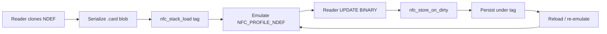

# NFC Stack Architecture — Capability-Driven, Dual-Role, Multi-Backend

**Date:** 2026-06-12 (v3, amended v3.1)
**Project:** writable_ndef_msg (Zephyr / Nordic NCS v3.2.4)
**Status:** High-level architecture of record. Supersedes the framing of the v2 design
spec (`2026-06-08-nfc-emulation-stack-design.md`), which remains valid as the
**card-mode / NFCT first-slice implementation detail**. Detailed wave plans
(`docs/superpowers/plans/wave1..6`) are the first slice of this architecture.

---

## 0. Document Map

This document is the **single architecture-of-record** for the NFC stack.

| Document | Role |
|---|---|
| **This file (v3, 2026-06-12)** | Architecture of record — authoritative entry point for all design decisions |
| `2026-06-08-nfc-emulation-stack-design.md` (v2) | Retained as card-mode / NFCT implementation detail; see subordination banner in that file |
| `wave1-hal.md` | Implementation slice — HAL (nfc_transport) |
| `wave2-framing.md` | Implementation slice — APDU framing |
| `wave3-router.md` | Implementation slice — AID router + lane model |
| `wave4-stack.md` | Implementation slice — stack orchestrator (card role) |
| `wave5-{ndef,ultralight,desfire,emv,aliro}.md` | Implementation slices — protocol modules |
| `wave6-store.md` | Implementation slice — card file format + store |
| `wave7-pn7160-reader.md` | Implementation slice — PN7160 reader backend + capture engine |
| `2026-06-13-implementation-phases.md` | **Locked build order — PN7160 first, then NFCT** |
| `2026-06-13-nfc-final-design.md` | **Master design — final reconciled topology, API stack, waves** |
| `2026-06-13-locked-architecture-summary.md` | Short summary; role detail superseded by final design |
| `2026-06-13-nfct-pn7160-capability-matrix.md` | Per-protocol support matrix + NFCT T2/T4 limits |
| `docs/NFC_STACK_CONVENTIONS.md` | Coding conventions (binding for all waves) |
| `docs/NFC_HAL_AUTHORING_GUIDE.md` | How to write a HAL backend (capability, event bridging, Kconfig/DT, porting checklist) |
| `docs/NFC_WAVE_PLANNING_GUIDE.md` | Wave planning process and template |

---

## 1. Purpose

A Zephyr-native NFC library whose **capabilities are driven by the HAL backend**,
supporting two roles — **card emulation** and **reader/copy** — selectable by
Kconfig, with a **portable card file format** for clone / save / replay and
**live persistence** of writable cards. Three hardware backends are targeted:
**NFCT now** (on-die; primary target **nRF54L15** on product board
`sigmationbaord/nrf54l15/cpuapp` / DK bring-up board
`nrf54l15dk/nrf54l15/cpuapp`; nRF52840 is a valid **secondary** target — the
nrfxlib nfc_t4t_lib/nfc_t2t_lib contract is identical across both SoC families;
card-only), **ST25R3916 second** (via ST RFAL,
reader + card, multi-technology — hardware and driver already in hand), and
**PN7160 third** (external NCI controller). An external controller may be its
own device or a companion chip on the nRF over I²C/SPI.

The design is a **clean-room re-expression** of the architecture proven by the
Flipper Zero NFC stack (`lib/nfc`): same layering (per-protocol data model +
poller + listener, registry tables, base/child technology lanes), our own code.
See §10 for the sourcing discipline.

### 1.1 Clone → Emulate → Persist (FINAL — 2026-06-13)

> **Implementation order (LOCKED):** PN7160 first (Phases 0–2), NFCT port second (Phase 3).
> See [`2026-06-13-implementation-phases.md`](2026-06-13-implementation-phases.md).
>
> **Final design (2026-06-13):** The reconciled hardware topology, API layer stack,
> and PN7160 card-emulation evidence live in
> [`2026-06-13-nfc-final-design.md`](2026-06-13-nfc-final-design.md).
> Summary: PN7160 = reader primary + prove emulate on same chip · NFCT = default product
> emulator (built in Phase 3) · ST25R3916 demoted. Per-protocol matrix:
> [`2026-06-13-nfct-pn7160-capability-matrix.md`](2026-06-13-nfct-pn7160-capability-matrix.md).
> PN7160 reader plan: [`../plans/wave7-pn7160-reader.md`](../plans/wave7-pn7160-reader.md) (Phase 0/1).

When a card is **cloned**, the card role **emulates it fully** — not a partial or
read-only stub unless the source card or capture metadata says otherwise.

**NDEF profile (`NFC_PROFILE_NDEF`):**
- Reader-captured NDEF clones replay as a complete Type-4 NDEF tag
  (`EMULATION_COMPLETE`; not `READ_ONLY_PARTIAL`).
- Reader writes (`UPDATE BINARY` on file `E104`) update the live NDEF data model
  and are **persisted** via `nfc_store_on_dirty()` under the active load tag —
  same behaviour as a normal writable NDEF-capable tag (survives field-off,
  reload, and re-emulation with updated content).
- `nfc_stack` tracks the tag from the last successful `nfc_stack_load(tag)` and
  wires the live-commit call from `nfc_stack.c` (no service→store upward include).

**Other profiles (unchanged by this decision):**
- **Ultralight** (`NFC_PROFILE_ULTRALIGHT`): T4T-via-NDEF adapter only;
  `DECISION-UL-3` / `DECISION-UL-9` stand — reader-written NDEF is not
  back-propagated into the page model; live NDEF persist applies only under
  `NFC_PROFILE_NDEF`.
- **DeSFire / EMV / Aliro:** reader capture remains **partial** when auth
  secrets are unavailable (`READER_CAPTURED | READ_ONLY_PARTIAL`).



---

## 2. Design Principles

1. **Capabilities come from the HAL, not assumptions.** A backend advertises which
   roles and technologies it supports. The build refuses role/technology
   combinations the chosen backend cannot do, with a clear compile-time error.
2. **The durable core is frozen from v1.** The card file format, the per-protocol
   data models, and the card-emulation role are hardware- and role-independent.
   Only the unbuilt reader role and new HAL backends grow later — and they grow
   into *reserved seams*, never by reworking the core. (Honest boundary: the
   poller HAL sub-API may move when real controller hardware lands; the blast
   radius is contained to the reader role + that backend.)
3. **Design every interface now, implement only what current hardware can run.**
   NFCT + card mode is built and testable today. Reader mode and the PN7160
   backend are defined as interfaces and reserved seams, not speculative code.
4. **Dispatch is multi-lane, not a single spine.** ISO-DEP/APDU cards and raw
   (Type 2/3/…) cards take different paths to the HAL. The APDU framing + AID
   router is the *Type-4 lane*, one lane among several.
5. **Don't blindly reject a card type.** Every known protocol is represented even
   when a given build or backend can't perform a role for it; the registry simply
   carries a `NULL`/absent entry and the system reports "unsupported here"
   gracefully (Flipper's table-with-NULL pattern).

---

## 3. Architecture Block Diagram

```
+-----------------------------------------------------------------------------+
|                            Application / Shell                              |
+-----------------------------------------------------------------------------+
            |                                              |
     card lifecycle/events                          reader control
            v                                              v
+-----------------------------+              +-------------------------------+
|   CARD ROLE  (listen)       |              |   READER ROLE  (poll)         |
|   CONFIG_NFC_ROLE_CARD       |              |   CONFIG_NFC_ROLE_READER      |
|   nfc_stack orchestrator     |              |   poll / scan / capture engine|
+-----------------------------+              +-------------------------------+
            |                                              |
            |        shared, hardware-independent          |
            v                                              v
+-----------------------------------------------------------------------------+
|                     PROTOCOL MODULES  (one per card type)                   |
|     each = data model  +  (de)serialize  +  listener[card]  +  poller[reader]|
|     gated by CONFIG_NFC_PROTOCOL_<X>;  listener<-CARD, poller<-READER         |
|                                                                             |
|     NDEF    Ultralight    DeSFire    EMV    Aliro    [ MfClassic, ... ]      |
+-----------------------------------------------------------------------------+
        |  ISO-DEP / APDU lane                  |  raw / native lane
        v                                       v
+-------------------------------+      +-------------------------------+
|  framing (APDU assemble)      |      |  raw-frame dispatch           |
|  + AID router                 |      |  (Type 2/3/15693/...)         |
+-------------------------------+      +-------------------------------+
                \                       /
                 v                     v
+-----------------------------------------------------------------------------+
|                  HAL  (nfc_transport)  +  CAPABILITY MODEL                  |
|     listen sub-API  (built now)        poller sub-API  (reserved seam)      |
|     capabilities = { roles: card|reader, technologies: [...] }             |
+-----------------------------------------------------------------------------+
        |                                              |
        v                                              v
+-----------------------------+              +-------------------------------+
|  NFCT backend  (now)        |              |  PN7160 backend  (later)      |
|  card only / Type-4A        |              |  card + reader / multi-tech   |
+-----------------------------+              +-------------------------------+
        |                                              |
        v                                              v
   nRF54L15 NFCT (primary) /               external controller (I2C/SPI)
   nRF52840 NFCT (secondary)

  +---------------------------------------------------------------------------+
  |  CARD FILE FORMAT + STORE   (cross-cutting)                               |
  |  unified versioned container; per-protocol typed sections;               |
  |  capture-completeness metadata; live write-through on change             |
  |  pulls (de)serialize from the protocol modules; reached via nfc_stack     |
  +---------------------------------------------------------------------------+
```

---

## 4. Layers

### 4.1 HAL (`nfc_transport`) + capability model
The single hardware-specific layer. Each backend implements and advertises a
capability descriptor:

- **roles:** `card` (listen) and/or `reader` (poll)
- **technologies:** e.g. `ISO14443-4A` (ISO-DEP), `ISO14443-3A` (raw), `Type 2`,
  `ISO15693`, `FeliCa`, …

Two sub-interfaces:
- **listen sub-API** — event-driven (field on/off, APDU/frame in, response out).
  Built now; this is the contract the current Wave 1 HAL plan already defines.
- **poller sub-API** — app-driven (poll-for-tag, transceive, tag-info). Defined as
  an interface + capability now; **implemented when controller hardware exists.**

Backends: **NFCT** = `{card; ISO14443-4A (Type 4) + Type 2}` (no poller — the
NFCT cannot read; T2T command-set scope pending verification, see §4.3).
**ST25R3916 (via ST RFAL)** = `{card + reader, multi-technology}` — the first
backend to exercise the reader role and raw lanes. **PN7160** = similar, added
third. Companion chip over I²C/SPI is just a backend transport detail.

**Event model (both roles event-driven at the API; backends bridge their driver).**
The upward HAL contract is event-driven regardless of backend:
- **NFCT** is natively interrupt-driven — ISR → listen events, no worker needed.
- **RFAL** is worker-driven — a backend thread runs the RFAL iteration
  (`rfalNfcWorker` / the `NfcTransportRfal::Execute()` pattern already present in
  `aliro/platform/nfc/`) and raises state-change notifications
  (`RfalNotifyCallback`) that the backend translates into the same listen/poller
  events. This poll-loop-emitting-events detail is fully contained in the backend;
  nothing above the HAL sees it.

### 4.2 Dispatch lanes
- **ISO-DEP / APDU lane:** `framing` (assemble C-APDU) → `aid_router` (match AID) →
  protocol module **listener**. For Type-4 cards (NDEF, DeSFire, EMV, Aliro).
- **Raw / native lane:** HAL listen frames → protocol module **listener** directly.
  For Type 2/3/15693/MIFARE Classic, which have no AID and no APDUs.

A protocol module declares which lane it uses. Framing + router are components of
the Type-4 lane, **not** a universal spine.

### 4.3 Protocol modules (the reusable core)
One module per card type. Per the locked single-module decision, each owns:
- **data model** — the card's contents (hardware/role independent),
- **(de)serialize** — to/from the card file format (the durable contract),
- **listener** — emulation behavior (built under `CONFIG_NFC_ROLE_CARD`),
- **poller** — read/copy behavior (built under `CONFIG_NFC_ROLE_READER`; reserved).

The data model and serialization are shared by both roles: a copier reads a card
into the same model a player emulates from, via the same file format. Mirrors
Flipper's `protocols/<name>/{<name>.c, _poller.c, _listener.c}` layout.

> **OPEN — Ultralight / Type-2 native emulation (pending verification):**
> The nRF54L15 (and nRF52840) NFCT supports **both** Type 4 (`nfc_t4t_lib`) **and** Type 2
> (`nfc_t2t_lib`) tag emulation. This means native Ultralight (Type-2) emulation on
> NFCT *may* be feasible — the current NDEF-Type-4-adapter approach for
> `NFC_PROFILE_ULTRALIGHT` was chosen before this was confirmed.
>
> This decision is **REOPENED — pending a `nfc_t2t_lib` capability check**: does the
> Nordic `nfc_t2t_lib` expose the write/command handling needed for full Ultralight
> emulation (i.e. WRITE `0xA2`, proprietary commands, CC maintenance)?
>
> **Until that verification is complete, the existing NDEF-Type-4-adapter approach
> STANDS.** If verified capable, a native T2T Ultralight listener on NFCT should be
> considered as a more faithful implementation. See also §6 backend matrix.

### 4.4 Roles
- **Card role** — `nfc_stack` orchestrator + listeners, driven by HAL listen
  events. **Built now.**
- **Reader role** — a poll/scan/capture engine driving the HAL poller sub-API +
  protocol pollers to detect and read a card into a data model, then serialize to
  a card file. **Interface now, implementation with PN7160.**

Both can be enabled simultaneously where the backend supports it.

### 4.5 Card file format + store
- **Unified container** (locked): a versioned envelope + per-protocol typed
  sections keyed by `persist_id`, with a CRC trailer — the generalization of the
  Wave 6 store blob, promoted from "nRF persistence" to "the `.card` interchange
  format." Cross-device portable from v1; Flipper's single-`.nfc`-with-type-tag
  model.
- **Capture-completeness metadata** (locked): each section carries flags —
  `NFC_STORE_ENTRY_FLAG_READER_CAPTURED` (bit 0) · `NFC_STORE_ENTRY_FLAG_HAND_AUTHORED`
  (bit 1) · `NFC_STORE_ENTRY_FLAG_EMULATION_COMPLETE` (bit 2) ·
  `NFC_STORE_ENTRY_FLAG_READ_ONLY_PARTIAL` (bit 3)
  — defined as canonical C symbols in `wave6-store.md §1.7`. These tell a player
  what it can faithfully replay (authenticated cards like DeSFire and Aliro can be
  read but never key-cloned; they carry `READ_ONLY_PARTIAL` from a poller).
- **Live persistence:** a writable-card mutation (e.g. NDEF UPDATE) marks dirty →
  commit hook → store write-through.
- Reached only via `nfc_stack` save/load (preserving the not-while-running guard);
  the storage backend itself is a swappable seam (stub now; NVS/Settings later).

---

## 5. Capability & Role Model (Kconfig)

```
CONFIG_NFC_ROLE_CARD      # build the listen/emulate role
CONFIG_NFC_ROLE_READER    # build the poll/copy role         (needs reader-capable backend)
CONFIG_NFC_HAL_BACKEND_*  # choose backend (NFCT | PN7160)
CONFIG_NFC_PROTOCOL_<X>   # include protocol module X (NDEF, ULTRALIGHT, DESFIRE, EMV, ALIRO, ...)
```

- A backend declares its capability set. A `BUILD_ASSERT` enforces
  **enabled roles ⊆ backend capabilities** — selecting `READER` on the NFCT fails
  at compile time with an explanatory message.
- Within an enabled protocol module, `_listener.c` compiles under `ROLE_CARD` and
  `_poller.c` under `ROLE_READER`; CMake includes only the relevant units, and the
  role registry tables are assembled from what is compiled in (Flipper's
  table-with-NULL pattern, expressed via Kconfig + CMake).

---

## 6. Backend Capability Matrix (initial)

| Backend | Roles | Technologies | Driver layer | Event model | Status |
|---|---|---|---|---|---|
| NFCT (nRF54L15 **primary** / nRF52840 secondary; on-die) | card | ISO14443-4A (ISO-DEP / Type 4) **AND Type 2** (nfc_t2t_lib; full T2T command-set scope to be verified — see §4.3 open note) | nrfxlib `nfc_t4t_lib` (+ `nfc_t2t_lib` for T2T emulation) — same prebuilt lib contract on both nRF52/nRF54 families | native ISR | **built now (T4T path); T2T path pending verification** |
| ST25R3916 (external) | card + reader | ISO-DEP + raw A/B, Type 2/3, ISO15693, FeliCa, … | **ST RFAL** (already integrated in `aliro/platform/nfc/`) | worker + notify cb | **second — concrete, testable (owner has hardware); reader-strong for copies; card-emulation coverage narrower than a dedicated emulation controller** |
| PN7160 (external) | card + reader | similar multi-technology (pin per datasheet) | NXP NCI driver | worker/event | third (reserved seam) |

> **ST25R3916 note:** The owner has both an ST25R3916 board and a PN7160 board.
> The ST backend is sequenced **second** because its driver (ST RFAL) is already
> integrated and it is the **concrete, testable next wave** — not an indefinite seam.
> The ST25R3916 excels as a **reader** (reads/copies all card types) while its
> card-emulation coverage is narrower than a full emulation controller.
> Discipline: **land the NFCT card slice first** (Waves 1–6), then bring up the
> ST25R3916 backend to exercise the reader role and raw lanes.

Exact technology lists per controller are pinned when each backend is
implemented; the capability model carries them so nothing above the HAL
hard-codes a technology set.

---

## 7. Build Scope

**Now (this slice):** NFCT backend · CARD role · Type-4 protocol listeners
(NDEF, Ultralight-as-NDEF adapter, DeSFire, EMV, Aliro) · unified card file format
· store stub seam. This is exactly Waves 1–6, reframed to be role/backend-aware.

**Reserved seams (designed, not implemented):** poller HAL sub-API · READER role
engine · **ST25R3916/RFAL backend (next; brings reader role + raw lanes, driver
already in-repo)** · PN7160 backend (third) · raw/native dispatch lane ·
non-Type-4 protocol modules (MIFARE Classic, ISO15693, …) · real storage backend
(NVS/Settings).

**Explicitly deferred:** planning non-Type-4 protocols in detail against NFCT
hardware that cannot run them (avoids designing blind against missing silicon).

**Integration open items (nRF54L15 / writable_ndef_msg):**

- **BLE+NFC coexistence policy (open item — Wave 4 integration):** the product runs continuous BLE extended advertising and scan on `nrf54l15dk`. NFC listen `start`/`stop` coordination with the BLE-driven product lifecycle is a **Wave-4-integration-time decision**. Options include NFC always-on (if coexistence is benign on nRF54L15 NFCT + SoftDevice/host), or orchestrated start/stop from `system_lifecycle.c`. Decision deferred; no stack API is locked by this open item.
- **RAM/flash budget constraint:** `nfc_work_q` stack + APDU `net_buf` pool + all service `.bss` must be budgeted against the ~188 KiB SRAM on nRF54L15 already carrying BLE host stacks and TX/RX work queues. Measure Thread Analyzer peak for `nfc_work_q` (Wave 1 task 16) and ensure combined NFC allocation ≤ 20 KiB to leave headroom.

**Delivered — `docs/NFC_HAL_AUTHORING_GUIDE.md` (v1).** The step-by-step "how to
add a backend" guide every HAL backend follows, so new controllers (PN7160, …)
are a recipe rather than a research project. v1 is authored from the locked
Wave 1 contract plus the in-repo RFAL transport (`aliro/platform/nfc/`) as the
worker-driven reference; it will be **revised against the real ST25R3916/RFAL
backend** when that backend is implemented. Its final section, *Open items for
spec owners*, is the **reader-wave open-items register** (poller lifecycle vs
transport FSM, reader stats counters, worker-thread contract, sync-vs-async
transceive, reader config knobs) — those items are resolved when the ST/RFAL
wave is planned, not before.

---

## 8. Role Flows

**Emulate (card role, today):**
field-on → HAL listen event → (APDU lane: framing → router) → protocol listener →
response. Writable NDEF mutation → `nfc_store_on_dirty` under active tag (§1.1).

**Save / replay (today, NFCT):**
provision/hand-author or load card file → deserialize into protocol data models →
emulate. `store export/import` over shell moves card files in/out by hex.

**Copy (reader role, with ST25R3916/RFAL first, then PN7160):**
poll → detect technology → protocol poller reads card into data model →
serialize (with completeness flags) → card file. The file is the handoff to any
player.

---

## 9. Mapping to Existing Plans

| Plan | Reframe |
|---|---|
| Wave 1 HAL | add capability descriptor + reserved poller sub-API + role/capability `BUILD_ASSERT`; keep current listen contract as the NFCT card path |
| Wave 2 framing / Wave 3 router | reframed as the **Type-4 / APDU dispatch lane** (not the universal spine); unchanged for card mode |
| Wave 3 / Wave 5 services | reframed as **protocol modules** (data model + serialize + listener now; poller seam reserved); verify DeSFire/EMV/Aliro keep data model separable from emulation |
| Wave 4 stack | the CARD-role orchestrator; reader role is a sibling engine (reserved) |
| Wave 6 store | promoted to the **portable card file format** spec + completeness metadata + live-persist commit hook + export/import |

---

## 10. Sourcing Discipline (clean-room)

Flipper's `lib/nfc` is GPL and welded to Flipper OS. We use it as a **protocol /
architecture reference only**:

- **Reuse freely (not copyrightable):** protocol facts — command codes, frame
  layouts, status bytes, auth handshakes, CC/TLV structures — and architectural
  ideas (the layering, the registry pattern, the base/child lanes).
- **Never lift (copyrightable expression):** their actual source, including
  renamed/transliterated copies. A derivative stays a derivative regardless of
  naming; cosmetic divergence is not a license strategy.
- Our naming and structure differ because the implementation is genuinely ours
  (Zephyr idioms, our conventions, Kconfig), not to disguise provenance; we cite
  Flipper honestly where used as a reference.

**Open item:** if the product must ship proprietary/closed, the
reimplement-from-facts discipline is mandatory and kept strict. If GPL/open is
acceptable, constraints relax. (To be confirmed by the owner.)

**Open items — Aliro 0.9.4 wire-format constants (build-gated by `CONFIG_NFC_ALIRO_PROTOCOL_VERIFIED`):**
The following four constants in `wave5-aliro.md` (DECISIONs 9–12) are inferred
from reverse-engineering and must be verified against the Aliro 0.9.4 NFC protocol
specification before hardware testing. Until `CONFIG_NFC_ALIRO_PROTOCOL_VERIFIED=y`
is set, the Aliro service emits a `#warning` at build time:
- **DECISION-9:** EXCHANGE INS byte = `0x82` (CLA `0x80`).
- **DECISION-10:** AUTH0 data layout: reader_nonce (16 bytes) ‖ reader_eph_pubkey (65 bytes).
- **DECISION-11:** SELECTResponse TLV encoding and version field byte order.
- **DECISION-12:** AUTH1 transcript construction + HKDF info string format.

---

## 11. Devicetree & Configuration

**PRINCIPLE — do NOT over-design external bindings before hardware exists.**

### 11.1 Design rule: Kconfig vs Devicetree

| Layer | Governs |
|---|---|
| **Kconfig** | Policy / feature selection: backend choice (`NFC_HAL_BACKEND_*`), roles (`NFC_ROLE_CARD/READER`), protocol modules (`NFC_PROTOCOL_<X>`), buffer sizes |
| **Devicetree** | Hardware topology: which controller, which bus, which pins/IRQ, board-level wiring |

The library is unchanged across boards; one board overlay selects the hardware, and the backend code consumes that overlay via `DEVICE_DT_GET` / `DT_INST` macros.

### 11.2 NFCT backend (now)

The on-die NFCT peripheral is selected in Devicetree by enabling the `nfct` node in the SoC DTS. Antenna pin handling is SoC-specific:

- **nRF52840:** antenna pins are configured via the UICR NFC pins mux (`AIN[26/27]`); nrfxlib manages this internally. A minimal board overlay:

```devicetree
/* Board overlay — enable NFCT (nRF52840 UICR antenna mux) */
&nfct {
    status = "okay";
    /* NFC antenna pin configuration is managed by nrfxlib (UICR AIN[26/27] mux).
     * No reg / irq-gpios needed — on-die peripheral, accessed via nrfxlib nfc_t4t_lib. */
};
```

- **nRF54L15 DK (`nrf54l15dk/nrf54l15/cpuapp`):** the DK provides the NFC antenna; pin config comes from the SoC DTS and the board's DTS files included in NCS v3.2.4. No UICR mux step required.

- **nRF54L15 product board (`sigmationbaord/nrf54l15/cpuapp`):** ⚠️ **Hardware/DTS prerequisite.** The custom `sigmationbaord` currently has **no NFC antenna wiring** in its DTS. Before NFC emulation can work on the product board, the board DTS must add an NFC antenna connection and enable the `nfct` node. This is a hardware bring-up prerequisite tracked outside this software plan. Until resolved, NFC development proceeds on the DK.

No custom DT binding YAML is needed for NFCT — it is a fixed on-die peripheral. Backend code uses `nfc_t4t_lib` directly. The `NFC_HAL_BACKEND_NRFX` Kconfig symbol gates compilation.

### 11.3 Integration home

The stack is implemented in **writable_ndef_msg** (`/Users/majidfaroud/writable_ndef_msg`):

- `src/nfc/` — NFC stack (HAL, reader, services, store)
- `modules/nfc_pn7160/` — PN7160 out-of-tree Zephyr module

Integration points:

- **Kconfig gate:** one top-level `CONFIG_NFC_STACK=y` symbol in the root `Kconfig` (via `rsource "src/nfc/Kconfig"`). Until set, the existing NFCT sample build is **unchanged**.
- **CMake gate:** root `CMakeLists.txt` registers `ZEPHYR_EXTRA_MODULES` for `modules/nfc_pn7160`; `add_subdirectory(src/nfc)` when the stack is enabled.
- **NFCT sample (existing):** `west build -b nrf54l15dk/nrf54l15/cpuapp`
- **PN7160 bring-up:** see [`2026-06-13-implementation-phases.md`](2026-06-13-implementation-phases.md) §Build from this repo.
- **Product board:** `west build -b sigmationbaord/nrf54l15/cpuapp --board-root <BOARD_ROOT> -- -DCONFIG_NFC_STACK=y` (blocked until the antenna DTS prerequisite in §11.2 is resolved).

### 11.4 External controller backends (ST25R3916, PN7160) — DEFERRED

Each external controller gets a **custom DT binding** (compatible string, `reg` on SPI/I2C, `irq-gpios`, optional `reset-gpios`/`enable-gpios`) consumed by the backend implemented as a Zephyr device driver.

**The full binding YAML is intentionally deferred** to when each backend is implemented — to avoid guessing pins against missing hardware. Only the strategy is locked now:

- Compatible strings reserved: `st,st25r3916` (ST25R3916), `nxp,pn7160` (PN7160).
- Backend driver instantiated via `DEVICE_DT_INST_DEFINE` / `DT_INST_*` macros.
- Board overlay selects the controller; application code (`NFC_HAL_BACKEND_RFAL` / `NFC_HAL_BACKEND_PN7160` Kconfig) selects the driver.
- `nfc_transport.h` contract is identical across backends.

---

## 12. Changelog

- **v3.5 (2026-06-14):** Retargeted implementation home to `writable_ndef_msg`; PN7160 module at `modules/nfc_pn7160/`.
- **v3.4 (2026-06-13):** Final design doc added; §1.1 points to `2026-06-13-nfc-final-design.md`; PN7160 CE capability acknowledged (optional Wave 7b).
- **v3.3 (2026-06-13):** Locked PN7160-only reader backend; ST25R3916 demoted; added capability matrix + Wave 7 plan pointers in §1.1.
- **v3.2 (2026-06-13):** Locked §1.1 clone→emulate→persist: NDEF profile = full writable emulation with mandatory `nfc_store_on_dirty` on reader UPDATE BINARY; Ultralight adapter and DeSFire/EMV/Aliro partial-capture boundaries unchanged.
- **v3.1 (2026-06-12, amended):** Retargeted primary platform to nRF54L15 (`sigmationbaord/nrf54l15/cpuapp` product; `nrf54l15dk/nrf54l15/cpuapp` DK bring-up); noted nRF52840 as valid secondary target; generalized antenna pin handling (§11.2) with sigmationbaord DTS prerequisite flag; added §11.3 integration home; added BLE+NFC coexistence + RAM/flash budget open items (§7); CRACEN crypto noted in wave5-desfire/aliro amendments; sigmation test-path convention (`tests/unit/nfc_<module>/`) propagated to wave plans.
- **v3 (2026-06-12):** Re-architected to capability-driven, dual-role
  (card/reader), multi-backend (NFCT → ST25R3916/RFAL → PN7160) with multi-lane
  dispatch, an event-driven upward HAL contract (backends bridge ISR vs
  worker-loop models), a unified portable card file format with completeness
  metadata (`NFC_STORE_ENTRY_FLAG_*` canonical C symbols from wave6), clean-room
  sourcing discipline, document map, and Devicetree/Kconfig strategy. v2 retained
  as the card-mode/NFCT implementation detail.
