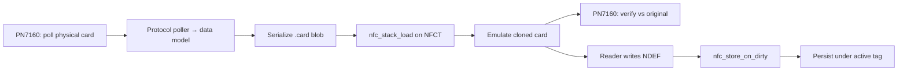

# Locked Architecture Summary — writable_ndef_msg NFC Stack

**Date:** 2026-06-13 (amended 2026-06-13)  
**Status:** LOCKED summary — **role-split detail superseded by** [`2026-06-13-nfc-final-design.md`](2026-06-13-nfc-final-design.md)  
**Platform:** Zephyr / Nordic NCS v3.2.4 · primary SoC nRF54L15 (`nrf54l15dk` bring-up)

> **Master design:** [`2026-06-13-nfc-final-design.md`](2026-06-13-nfc-final-design.md) — read that for hardware topology, API stack, waves, and PN7160 CE evidence.

---

## One-sentence goal

Clone a physical NFC card with an external reader, emulate it on the on-die NFCT frontend, persist live writes, and verify round-trip fidelity — with Aliro on both sides of the link.

---

## Role split (hardware-locked — see final design for detail)

| Role | Hardware | What it does |
|---|---|---|
| **Reader / cloner / verifier** | **PN7160** (primary; NXP NCI over I²C or SPI) | Poll, detect technology, read card into data model, serialize `.card`, re-poll emulated tag to verify |
| **Card emulation (default)** | **NFCT** (on-die nRF54L15 / nRF52840) | Listen: Type 4 (ISO-DEP) **and** Type 2 (read-only NDEF) — not a reader |
| **Card emulation (optional)** | **PN7160 listen** (Wave 7b) | Type-4 ISO-DEP / T4T NDEF per NXP examples — for clone-only replay when NFCT cannot; **not** the default product path |

**ST25R3916 / RFAL is demoted.** PN7160 is the **sole planned reader backend**. PN7160 **can** emulate (NXP `NXPNCI_MODE_CARDEMU` + `ProcessCardMode`); product default remains **NFCT for emulate**.

Both roles may be enabled in one firmware image when wiring allows (PN7160 companion + NFCT on same nRF).

---

## Core workflow (locked)



1. **Clone** — PN7160 reader captures card state into the portable `.card` format (Wave 6 store envelope).
2. **Mimic** — NFCT card role loads the blob and emulates fully (not a read-only stub unless capture flags say so).
3. **Verify** — PN7160 re-reads the emulated NFCT tag and compares against the clone (UID, NDEF, visible APDUs/pages).

---

## NDEF + persistence (locked §1.1)

| Profile | Clone fidelity | Live persist on reader write |
|---|---|---|
| **NDEF** (`NFC_PROFILE_NDEF`) | Full writable Type-4 NDEF emulation (`EMULATION_COMPLETE`) | **Required** — `UPDATE BINARY` on file `E104` → `nfc_store_on_dirty()` under active load tag |
| **Ultralight** | T4T-via-NDEF adapter only; page model not live-synced from NDEF writes | NDEF persist applies only under `NFC_PROFILE_NDEF` |
| **DeSFire / EMV / Aliro** | Partial capture when keys unavailable (`READ_ONLY_PARTIAL`) | Credential/session state per service plan |

---

## Aliro (both sides)

| Side | Backend | Implementation slice |
|---|---|---|
| **Poller** (reader) | PN7160 | Wave 7 reader engine + `aliro_poller.c` (capture public transcript) |
| **Listener** (card) | NFCT | Wave 5e `aliro_service` listener on ISO-DEP lane |

Hand-provisioned Aliro credentials on NFCT do not require a physical clone. Reader-captured Aliro blobs carry `READ_ONLY_PARTIAL` (no private-key clone).

---

## Software layering (unchanged from v3)

- **HAL** (`nfc_transport`) — capability descriptor; listen sub-API on NFCT; poller sub-API on PN7160.
- **Lanes** — ISO-DEP/APDU (Type 4) vs raw/native (Type 2 pages).
- **Protocol modules** — data model + serialize + listener (NFCT) + poller (PN7160).
- **Store** — unified `.card` interchange format; cross-device portable.

---

## Flipper reuse policy (pragmatic)

Flipper `lib/nfc` is **GPL**. User has authorized pragmatic reuse.

- **Always OK:** protocol facts (command bytes, TLV layouts, AID tables, state machines) from `flipperzero/` in-repo.
- **Lift when it saves time:** poller sequencing logic, Ultralight page tables, DeSFire command parsers — port to Zephyr/MISRA style; cite source file in comment.
- **Do not ship verbatim:** Furi/OS coupling, malloc-heavy paths, renamed transliterations presented as “clean-room.”

---

## Build gates (Kconfig)

```
CONFIG_NFC_ROLE_CARD=y          # NFCT listen path (Waves 1–6)
CONFIG_NFC_ROLE_READER=y        # PN7160 poll path (Wave 7+)
CONFIG_NFC_HAL_BACKEND_NRFX=y   # NFCT card backend
CONFIG_NFC_HAL_BACKEND_PN7160=y # PN7160 reader backend (mutually exclusive with NRFX in single-backend builds; dual-backend = both compiled, role selects runtime path)
```

`BUILD_ASSERT`: enabled roles ⊆ backend capabilities. NFCT must never enable `NFC_ROLE_READER`.

---

## Sequencing

| Phase | Waves | Backend |
|---|---|---|
| **Now** | 1–6 card slice | NFCT |
| **Next** | 7a PN7160 reader | PN7160 poll |
| **Optional** | 7b PN7160 card emulation | PN7160 listen |
| **Deferred** | ST25R3916 RFAL reader | Demoted |

Waves 1–6 **must complete** before Wave 7 implementation — reader needs `.card` format, protocol data models, poller seams, and shell store paths.

---

## Related documents

| Document | Purpose |
|---|---|
| [`2026-06-13-nfc-final-design.md`](2026-06-13-nfc-final-design.md) | **Master design — start here** |
| [`2026-06-12-nfc-stack-architecture.md`](2026-06-12-nfc-stack-architecture.md) | Architecture principles + history (v3.2+) |
| [`2026-06-13-nfct-pn7160-capability-matrix.md`](2026-06-13-nfct-pn7160-capability-matrix.md) | Per-protocol PN7160 vs NFCT matrix |
| [`../plans/wave7-pn7160-reader.md`](../plans/wave7-pn7160-reader.md) | Wave 7a PN7160 reader plan |
