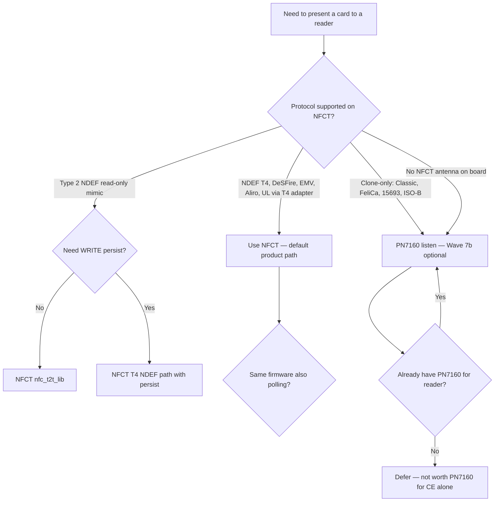
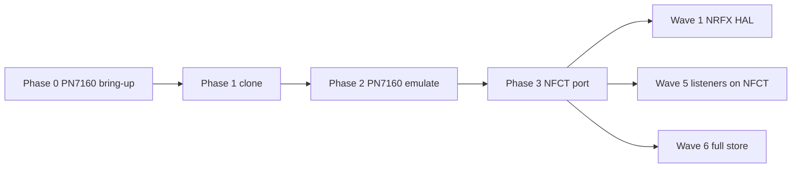
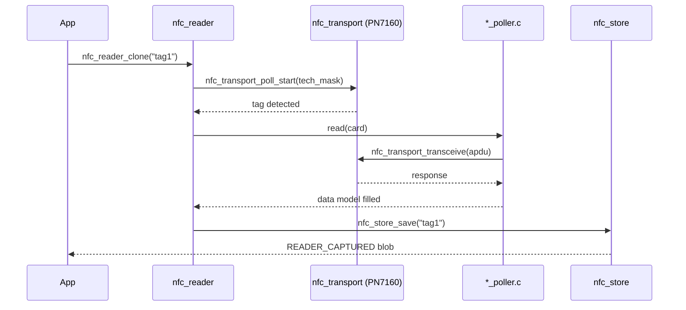
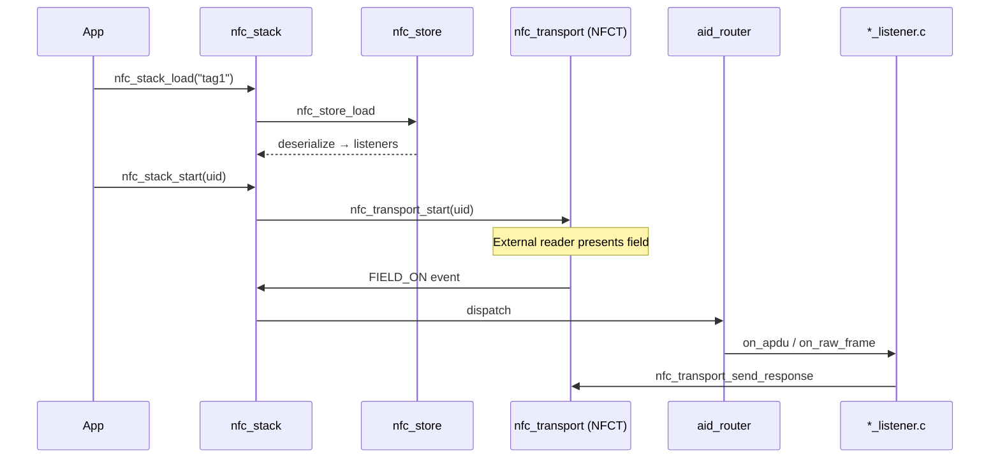
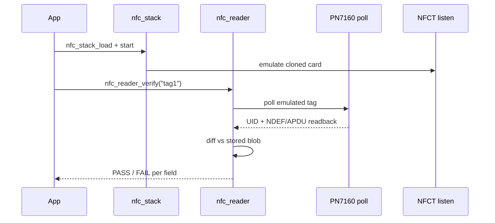
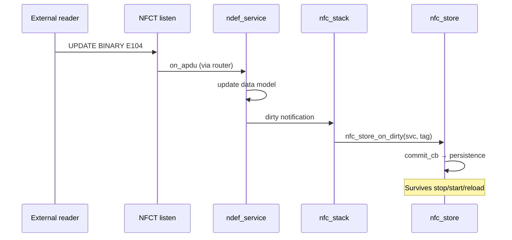
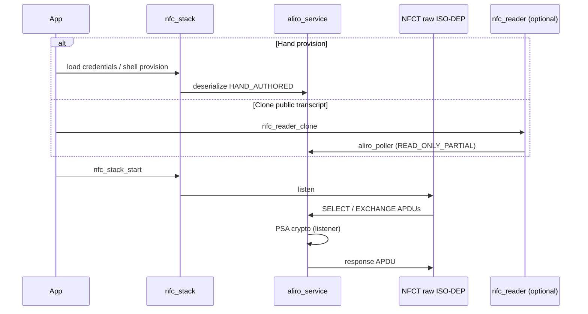

# NFC Stack — Final Design (writable_ndef_msg)

**Date:** 2026-06-13  
**Status:** FINAL — master design document; supersedes scattered role-split notes  
**Platform:** Zephyr / Nordic NCS v3.2.4 · primary SoC nRF54L15 (`nrf54l15dk` bring-up)

> **Read this first.** This is the single reconciled design. Detailed wave plans remain in
> `docs/superpowers/plans/wave*.md`; this doc is the map, not a rewrite of those plans.
>
> **Implementation repo:** All firmware — `src/nfc/`, `modules/nfc_pn7160/`, tests, and
> build wiring — lives in **writable_ndef_msg** (`/Users/majidfaroud/writable_ndef_msg`).
> See [`2026-06-13-implementation-phases.md`](2026-06-13-implementation-phases.md) §Build from this repo.

---

## 1. North Star

Clone a physical NFC card with an external reader, emulate it on the product antenna, persist live writes, and verify round-trip fidelity — with Aliro on both sides of the link. The durable core (protocol data models, `.card` file format, card role) is hardware-independent; only HAL backends and the reader engine grow later into reserved seams. Flipper `lib/nfc` is a protocol/architecture reference; pragmatic porting of poller logic and constants is allowed with source citations.

---

## 2. Hardware Topology — FINAL

### 2.1 Two RF frontends on one MCU

```
                    nRF54L15 (application MCU)
+------------------------------------------------------------------+
|  NFCT (on-die)              PN7160 (companion, I²C/SPI + IRQ)   |
|  antenna: DK / product      antenna: eval shield / product RF    |
|  card emulation (primary)   reader (primary) + optional CE       |
+------------------------------------------------------------------+
         ^                              ^
         | listen                       | poll (+ optional listen)
    phone / verifier               physical card
```

Both roles may compile into one firmware image when board wiring provides both antennas.

### 2.2 PN7160 — reader (primary) + card emulation (evidence-based)

**Verified in-repo:** `hals_temp/NXP-NCI2.0_LPC55S6x_examples/`

| Evidence | What it proves |
|---|---|
| `Nfc.h` | `NXPNCI_MODE_CARDEMU`, `NXPNCI_MODE_RW`, `MODE_LISTEN` (0x80), `MODE_POLL` (0x00) |
| `NxpNci20.c` | `NxpNci_ConfigureMode()` builds discovery map + routing for CARDEMU; `NxpNci_ProcessCardMode()` loops on NCI DATA_PACKET APDUs; `NxpNci_CardModeReceive/Send()` |
| `nfc_example_RWandCE.c` | Combined RW + CE: `ConfigureMode(NXPNCI_MODE_RW \| NXPNCI_MODE_CARDEMU)`, discovery includes `MODE_LISTEN \| TECH_PASSIVE_NFCA/B` |
| `CE_scenario2.c` | Listen-only CE with `NFCEE_NDEF_Configuration()` + `NFCEE_NDEF_DH_Write()` (PN7160 NFCEE NDEF store) |
| `T4T_NDEF_emu.c` | Type-4 NDEF listen: SELECT NDEF AID, READ/UPDATE BINARY on CC + NDEF file |

**PN7160 listen scope in NXP examples (not extrapolated):**

| Technology | Listen / CE in NXP examples | Notes |
|---|---|---|
| ISO-DEP / Type 4 (NFC-A) | Yes | `INTF_ISODEP` + `MODE_LISTEN` in RWandCE / CE_scenario2 |
| ISO-DEP / Type 4 (NFC-B) | Yes | `MODE_LISTEN \| TECH_PASSIVE_NFCB` in discovery table |
| Type 4 NDEF (T4T) | Yes | `T4T_NDEF_emu.c` — SELECT, READ BINARY, UPDATE BINARY |
| NFCEE NDEF (HW store) | Yes | `NFCEE_NDEF_*` in CE_scenario2 — DH preloads NDEF into PN7160 |
| Type 2 / raw NFC-A | **Not shown** | Reader side reads T2T; no T2 listen example |
| MIFARE Classic / FeliCa / 15693 listen | **Not shown** | Reader poll examples only |
| P2P | Yes (separate) | `nfc_example_P2P.c` — out of product scope |

**Product decision:** PN7160 **can** emulate Type-4 ISO-DEP (including NDEF T4T) per NXP. It is **not** the default product emulator — see §2.4.

### 2.3 NFCT — card emulation only (scope limits)

Evidence: nrfxlib NCS v3.2.4 (`nfc_t4t_lib`, `nfc_t2t_lib`, `integration_notes.rst`). Full detail in [`2026-06-13-nfct-pn7160-capability-matrix.md`](2026-06-13-nfct-pn7160-capability-matrix.md).

| Mode | Library | Scope |
|---|---|---|
| **Type 4** | `nfc_t4t_lib` | ISO-DEP listen; raw APDU mode (`NFC_T4T_EMUMODE_PICC`); NDEF RO/RW; DeSFire/EMV/Aliro via raw lane |
| **Type 2** | `nfc_t2t_lib` | READ (0x30) only — **no WRITE (0xA2)**; read-only NDEF broadcast |
| **Reader / poll** | — | **Not supported** — on-die NFCT is listen-only |
| **T2 + T4 simultaneous** | — | **No** — one library owns NFCT; runtime mode switch requires stop + re-init |

NFCT cannot emulate: MIFARE Classic (Crypto1), FeliCa, ISO15693, ISO14443-B, full Ultralight page WRITE.

### 2.4 When to use which emulator (decision tree)



| Choose | When |
|---|---|
| **NFCT (default)** | All in-scope product profiles; live NDEF persist; lowest integration cost; on-die antenna |
| **NFCT T2T (`nfc_t2t_lib`)** | Read-only Type-2 NDEF presentation for verify fidelity; no WRITE |
| **NFCT T4 adapter for Ultralight** | Writable NDEF + coexistence with ISO-DEP services (Wave 5b default) |
| **PN7160 listen (Wave 7b, optional)** | Replay **clone-only** blobs (Classic, FeliCa, 15693); bench tag with only PN7160 antenna; NFCEE NDEF offload experiments |
| **Never PN7160 listen for** | Primary NDEF/Aliro/DeSFire product path when NFCT is available — duplicates stack, splits antenna policy |

---

## 3. API Layer Stack

### 3.1 Layer diagram (top → bottom)

```
Application / Shell
  nfc_stack_*  (card role)          nfc_reader_*  (reader role)
        \                              /
         -------- orchestrators -------
                      |
  protocol services (nfc_service_t vtable per profile)
    ndef_service      ultralight_service    desfire_service
    emv_service       aliro_service
    *_listener.c (CARD)          *_poller.c (READER)
                      |
         +------------+-------------+
         | ISO-DEP lane            | raw / native lane
         v                         v
  apdu_assembler_*          (direct HAL frame dispatch)
  aid_router_*                      |
         \                         /
          v                       v
  nfc_transport_*  (HAL — capability-driven)
    listen sub-API: init/start/stop, send_response, register_callbacks
    poller sub-API: poll_start/stop, transceive, register_poller_callbacks
    nfc_transport_nrfx.c  |  nfc_transport_pn7160.c
                      |
  nfc_store_*  (cross-cutting — reached via nfc_stack, not services→store)
                      |
                   hardware
```

### 3.2 Application entry points

#### Card role (`CONFIG_NFC_ROLE_CARD` → NFCT backend)

| API | Purpose |
|---|---|
| `nfc_stack_init()` / `nfc_stack_shutdown()` | Lifecycle |
| `nfc_stack_start(uid)` / `nfc_stack_stop()` | Begin/end field listen |
| `nfc_stack_load(tag)` / `nfc_stack_save(tag)` | Deserialize / serialize `.card` blob |
| `nfc_stack_set_profile()` / `nfc_stack_get_active_profile()` | Active protocol profile |
| `nfc_stack_set_uid()` | NFCID1 rotation |
| `nfc_stack_register_event_cb()` | Field on/off, profile applied |
| Shell: `nfc stack start/stop/load/save/profile/uid` | DK bring-up |

Live persist path: listener detects writable mutation → `nfc_stack` wires → `nfc_store_on_dirty(svc, tag)`.

#### Reader role (`CONFIG_NFC_ROLE_READER` → PN7160 backend)

| API | Purpose |
|---|---|
| `nfc_reader_init()` / `nfc_reader_shutdown()` | Lifecycle |
| `nfc_reader_scan()` | Detect UID, tech, protocol |
| `nfc_reader_clone(tag)` | Poller → data model → `.card` blob |
| `nfc_reader_verify(tag)` | Re-poll emulated tag vs stored clone |
| Shell: `nfc reader scan/clone/verify/stats` | Wave 7 |

#### Store (cross-cutting)

| API | Purpose |
|---|---|
| `nfc_store_save()` / `nfc_store_load()` | Envelope read/write |
| `nfc_store_on_dirty()` | Live write-through after reader UPDATE BINARY |
| `nfc_store_register_commit_cb()` | NVS/Settings backend seam |

### 3.3 Protocol service shape (each module)

Each service implements `nfc_service_t`:

- `listener`: `on_field_on/off`, `on_apdu` (ISO-DEP lane) or `on_raw_frame` (native lane)
- `poller`: `detect`, `read`, `serialize` / `deserialize`
- Persistence hooks: `get_persist_id`, `serialize`, `deserialize`, `on_dirty`

Registry: Flipper-style table-with-NULL for unsupported role/backend combos.

### 3.4 Workflow API traces

#### Clone → mimic → verify

```
1. nfc_reader_clone("tag1")
     → nfc_transport_poll_start(tech_mask)
     → *_poller.c reads card → data model
     → nfc_store_save("tag1", svcs, n)  [READER_CAPTURED flags]

2. nfc_stack_load("tag1")
     → nfc_store_load → deserialize into listeners

3. nfc_stack_start(&uid)
     → nfc_transport_start (NFCT listen)
     → field on → aid_router → *_listener.c

4. nfc_reader_verify("tag1")
     → poll emulated NFCT tag → compare UID/NDEF/APDU transcript
```

#### Live NDEF persist

```
Reader UPDATE BINARY on E104
  → apdu_assembler → aid_router → ndef_service listener
  → ndef data model updated
  → nfc_store_on_dirty(ndef_service, active_tag)
  → commit_cb → NVS (future) / stub now
  → survives nfc_stack_stop/start and nfc_stack_load reload
```

#### Aliro provision + emulate

```
Hand path (no physical card):
  shell / config → aliro_service deserialize credentials
  → nfc_stack_start → aliro listener on ISO-DEP lane (NFCT raw mode)

Clone path:
  nfc_reader_clone → aliro_poller (public transcript only)
  → READ_ONLY_PARTIAL in .card
  → nfc_stack_load → partial listener replay on NFCT
```

---

## 4. Card Support Matrix

Condensed from [`2026-06-13-nfct-pn7160-capability-matrix.md`](2026-06-13-nfct-pn7160-capability-matrix.md).

| Card / Protocol | PN7160 read | NFCT emulate | PN7160 emulate | Category |
|---|---|---|---|---|
| **NDEF Type 4** | Yes | Yes (T4T RW) | Yes (T4T per NXP) | **Full round-trip** — default NFCT |
| **NDEF Type 2** | Yes | Yes (T2T read-only) | Not in NXP CE examples | **Full round-trip** (content); T2 WRITE → use T4 path |
| **Ultralight** | Yes (pages) | Partial (T4 adapter) | Not shown | **Partial** |
| **MIFARE Classic** | Yes | No | Theoretically via raw CE — **not planned v1** | **Clone-only** → PN7160 replay (7b) |
| **DESFire** | Yes (partial) | Yes (hand/partial) | ISO-DEP CE possible | **Partial** |
| **EMV** | Yes (public) | Yes (static) | ISO-DEP CE possible | **Partial** |
| **Aliro** | Yes (transcript) | Yes (PSA listener) | ISO-DEP CE possible | **Emulate-only** typical; partial clone |
| **ISO15693 / FeliCa / ISO-B** | Yes | No | Not in NXP CE examples | **Clone-only** |

### Category legend

| Category | Meaning |
|---|---|
| **Full round-trip** | Clone → `.card` → NFCT emulate → PN7160 verify; live persist where applicable |
| **Clone-only** | PN7160 stores; NFCT cannot emulate; optional PN7160 listen replay (Wave 7b) |
| **Partial** | Public data round-trips; secrets/auth incomplete |
| **Emulate-only** | Hand-provisioned credentials; no physical clone required |

---

## 5. Implementation Order — LOCKED (PN7160 first)

> **Sequencing lock (2026-06-13):** PN7160 bring-up → clone → emulate → verify on one chip,
> **then** port the proven stack to NFCT. Full phase detail:
> [`2026-06-13-implementation-phases.md`](2026-06-13-implementation-phases.md).

**API shape is unchanged** (`nfc_transport`, `nfc_reader`, `nfc_stack`). Only build order changed.

| Phase | Goal | Old wave mapping | Plan |
|---|---|---|---|
| **0** | PN7160 HAL, NCI, IRQ, worker, scan | Wave 7a Phase 1–2 | [`wave7-pn7160-reader.md`](../plans/wave7-pn7160-reader.md) |
| **1** | PN7160 clone (NDEF first, then expand) | Wave 7a Phase 3–4 + Wave 6 minimal | wave7 + [`wave6-store.md`](../plans/wave6-store.md) |
| **2** | PN7160 emulate (Type-4 CE, verify loop on same chip) | Wave 7b (required gate) | implementation-phases §Phase 2 |
| **3** | NFCT migration (port proven protocols) | Waves 1–6 repurposed | wave1–6 plans |

### Sequencing (visual)



### Success gates (must pass before next phase)

| Gate | Criterion |
|---|---|
| 0 → 1 | `CORE_RESET` OK; `nfc reader scan` detects tag |
| 1 → 2 | `nfc reader clone` produces valid NDEF `.card` blob |
| 2 → 3 | Clone → PN7160 emulate → PN7160 verify **PASS** |
| 3 → ship | Same blob on NFCT emulate; PN7160 verify **PASS** |

### Wave plans (reference — execution order follows phases above)

| Wave | Goal | Phase | Status |
|---|---|---|---|
| **1** | HAL + NFCT listen + capability model | **3** | **LOCKED** |
| **2** | APDU framing (`apdu_assembler`) | **2 or 3** | **LOCKED** |
| **3** | AID router + ISO-DEP lane | **2 or 3** | **LOCKED** |
| **4** | Card orchestrator (`nfc_stack`) | **2 then 3** | **LOCKED** |
| **5a–5e** | Protocol services | **1–3** (pollers early, listeners on PN7160 then NFCT) | DRAFT |
| **6** | `.card` format + store + live persist | **1 minimal → 3 full** | DRAFT |
| **7a** | PN7160 reader backend | **0 + 1** | DRAFT |
| **7b** | PN7160 card emulation | **2** (required, not optional) | DRAFT |

### Phase 2 notes (PN7160 emulate — was Wave 7b)

- Enable `NXPNCI_MODE_CARDEMU` via `CONFIG_NFC_PN7160_LISTEN` after Phase 1 gate passes.
- Port `T4T_NDEF_emu.c` logic into `ndef_listener.c`; wire through same `nfc_service_t` vtable.
- Phase 2 pulls minimal card slice (framing + router + stack) on PN7160 listen — NFCT backend comes in Phase 3.
- Dual-backend product routing unchanged: card ops → NRFX (default), reader ops → PN7160.

---

## 6. Data Flow Diagrams

### 6.1 Clone workflow



### 6.2 Mimic workflow



### 6.3 Verify workflow



### 6.4 NDEF write + persist



### 6.5 Aliro provision + emulate



---

## 7. Amendments to Prior Locks

Reference: [`2026-06-13-locked-architecture-summary.md`](2026-06-13-locked-architecture-summary.md) (2026-06-13 early lock).

| Prior lock | Final design | Why |
|---|---|---|
| PN7160 = reader **only** | PN7160 = reader **primary** + CE **optional** (Wave 7b) | NXP examples prove `NXPNCI_MODE_CARDEMU`, `MODE_LISTEN`, `ProcessCardMode`, T4T NDEF emu |
| NFCT = sole emulator | NFCT = **default** emulator for all in-scope product profiles | On-die antenna, raw ISO-DEP for Aliro/DeSFire, live persist — already built in Waves 1–6 |
| "Card emulation on PN7160 out of scope" (capability matrix) | **Amended:** out of scope for **7a**; optional **7b** for clone-only replay | Avoid duplicating NFCT path; keep PN7160 CE for protocols NFCT cannot do |
| ST25R3916 second backend | **Unchanged — demoted** | PN7160 is sole reader backend; RFAL remains reference only |
| Ultralight native T2T replaces T4 adapter | **Unchanged — rejected** | nrfxlib T2T is READ-only; T4 adapter stands (matrix § resolved) |
| Wave 7 DECISION-PN7-1 "reader only" | **Amended:** reader-first; listen capability reserved | Dual-backend routing unchanged: card ops → NRFX, reader ops → PN7160 |

**What did NOT change:** clone→load→emulate→verify happy path; NDEF live persist via `nfc_store_on_dirty`; Aliro poller on PN7160 / listener on NFCT; Flipper reuse policy; Waves 1–4 locked contracts.

---

## 8. What NOT to Build (scope fence)

| Out of scope | Reason |
|---|---|
| ST25R3916 / RFAL production backend | Demoted; PN7160 covers reader |
| NFCT poller / reader mode | Silicon cannot poll |
| PN7160 P2P / LLCP | NXP example only; not product |
| PN7160 CE as default for NDEF/Aliro | NFCT is simpler and already planned |
| Full MIFARE Classic **emulation** on NFCT | No Crypto1 in nrfxlib |
| Full Ultralight page WRITE on NFCT T2T | nrfxlib READ-only |
| T2 + T4 simultaneous on NFCT | One library owns NFCT |
| Verbatim Flipper source ship | GPL; port + cite |
| Custom DT bindings before hardware | Deferred per architecture §11.4 |
| NFCT port before Phase 2 PN7160 verify passes | PN7160 clone+emulate is the gate |

---

## 9. Document Map

| Document | Role after this final design |
|---|---|
| **This file** | **Master design — read first** |
| [`2026-06-13-implementation-phases.md`](2026-06-13-implementation-phases.md) | **Locked build order — PN7160 first, then NFCT** |
| [`2026-06-12-nfc-stack-architecture.md`](2026-06-12-nfc-stack-architecture.md) | Architecture principles + history; §1.1 points here |
| [`2026-06-13-locked-architecture-summary.md`](2026-06-13-locked-architecture-summary.md) | Short summary; superseded for role split detail |
| [`2026-06-13-nfct-pn7160-capability-matrix.md`](2026-06-13-nfct-pn7160-capability-matrix.md) | Per-protocol evidence tables |
| `docs/superpowers/plans/wave*.md` | Implementation slices — not duplicated here |
| `docs/NFC_STACK_CONVENTIONS.md` | Coding binding for all waves |

---

## Changelog

- **v1 (2026-06-13):** Final reconciled design; PN7160 CE evidence from NXP NCI examples; NFCT limits from nrfxlib; wave order 7a/7b; supersedes scattered role locks.
- **v1.1 (2026-06-13):** Implementation order locked PN7160-first (Phases 0–3); see [`2026-06-13-implementation-phases.md`](2026-06-13-implementation-phases.md).
