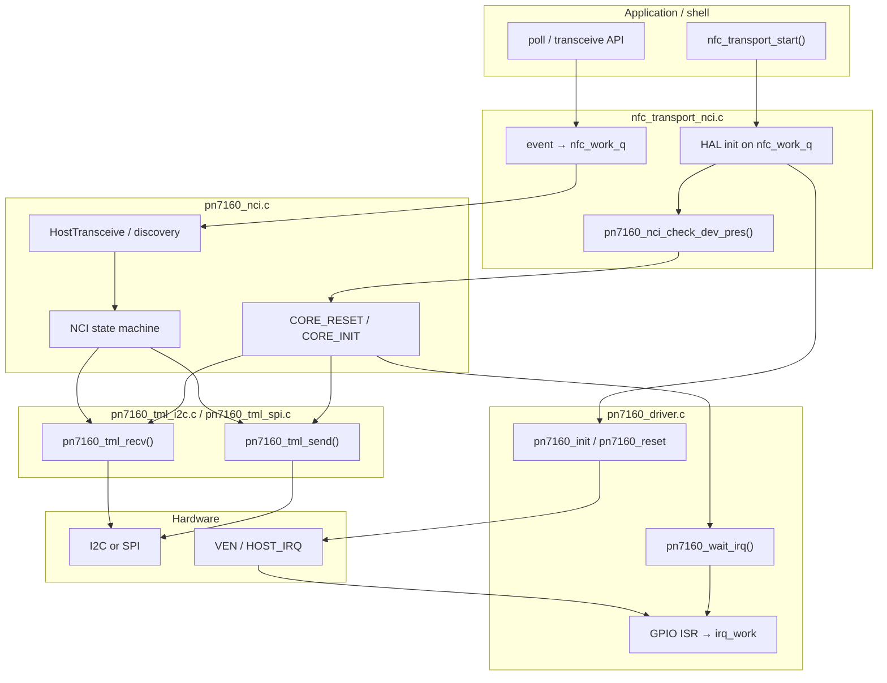

# PN7160 Zephyr Device Driver — Phase 0 Architecture

**Date:** 2026-06-14  
**Status:** LOCKED (architecture + integration design; Phase 0 implementation gated on § Phase 0 Implementation Checklist approval and § Upstream Quality Bar)  
**Platform:** Zephyr / Nordic NCS v3.2.4 · nRF54L15 + PN7160 eval shield

**Related:** [`2026-06-13-implementation-phases.md`](2026-06-13-implementation-phases.md) Phase 0 · [`../plans/wave7-pn7160-reader.md`](../plans/wave7-pn7160-reader.md)

---

## LOCKED DECISIONS

These user decisions are locked. Do not revisit without explicit user approval.

| ID | Decision | Notes |
|---|---|---|
| **DECISION-DRV-1** | **Out-of-tree Zephyr module** at `writable_ndef_msg/modules/nfc_pn7160/` | Not in-tree under `zephyr/drivers/nfc/`. Wire via `ZEPHYR_EXTRA_MODULES` or west manifest. |
| **DECISION-DRV-2** | **Dual transport** — I2C (primary/default) **and** SPI (fully supported) | User-selectable via devicetree. One PN7160 instance uses **either** an I2C **or** SPI child bus, never both (mutually exclusive DT). Kconfig TML backends (`CONFIG_PN7160_TML_I2C` / `CONFIG_PN7160_TML_SPI`) are auto-selected from DT. |

> **Implementation gate:** Driver implementation beyond the Phase 0 scaffold is **paused** until the user approves the full driver spec in this document.

---

## 1. In-tree driver vs out-of-tree Zephyr module (DECISION-DRV-1)

**Locked: out-of-tree Zephyr module** at `writable_ndef_msg/modules/nfc_pn7160/`.

| Option | Pros | Cons |
|---|---|---|
| **Out-of-tree module** (locked) | Reusable across apps; proper `module.yml` + DT bindings; isolates NXP port from app; matches zephyr-module skill; can be west-fetched later | One extra CMake/west wiring step |
| In-tree under `zephyr/drivers/nfc/` | Upstreamable path | Wrong repo; couples to NCS fork; slower iteration |

**Rationale:** **writable_ndef_msg** is the firmware implementation repo (NFC stack, PN7160 driver module, unit tests, HIL). The PN7160 driver is a hardware abstraction reusable by the NCI HAL (`nfc_transport_nci.c`) and the sample app — module boundary is correct.

**Migration note:** `src/nfc/hal/nci/tml/nci_tml_zephyr.c` uses `SYS_INIT` + static bus registration (Phase 0 interim). Phase 0.2 replaces it with `DEVICE_DT_GET(DT_NODELABEL(pn7160))` → driver TML ops.

---

## 2. Layer split

```
┌─────────────────────────────────────────────────────────────┐
│  nfc_transport_nci.c  (SMART HAL — Model B worker bridge)   │
│  poll_start/stop, transceive, event → nfc_work_q            │
└───────────────────────────┬─────────────────────────────────┘
                            │ pn7160_nci_* / NxpNci_* API
┌───────────────────────────▼─────────────────────────────────┐
│  pn7160_nci.c — NCI 2.0 state machine                       │
│  CORE_RESET/INIT, discovery, HostTransceive, ReaderTagCmd   │
│  (ported from NXP NxpNci20.c; async refactor in Phase 0.6)  │
└───────────────────────────┬─────────────────────────────────┘
                            │ tml_Send / tml_Receive
┌───────────────────────────▼─────────────────────────────────┐
│  pn7160_tml_i2c.c / pn7160_tml_spi.c — TML framing           │
│  Port logic from NXP source/TML/tml.c (I2C or SPI INTF_*)   │
└───────────────────────────┬─────────────────────────────────┘
                            │ pn7160_tml_send / recv (bus via DT)
┌───────────────────────────▼─────────────────────────────────┐
│  pn7160_driver.c — Zephyr device driver                     │
│  DT_INST, I2C or SPI bus, VEN/IRQ/DWL GPIO, ISR → k_work    │
└─────────────────────────────────────────────────────────────┘
```

| Layer | Owns | Does not own |
|---|---|---|
| **Driver** | Bus transactions, GPIO (VEN, IRQ, DWL), IRQ → work queue signal, device lifecycle | NCI protocol, discovery tables, tag protocols |
| **TML** | NCI payload framing over I2C or SPI; send/receive sequencing; download-mode header sizes | Threading policy beyond bus lock |
| **NCI** | NCI commands, RF config blobs, discovery, tag commands | Zephyr device model |
| **nfc_transport HAL** | Capabilities, worker bridge, errno mapping, shell | Raw I2C/SPI/GPIO |

---

## 3. Devicetree binding (DECISION-DRV-2: dual transport)

**Compatible:** `nxp,pn7160` (same string on I2C and SPI bindings)  
**Binding files:**

| File | Bus | Include |
|---|---|---|
| `nxp,pn7160-common.yaml` | — | Shared GPIO properties |
| `nxp,pn7160-i2c.yaml` | I2C | `i2c-device.yaml` + common |
| `nxp,pn7160-spi.yaml` | SPI | `spi-device.yaml` + common |

One PN7160 node is a child of **either** an `i2c` **or** `spi` controller — never both. Zephyr selects the TML backend at compile time via `DT_INST_ON_BUS(inst, i2c|spi)` (ens160 / adxl345 pattern).

| Property | Required | I2C | SPI | Description |
|---|---|---|---|---|
| `reg` | yes | 7-bit address (`0x28` default) | CS index (`0` typical) | Bus address from parent include |
| `irq-gpios` | yes | ✓ | ✓ | HOST_IRQ — active high when data available |
| `ven-gpios` | yes | ✓ | ✓ | VEN (enable/reset) — active high |
| `dwl-gpios` | no | ✓ | ✓ | FW download mode select |
| `clock-frequency` | no | on **I2C parent** | — | I2C: **100 kHz** NXP default |
| `spi-max-frequency` | no | — | on node | SPI: **500 kHz** NXP default |

**Reference overlays:**

- I2C: `boards/overlays/pn7160_i2c.overlay`
- SPI: `boards/overlays/pn7160_spi.overlay`

Default eval-shield wiring on nRF54L15 DK: I2C on `i2c21` @ `0x28`, IRQ P1.10, VEN P1.11. SPI uses the same GPIOs on `spi21` @ CS0.

```dts
/* I2C — primary / default */
&i2c21 {
	status = "okay";
	clock-frequency = <100000>;
	pn7160: pn7160@28 {
		compatible = "nxp,pn7160";
		reg = <0x28>;
		irq-gpios = <&gpio1 10 GPIO_ACTIVE_HIGH>;
		ven-gpios = <&gpio1 11 GPIO_ACTIVE_HIGH>;
	};
};

/* SPI — alternative (mutually exclusive instance) */
&spi21 {
	status = "okay";
	pn7160: pn7160@0 {
		compatible = "nxp,pn7160";
		reg = <0>;
		spi-max-frequency = <500000>;
		irq-gpios = <&gpio1 10 GPIO_ACTIVE_HIGH>;
		ven-gpios = <&gpio1 11 GPIO_ACTIVE_HIGH>;
	};
};
```

Use label `pn7160` — existing HAL and tests reference `DT_NODELABEL(pn7160)`.

---

## 4. Kconfig

| Symbol | Purpose |
|---|---|
| `CONFIG_PN7160` | Master enable; `depends on DT_HAS_NXP_PN7160_ENABLED` |
| `CONFIG_PN7160_TML_I2C` | Auto `def_bool` when any enabled instance is on I2C |
| `CONFIG_PN7160_TML_SPI` | Auto `def_bool` when any enabled instance is on SPI |
| `CONFIG_PN7160_INIT_PRIORITY` | Driver init order (default 80) |
| `CONFIG_PN7160_RX_BUF_SIZE` | Static RX buffer (default 258) |
| `CONFIG_PN7160_LOG_LEVEL` | Module log level |

Transport is **not** a manual Kconfig choice — devicetree bus placement drives TML backend selection (`dt_compat_on_bus` selects `I2C` / `SPI` subsystems). Both TML source files are compiled when `CONFIG_PN7160=y`; instance macros pick I2C or SPI ops via `DT_INST_ON_BUS`.

Default builds use `boards/overlays/pn7160_i2c.overlay` (I2C primary). SPI builds use `boards/overlays/pn7160_spi.overlay`.

App-level symbols (unchanged, in `src/nfc/hal/Kconfig`):

- `CONFIG_NFC_HAL_BACKEND_NCI_PN7160` — enables HAL backend
- `CONFIG_NFC_ROLE_READER` — reader role gate

---

## 5. Port verbatim vs rewrite

| NXP artifact | Action | Target |
|---|---|---|
| `source/TML/tml.c` — `tml_Tx/Rx`, `INTF_*` I2C path | **Port** framing; replace `INTF_*` with Zephyr `i2c_*_dt` | `pn7160_tml_i2c.c` |
| `source/TML/tml.c` — `INTF_*` SPI path (`0x7F` write / `0xFF` read) | **Port** framing; replace with `spi_transceive_dt` | `pn7160_tml_spi.c` |
| `source/TML/tml.c` — `tml_Connect/Reset`, GPIO | **Rewrite** Zephyr-native in driver | `pn7160_driver.c` |
| `NxpNci20.c` — `NxpNci_CheckDevPres`, `HostTransceive` | **Port** logic; replace `Sleep` → `k_msleep`, bool → errno | `pn7160_nci.c` |
| `NxpNci20.c` — `Connect`, `ConfigureSettings`, discovery | **Port** Phase 0.3–0.8 | `pn7160_nci.c` |
| `Nfc_settings.h` RF blobs | **Port** as `const` arrays | `pn7160_nci_settings.c` (Phase 0.3) |
| `nfc_example_RW.c` tech table | **Reference only** | HAL discovery config |
| `board/pin_mux.c`, `fsl_*` drivers | **Skip** | DT + Zephyr drivers |
| Flipper `lib/nfc` | **Skip** | Not needed Phase 0 |

**NXP license:** NXP Semiconductors copyright (see file headers in `hals_temp/NXP-NCI2.0_LPC55S6x_examples/`). Ported sections retain NXP header + note in module `README.md`. Do not mix GPL Flipper code.

---

## 6. Threading model

**Recommendation: driver ISR only enqueues; dedicated work on shared `nfc_work_q` drains RX.**

| Context | Responsibility |
|---|---|
| **GPIO ISR** | `gpio_pin_get_dt`, `atomic_set(irq_pending)`, `k_work_submit(&irq_work)` — no bus I/O |
| **Driver `irq_work`** (system work queue, short) | Optional: coalesce edges; call registered HAL callback |
| **`nfc_work_q` worker** (Model B) | `pn7160_nci_process()`, discovery notifications, `HostTransceive` timeouts |

**Not chosen:** dedicated `k_thread` for PN7160 only — duplicates `nfc_work_q` already used by NFCT/RFAL backends (DECISION-PN7-3).

**Blocking transceive (Phase 0.4 interim):** worker thread calls `tml_Receive` with timeout; ISR only wakes waiters via semaphore/atomic flag. Phase 0.6 splits `ProcessReaderMode` blocking loops into async steps.

---

## 7. File tree

```
writable_ndef_msg/modules/nfc_pn7160/
├── zephyr/
│   ├── module.yml
│   └── Kconfig
├── dts/bindings/nfc/
│   ├── nxp,pn7160-common.yaml
│   ├── nxp,pn7160-i2c.yaml
│   └── nxp,pn7160-spi.yaml
├── include/nfc/
│   └── pn7160.h
├── src/
│   ├── pn7160_driver.c      # DEVICE_DT_DEFINE, IRQ, TML dispatch
│   ├── pn7160_tml_i2c.c     # TML I2C (NXP port)
│   ├── pn7160_tml_spi.c     # TML SPI (NXP port)
│   └── pn7160_nci.c         # NCI core (NXP port, Phase 0.3+)
├── CMakeLists.txt
└── README.md
```

Existing HAL integration (unchanged path, wired in Phase 0.5):

```
writable_ndef_msg/src/nfc/hal/nci/
├── nfc_transport_nci.c       # consumes pn7160 + NCI API
└── vendor/NxpNci20/          # retire after pn7160_nci.c parity
```

---

## 8. NXP port map

| NXP file / function | Zephyr file | Notes |
|---|---|---|
| `source/TML/tml.c` `tml_Connect` | `pn7160_driver.c` `pn7160_init` + `pn7160_reset` | VEN sequence via `ven-gpios` |
| `source/TML/tml.c` `INTF_WRITE/READ` (I2C) | `pn7160_tml_i2c.c` | Raw I2C write/read per `tml_Tx/Rx` |
| `source/TML/tml.c` `INTF_WRITE/READ` (SPI) | `pn7160_tml_spi.c` | `0x7F` + payload write; `0xFF` dummy read; 10 µs post-read delay |
| `source/TML/tml.c` `tml_Tx` | `pn7160_tml_i2c.c` / `pn7160_tml_spi.c` | Bus transfer + retry |
| `source/TML/tml.c` `tml_Rx` | `pn7160_tml_i2c.c` / `pn7160_tml_spi.c` | Shared header parse after bus read |
| `source/TML/tml.c` `tml_WaitForRx` | `pn7160_driver.c` `pn7160_wait_irq` | GPIO or IRQ flag + timeout |
| `source/TML/tml.c` `tml_Send/Receive` | TML backends + `pn7160_driver.c` dispatch | `cfg->tml_send/recv` function pointers |
| `NxpNci20.c` `NxpNci_CheckDevPres` | `pn7160_nci.c` | CORE_RESET probe |
| `NxpNci20.c` `NxpNci_HostTransceive` | `pn7160_nci.c` | Send + recv with timeout |
| `NxpNci20.c` `NxpNci_Connect` | `pn7160_nci.c` | Connect + CORE_INIT |
| `NxpNci20.c` `NxpNci_ConfigureSettings` | `pn7160_nci.c` | RF blobs from settings |
| `NxpNci20.c` `NxpNci_StartDiscovery` | `pn7160_nci.c` | Phase 0.8 |
| `NxpNci20.c` `NxpNci_ReaderTagCmd` | `pn7160_nci.c` | Phase 1 |
| `Nfc_settings.h` | `pn7160_nci_settings.c` | const config arrays |
| `source/tool/tool.c` `Sleep` | Zephyr `k_msleep` | via adapter or direct |

---

## 9. Integration (summary)

See module `README.md`. Wire module via `ZEPHYR_EXTRA_MODULES` in app `CMakeLists.txt` until west manifest entry is added.

**Devicetree:** use `boards/overlays/pn7160_i2c.overlay` (default) or `boards/overlays/pn7160_spi.overlay` for SPI. Adjust bus and pins per board.

**Build flags (Phase 0):**

```bash
west build -b nrf54l15dk/nrf54l15/cpuapp \
  -- -DDTC_OVERLAY_FILE=boards/overlays/pn7160_i2c.overlay \
     -DEXTRA_CONF_FILE=overlay-pn7160.conf
```

---

## 10. Phase 0 gate tests

| Command | Expected |
|---|---|
| `west build ... -DDTC_OVERLAY_FILE=boards/overlays/pn7160_i2c.overlay ...` | Build OK with `CONFIG_PN7160=y`, `CONFIG_PN7160_TML_I2C=y` |
| `west build ... -DDTC_OVERLAY_FILE=boards/overlays/pn7160_spi.overlay ...` | Build OK with `CONFIG_PN7160=y`, `CONFIG_PN7160_TML_SPI=y`; SPI TML returns `-ENOTSUP` until Phase 0.2 |
| Flash + `nfc_transport pn7160 fwver` | 3-byte FW from CORE_RESET_NTF |
| IRQ trace (logic analyzer) | HOST_IRQ pulse on NCI response; no busy-poll in main |
| `west build -t run` / Twister `tests/unit/nci` | TML unit tests pass with mock |

---

## § Devicetree Integration (LOCKED)

**Bindings:** `nxp,pn7160-common.yaml`, `nxp,pn7160-i2c.yaml`, `nxp,pn7160-spi.yaml`  
**Compatible string (required):** `"nxp,pn7160"` — must match `DT_DRV_COMPAT nxp_pn7160` in driver sources.  
**Bus:** PN7160 node is a child of **either** an `i2c` **or** `spi` controller (mutually exclusive per instance).

### Binding properties

| Property | Required | GPIO / bus role | Purpose |
|---|---|---|---|
| `compatible` | yes | — | `"nxp,pn7160"` — selects `pn7160_driver.c` instance |
| `reg` | yes | I2C: 7-bit addr / SPI: CS index | **I2C:** `0x28` on NXP eval. **SPI:** `0` for first CS |
| `status` | yes | — | Must be `"okay"` or the instance is not compiled (`DT_INST_FOREACH_STATUS_OKAY`) |
| `irq-gpios` | yes | **HOST_IRQ** | Input, **active high** — identical for I2C and SPI |
| `ven-gpios` | yes | **VEN** | Output, **active high** — powers / resets the controller |
| `dwl-gpios` | no | **DWL_REQ** | Output, active high — firmware download mode select |
| `clock-frequency` | no | I2C parent | **100 kHz** on `&i2cN` if board default ≠ NXP reference |
| `spi-max-frequency` | no | SPI node | **500 kHz** NXP default (`BOARD_NXPNCI_SPI_BAUDRATE`) |

I2C properties from `i2c-device.yaml`; SPI from `spi-device.yaml`. GPIO properties from `nxp,pn7160-common.yaml`.

### Sample overlay — line by line

Reference file: `boards/overlays/pn7160_i2c.overlay`

```dts
&i2c21 {
	status = "okay";
	pn7160: pn7160@28 {
		compatible = "nxp,pn7160";
		reg = <0x28>;
		irq-gpios = <&gpio1 10 GPIO_ACTIVE_HIGH>;
		ven-gpios = <&gpio1 11 GPIO_ACTIVE_HIGH>;
	};
};
```

| Line | Meaning |
|---|---|
| `&i2c21 {` | Applies to the board's `i2c21` node (nRF54L15 DK default TWIM instance for shield wiring) |
| `status = "okay";` | Enables the I2C controller — required before the child PN7160 instance can probe |
| `pn7160: pn7160@28 {` | Defines child at address `0x28`; label **`pn7160`** is locked for `DT_NODELABEL(pn7160)` / `PN7160_DEVICE` |
| `compatible = "nxp,pn7160";` | Binds the out-of-tree driver (`nxp_pn7160` compat) |
| `reg = <0x28>;` | 7-bit I2C address per NXP reference |
| `irq-gpios = <&gpio1 10 GPIO_ACTIVE_HIGH>;` | HOST_IRQ on P1.10; `GPIO_ACTIVE_HIGH` = logical 1 means "data ready" |
| `ven-gpios = <&gpio1 11 GPIO_ACTIVE_HIGH>;` | VEN on P1.11; active high = controller powered |

Adjust bus instance and pin numbers per board; keep label `pn7160` unless all `DT_NODELABEL` call sites are updated.

Reference SPI overlay: `boards/overlays/pn7160_spi.overlay`

```dts
&spi21 {
	status = "okay";
	pn7160: pn7160@0 {
		compatible = "nxp,pn7160";
		reg = <0>;
		spi-max-frequency = <500000>;
		irq-gpios = <&gpio1 10 GPIO_ACTIVE_HIGH>;
		ven-gpios = <&gpio1 11 GPIO_ACTIVE_HIGH>;
	};
};
```

### SPI — mode, CS, framing (NXP reference)

Source: `hals_temp/.../source/TML/tml.c` — `#else // BOARD_NXPNCI_INTERFACE_SPI` and `board.h` `BOARD_NXPNCI_SPI_*`.

| Parameter | Locked value |
|---|---|
| **Mode** | SPI mode 0 (CPOL=0, CPHA=0), 8-bit, MSB first |
| **CS** | Active low; **one** `spi_transceive_dt` per TML segment with CS held (`kSPI_FrameAssert` in NXP) |
| **Clock** | **500 kHz** default (`spi-max-frequency = <500000>`) |
| **Write** | Single transfer: byte **0x7F** then payload |
| **Read** | Full-duplex: leading **0xFF** dummy; discard first received byte; **10 µs** delay after read (NXP `SDK_DelayAtLeastUs(10, ...)`) |
| **Shared with I2C** | `tml_Rx` header parsing, `tml_WaitForRx`, VEN/DWL/IRQ GPIO semantics |

### VEN power-on / reset sequence (NXP reference)

Source: `hals_temp/.../source/TML/tml.c` — `tml_Reset()` / `tml_Connect()`. Applies to **both** I2C and SPI instances.

**Locked sequence for normal NCI mode** (DWL inactive):

1. Configure **VEN** as output, initially **inactive** (low) — matches `GPIO_OUTPUT_INACTIVE` + `GPIO_ACTIVE_HIGH`.
2. Configure **DWL** as output inactive (low) when `dwl-gpios` is present; skip if property omitted.
3. Configure **HOST_IRQ** as input (no pull unless board requires it).
4. Assert reset: **VEN → inactive (low)**; wait **≥ 10 ms** (`Sleep(10)` in NXP).
5. **VEN → active (high)**; wait **≥ 10 ms** before first bus/NCI transaction.
6. Enable HOST_IRQ interrupt (see below).

**Disconnect / power-off:** VEN → inactive (low) — NXP `tml_DeInit()`.

**Download mode** (Phase 0+ FW update, not Phase 0 gate): DWL → active (high), then repeat VEN reset sequence; TML uses 1-byte header framing (`isDwlMode` in NXP `tml.c`).

> **Scaffold note:** Phase 0 scaffold `pn7160_reset()` currently uses 1 ms / 3 ms delays. Implementation **must align to NXP 10 ms / 10 ms** unless HIL proves shorter timing on target hardware.

### HOST_IRQ — edge, level, active state

| Aspect | Locked value | Rationale |
|---|---|---|
| **Active state** | **High** (`GPIO_ACTIVE_HIGH` in DT) | NXP `tml_WaitForRx()` polls until IRQ pin reads **1** |
| **Semantic** | **Level** while data pending | IRQ stays high until host reads NCI data over TML |
| **Zephyr ISR config** | `GPIO_INT_EDGE_TO_ACTIVE` | Wakes on rising edge; ISR only sets flag / submits work — **no bus I/O in ISR** |
| **Wait path** | `pn7160_wait_irq()` clears `irq_pending` atomic set by ISR; may also consult pin level if edge missed | Matches NXP blocking wait without GPIO polling in hot paths |

Do **not** use `GPIO_INT_LEVEL_ACTIVE` in ISR unless validated — level IRQ can re-enter ISR during drain; edge + work queue is the Zephyr sensor-driver pattern (e.g. `amg88xx_trigger.c`).

### I2C — address, clock, pull-ups

| Parameter | Locked value |
|---|---|
| **7-bit address** | **0x28** (`reg = <0x28>`) |
| **Clock** | **100 kHz** — NXP `BOARD_NXPNCI_I2C_BAUDRATE` (100000). Set on parent: `clock-frequency = <100000>;` under `&i2c21` if board default ≠ 100 kHz |
| **Pull-ups** | **External** on SDA/SCL (eval shield provides them). Devicetree does not model pull-ups; ensure SoC pins are not configured as push-pull outputs |
| **Transactions** | I2C: per NXP `INTF_*` in `tml.c`. SPI: per SPI table above. TML `tml_Rx` logic shared after bus read |

### VEN power-on / reset sequence (NXP reference)

Source: `hals_temp/.../source/TML/tml.c` — `tml_Reset()` / `tml_Connect()`.

### `status` / `compatible` requirements

- Parent bus **`status = "okay"`** and **`CONFIG_I2C=y`** or **`CONFIG_SPI=y`** matching instance bus — otherwise bus `*_is_ready_dt()` fails in `pn7160_init()`.
- PN7160 child **`status = "okay"`** (default when present in overlay) — omitted or `"disabled"` → no `DEVICE_DT_INST` and `PN7160_DEVICE` resolves empty.
- **`CONFIG_PN7160=y`** — master Kconfig gate; driver object files are not linked when disabled.

---

## § Driver Lifecycle (LOCKED)

### `DEVICE_DT_INST_DEFINE` and init level

The driver uses Zephyr's standard device model:

```c
DEVICE_DT_INST_DEFINE(inst, pn7160_init, NULL,
                      &pn7160_data_##inst, &pn7160_config_##inst,
                      POST_KERNEL, CONFIG_PN7160_INIT_PRIORITY, NULL);
```

| Choice | Locked recommendation |
|---|---|
| **Init level** | **`POST_KERNEL`** — PN7160 depends on I2C/SPI controller + GPIO drivers already initialized |
| **Not `PRE_KERNEL`** | Bus controllers and GPIO ports are not ready in PRE_KERNEL; `*_is_ready_dt()` would fail |
| **Init priority** | **`CONFIG_PN7160_INIT_PRIORITY` default 80** — **after** I2C/SPI (typically 50) so parent bus is ready first |
| **PM hook** | `NULL` for Phase 0 — no suspend/resume |

Pattern matches Zephyr I2C client drivers (e.g. `i2c_nrfx_twi.c`: bus at POST_KERNEL priority 50; sensor/I2C clients at higher numeric priority = later init).

### Init order inside `pn7160_init()`

```
1. bus *_is_ready_dt() via cfg->tml_send dispatch  → -ENODEV if bus missing/disabled
2. gpio_is_ready_dt(irq), gpio_is_ready_dt(ven) → -ENODEV
3. gpio_pin_configure_dt(irq, GPIO_INPUT)
4. gpio_pin_configure_dt(ven, GPIO_OUTPUT_INACTIVE)
5. [optional] gpio_pin_configure_dt(dwl, GPIO_OUTPUT_INACTIVE)
6. k_work_init(&irq_work, handler)
7. atomic_clear(irq_pending)
8. gpio_add_callback + gpio_pin_interrupt_configure_dt(EDGE_TO_ACTIVE)
9. pn7160_reset()  — VEN sequence (10 ms / 10 ms per NXP)
10. return 0  → device marked ready
```

**No I2C probe in init** for Phase 0 — first bus traffic is NCI `CORE_RESET` from HAL/NCI layer after `device_is_ready()`.

**Worker start:** PN7160 does **not** start `nfc_work_q`; the HAL owns worker startup. Driver only registers IRQ → `k_work` (system WQ for stub; see Run Context for RX drain target).

### Bus dependency

- Devicetree parent/child: `struct pn7160_config` holds `I2C_DT_SPEC_INST` **or** `SPI_DT_SPEC_INST_GET` per `DT_INST_ON_BUS`.
- Runtime: TML calls `cfg->tml_send/recv` → I2C or SPI backend.
- Init ordering enforced by **priority** (I2C/SPI ~50, PN7160 80) — sufficient on NCS v3.2.4.

### `device_is_ready()` contract

| Caller | Expectation |
|---|---|
| **HAL / app** | Must call `device_is_ready(PN7160_DEVICE)` (or `DEVICE_DT_GET` + ready check) before any `pn7160_*` / NCI API |
| **Ready == true** | `pn7160_init()` returned **0** — bus, GPIO, IRQ, VEN sequence complete |
| **Ready == false** | Init failed or device disabled in DT/Kconfig — do not send NCI; propagate **`-ENODEV`** |
| **After ready** | TML/NCI may block calling thread on bus I/O + `pn7160_wait_irq()`; see Run Context |

### Error paths

| Return | When | Caller action |
|---|---|---|
| **`-ENODEV`** | Bus or GPIO not ready; device not initialized | Fix DT/overlay/Kconfig; do not retry in tight loop |
| **`-ETIMEDOUT`** | `pn7160_wait_irq()` — no HOST_IRQ within timeout | NCI layer aborts transceive; optional controller reset via `pn7160_reset()` |
| **`-EIO`** | GPIO configure / bus transfer failure | Log; TML send retries once (NXP `tml_Tx` pattern) then fail |
| **`-ENOTSUP`** | SPI TML scaffold before Phase 0.2 implementation | Expected until SPI traffic is ported |
| **`-EINVAL`** | TML recv length invalid | Protocol or buffer sizing error |

Init failures (`pn7160_init` non-zero) mark the device **not ready** permanently for this boot — Zephyr does not re-run init.

---

## § Run Context (LOCKED)

### ISR rules

**GPIO ISR (`pn7160_gpio_isr`) may only:**

- `atomic_set(&irq_pending, 1)`
- `k_work_submit(&data->irq_work)` (or `k_work_submit_to_queue` once HAL queue exists)

**Forbidden in ISR:** `i2c_read_dt`, `i2c_write_dt`, `spi_transceive_dt`, `k_msleep`, mutex, logging (except deferred), NCI parsing.

### Worker — where NCI runs

| Option | Decision |
|---|---|
| Dedicated PN7160-only `k_thread` | **Rejected** — duplicates existing HAL `nfc_work_q` (DECISION-PN7-3) |
| System work queue only | **Insufficient alone** — NCI/discovery runs too long for sys WQ |
| **`nfc_work_q` (locked)** | **All NCI state machine work** — discovery, notifications, transceive timeouts, RX drain |

**Driver `irq_work` (system WQ):** short stub — coalesce edge, optionally notify HAL; Phase 0.6 submits RX drain work **to `nfc_work_q`**, not inline I2C.

**Stack size:** reuse **`CONFIG_NFC_HAL_WORKQ_STACK_SIZE` (default 2048 B)** — sized for NFC HAL; measure with Thread Analyzer when PN7160 NCI lands.

### Who owns the NCI state machine

| Layer | Owns |
|---|---|
| **`pn7160_nci.c`** | NCI protocol state: buffers, `CORE_RESET`/`CORE_INIT`, discovery tables, `HostTransceive` sequencing |
| **`pn7160_driver.c`** | Hardware: VEN/IRQ/DWL, `irq_pending`, `pn7160_wait_irq`, device lifecycle |
| **`pn7160_tml_i2c.c` / `pn7160_tml_spi.c`** | Framing only — bus-specific `INTF_*`; dispatched via `cfg->tml_send/recv` |
| **`nfc_transport_nci.c` (HAL)** | Capabilities, worker bridge, maps events to `nfc_work_q`, errno to HAL API |

NCI state machine is **not** in the driver — driver is bus + IRQ only.

### Sync vs async API

| Phase | API style | Context |
|---|---|---|
| **Init / probe** | **Synchronous** — `pn7160_nci_check_dev_pres()` blocks caller until `CORE_RESET` response or timeout | Called from HAL init on `nfc_work_q` or app init thread — **not ISR** |
| **Runtime discovery / tag ops** | **Async** — HAL posts work to `nfc_work_q`; NCI split into steps in Phase 0.6 | No blocking loops in main |
| **Interim transceive (Phase 0.4)** | Worker calls `pn7160_nci_host_transceive()` which may block on `pn7160_wait_irq` + TML recv | Acceptable on `nfc_work_q` only |

### Mutex — TML bus access

**Locked:** single **`k_mutex` on `struct pn7160_data`** (or TML module static) guarding bus transfer pairs (I2C **or** SPI per instance).

- One TML send or recv sequence holds the mutex.
- NCI layer never calls I2C/SPI directly — only TML entry points (`pn7160_tml_send/recv`).
- ISR never acquires mutex.

Optional if all NCI runs strictly on `nfc_work_q` single thread **and** no sync API from other threads — still add mutex in Phase 0.2 for shell/debug safety.

### Mapping to `nfc_work_q`

```
HOST_IRQ edge
    → ISR: atomic + k_work_submit(irq_work)     [system WQ, µs]
    → irq_work: k_work_submit_to_queue(nfc_work_q, &nci_rx_work)
    → nfc_work_q: pn7160_tml_recv → pn7160_nci_process → HAL callback
```

**Same queue as NFCT/RFAL backends** — HAL serializes all NFC backends on one worker; PN7160 does not create a second NFC thread.

---

## § Layer Call Graph

End-to-end call flow (init + runtime RX):



**Boot path:** `pn7160_init` → VEN reset → `device_is_ready` → HAL calls `pn7160_nci_check_dev_pres` → TML send `CORE_RESET` → wait IRQ → TML recv → NCI parses `CORE_RESET_NTF` → driver **ready for runtime**.

**Runtime path:** RF/event → HOST_IRQ → ISR → work → `nfc_work_q` → TML recv → NCI → HAL callback.

---

## § Upstream Quality Bar

**Goal:** Phase 0 code lives out-of-tree (`modules/nfc_pn7160/`) but is **written to the same standards as a Zephyr main-tree PR** — so a future upstream submission is a move + CI fixup, not a rewrite.

**Reference drivers studied (NCS v3.2.4 / zephyr main patterns):**

| Driver | Why relevant |
|---|---|
| `drivers/sensor/ens160/` | Dual I2C/SPI binding split + `DT_INST_ON_BUS`; Kconfig `dt_compat_on_bus`; separate `*_i2c.c` / `*_spi.c` |
| `drivers/sensor/bosch/bmm150/` | I2C + `drdy-gpios`; common binding yaml; trigger thread choice; optional PM hooks |
| `drivers/sensor/amg88xx/amg88xx_trigger.c` | `GPIO_INT_EDGE_TO_ACTIVE`; no I2C in ISR; I2C only in thread/work callback |

**Zephyr contribution baseline:** `CONTRIBUTING.rst`, `doc/contribute/style/code.rst` (Linux kernel style + checkpatch), `doc/build/dts/bindings-syntax.rst` (yaml `description`, `include`, property docs).

### What "zephyr main tree PR quality" means for this driver

| # | Area | Requirement for PN7160 |
|---|---|---|
| 1 | **API design** | Hardware layer exposes `struct device` + stable public header (`include/nfc/pn7160.h`). `pn7160_config` / `pn7160_data` and TML internals stay in `pn7160_priv.h` / driver `.c`. NCI helpers may live in a separate `pn7160_nci.h` if they are HAL-only — not mixed into the upstream-facing device API without review. Every public symbol has `@brief` doxygen. No globals except `LOG_MODULE_REGISTER`. |
| 2 | **Devicetree binding** | Split `nxp,pn7160-{common,i2c,spi}.yaml`: multi-line description, datasheet link, property docs, **example nodes** for both buses; SPI mode/CS/framing documented. |
| 3 | **Kconfig** | `depends on DT_HAS_NXP_PN7160_ENABLED`; `CONFIG_PN7160_TML_I2C/SPI` via `dt_compat_on_bus`; `select I2C` / `select SPI` as needed; help on every symbol. |
| 4 | **Init** | `DEVICE_DT_INST_DEFINE` + `DT_INST_FOREACH_STATUS_OKAY`; `POST_KERNEL` at `CONFIG_PN7160_INIT_PRIORITY` after I2C/SPI. `DT_INST_ON_BUS` selects bus config. Multi-instance via `DT_DRV_COMPAT nxp_pn7160`. |
| 5 | **Error handling** | All public functions return negative `errno` (`-ENODEV`, `-EIO`, `-ETIMEDOUT`, `-EINVAL`). No silent `(void)` on recoverable failures except documented fire-and-forget GPIO deassert. `LOG_MODULE_REGISTER(pn7160, CONFIG_PN7160_LOG_LEVEL)`; `LOG_ERR` on init/bus failures with instance context (`DT_INST` or dev name). |
| 6 | **Concurrency** | Documented in header + spec: GPIO ISR sets flag / submits work only — **no bus I/O, no mutex, no sleep in ISR**. `k_mutex` on TML send/recv pairs (I2C or SPI). NCI runs on `nfc_work_q`. |
| 7 | **Testing** | ztest TML framing for **both** I2C and SPI paths (header bounds, SPI prefix/dummy bytes); optional bus emul; Twister yaml. |
| 8 | **Documentation** | Binding described in yaml (required for upstream); optional `doc/hardware/peripherals/nfc/pn7160.rst` when in-tree. Public API doxygen in `pn7160.h`. Module `README.md` points to spec + wiring overlay. |
| 9 | **License** | Apache-2.0 SPDX on every file. NXP-ported sections retain original NXP copyright block + note in README (files derived from `NxpNci20.c`, `tml.c`). DCO `Signed-off-by` on commits. No GPL Flipper code. |
| 10 | **Style** | checkpatch-clean (`scripts/checkpatch.pl`). No `malloc`/`k_malloc` — static buffers (`CONFIG_PN7160_RX_BUF_SIZE`). C89 `/* */` comments only. 100-column limit. Tabs for indent. |

### Out-of-tree now vs in-tree later

| Phase | Location | Wiring |
|---|---|---|
| **Phase 0 (now)** | `writable_ndef_msg/modules/nfc_pn7160/` | `ZEPHYR_EXTRA_MODULES` or west manifest `module.yml`; `dts_root` in module |
| **Future upstream** | `zephyr/drivers/nfc/pn7160/` + `zephyr/dts/bindings/nfc/nxp,pn7160.yaml` + `zephyr/tests/drivers/nfc/pn7160/` | Built by default when `DT_HAS_NXP_PN7160_ENABLED`; no extra module path |

**What must change for main-tree submission:**

1. Move sources under `zephyr/drivers/nfc/pn7160/`; add `Kconfig` + `CMakeLists.txt` entries in Zephyr NFC subsystem (new `drivers/nfc/` if absent).
2. Move binding to `zephyr/dts/bindings/nfc/nxp,pn7160.yaml`; remove module `dts_root`.
3. Drop app `ZEPHYR_EXTRA_MODULES` — consumers enable via devicetree + `CONFIG_PN7160`.
4. Add Twister tests under `zephyr/tests/drivers/nfc/pn7160/` (CI runs on every PR).
5. Add optional `doc/hardware/peripherals/nfc/pn7160.rst` and index entry.
6. Run full Zephyr CI: checkpatch, compile-all, native_sim/qemu test platforms.
7. NCI/HAL integration (`nfc_transport_nci.c`) stays in **application/module repo** — upstream driver is bus + TML (+ optional thin NCI probe), not the full SMART HAL.

**Phase 0 rule:** implement as if item (1)–(4) already applied; only path and `ZEPHYR_EXTRA_MODULES` differ.

### Gap analysis: current scaffold vs upstream bar

| Area | Current `modules/nfc_pn7160/` | Upstream bar | Gap |
|---|---|---|---|
| **API** | `pn7160.h` mixes device + NCI API; no doxygen on all symbols | Stable device/TML surface; NCI optional separate header; full `@brief` | Split/document API; add doxygen |
| **Binding** | Split yaml with I2C/SPI examples | Rich description, dual-bus split, example DTS both buses | Expand SPI HIL validation post-scaffold |
| **Kconfig** | DT-driven `PN7160_TML_I2C/SPI` | `depends on DT_HAS_*`; bus `select` | Verify mixed-instance builds |
| **Init** | Correct `DEVICE_DT_INST_DEFINE` pattern | Same + NXP 10 ms VEN timing; consistent `-EIO` mapping | Fix VEN delays; normalize errno |
| **Errors** | Partial logging; some paths return raw GPIO ret | errno everywhere; `LOG_ERR` with context | Map GPIO ret to `-EIO`; audit paths |
| **Concurrency** | No TML mutex; ISR pattern OK in scaffold | Documented mutex; ISR rules in header | Add `k_mutex`; document in header |
| **Tests** | None | ztest TML + optional i2c_emul + Twister yaml | Add `tests/` tree |
| **Docs** | README only | yaml examples + API doxygen + optional .rst | yaml example; header docs |
| **License** | Apache-2.0; no NXP attribution in ported `.c` | Dual copyright on NXP ports | Add NXP headers to ports |
| **Style** | Not checkpatch-verified | CI checkpatch clean | Run checkpatch before PR |
| **Build** | No `#ifdef` DT guard on driver compiles | Driver sources behind `CONFIG_PN7160` + DT | Verify CMake/Kconfig guards |
| **PM** | `NULL` PM hook (acceptable Phase 0) | Optional `pm_device` for VEN suspend | Defer post-Phase 0 |

### Revised file structure (PR-quality module)

```
modules/nfc_pn7160/
├── zephyr/
│   ├── module.yml
│   └── Kconfig                 # DT_HAS gating, help on all symbols
├── dts/bindings/nfc/
│   └── nxp,pn7160-spi.yaml     # SPI bus + example node
├── include/nfc/
│   ├── pn7160.h                # public device API + doxygen
│   └── pn7160_nci.h            # optional: HAL-facing NCI (not required upstream)
├── src/
│   ├── pn7160_driver.c
│   ├── pn7160_tml_i2c.c
│   ├── pn7160_tml_spi.c
│   ├── pn7160_nci.c
│   └── pn7160_priv.h
├── tests/
│   ├── unit/
│   │   ├── pn7160_tml/         # ztest: framing, bounds (native_sim)
│   │   │   ├── src/main.c
│   │   │   ├── prj.conf
│   │   │   ├── testcase.yaml
│   │   │   └── CMakeLists.txt
│   │   └── pn7160_emul/        # optional: i2c_emul + canned CORE_RESET_NTF
│   └── dts/
│       └── bindings/vnd,pn7160-emul.yaml   # test-only compat (optional)
├── CMakeLists.txt
└── README.md                   # quality bar one-liner + wiring
```

Future in-tree mapping: `modules/nfc_pn7160/src/*` → `zephyr/drivers/nfc/pn7160/`; `tests/` → `zephyr/tests/drivers/nfc/pn7160/`.

---

## § Phase 0 Implementation Checklist

**Gate:** User must explicitly approve this checklist **and** § Upstream Quality Bar before implementation continues beyond the current scaffold.

Tasks are ordered; each item must meet the upstream quality bar, not merely "work on hardware."

| # | Task | Upstream-quality acceptance |
|---|---|---|
| 1 | **Devicetree binding** | Split `nxp,pn7160-{common,i2c,spi}.yaml`; I2C + SPI example nodes; SPI mode/CS/framing docs; overlays `pn7160_i2c.overlay` + `pn7160_spi.overlay`. |
| 2 | **Kconfig** | `DT_HAS_NXP_PN7160_ENABLED`; auto `PN7160_TML_I2C/SPI` from `dt_compat_on_bus`; help on every symbol. |
| 3 | **API + privacy** | Keep `pn7160_priv.h` internal; add doxygen to `pn7160.h`; decide NCI header split for HAL. |
| 4 | **Init + VEN** | NXP **10 ms / 10 ms** VEN sequence; errno on all `pn7160_init` failures; `device_is_ready` contract documented. |
| 5 | **TML I2C** | NXP I2C framing parity; `k_mutex` on bus access; retry policy documented; **ztest** for I2C framing. |
| 5b | **TML SPI** | Port NXP SPI `INTF_*` (`0x7F`/`0xFF`, CS-held transfers, 10 µs delay); **ztest** for SPI prefix/dummy; HIL on `pn7160_spi.overlay`. |
| 6 | **IRQ path** | ISR: atomic + `k_work` only; `irq_work` → `nfc_work_q` RX drain; validate no bus I/O in ISR (LA / trace). |
| 7 | **NCI probe** | `pn7160_nci_check_dev_pres`: parse `CORE_RESET_NTF`, return FW version bytes; runs on `nfc_work_q` only. |
| 8 | **Host transceive** | Blocking transceive on worker only; full errno mapping. |
| 9 | **HAL integration** | Replace `nci_tml_zephyr.c` with `DEVICE_DT_GET(DT_NODELABEL(pn7160))`; `nfc_transport_nci.c` guards `device_is_ready`. |
| 10 | **License + style** | NXP copyright on ported files; checkpatch clean on all module sources. |
| 11 | **Twister / CI** | TML unit tests for I2C + SPI; HIL gates for both overlays (`pn7160_i2c`, `pn7160_spi`). |
| 12 | **README** | Wiring for both buses, build flags, quality bar statement, link to this spec. |

---

## Changelog

- **v1 (2026-06-14):** Initial architecture + scaffold decision; out-of-tree module in `writable_ndef_msg`.
- **v1.1 (2026-06-14):** Retargeted implementation home from `sigmation_experimental` to `writable_ndef_msg`.
- **v1.2 (2026-06-14):** Locked DECISION-DRV-1 (out-of-tree module) and DECISION-DRV-2 (I2C primary); documented `boards/overlays/pn7160_i2c.overlay`; implementation paused pending user approval of full spec.
- **v1.3 (2026-06-14):** Added locked § Devicetree Integration, § Driver Lifecycle, § Run Context, § Layer Call Graph, § Phase 0 Implementation Checklist; NXP VEN/IRQ timing reference; `device_is_ready` and error-path contracts.
- **v1.4 (2026-06-14):** Added § Upstream Quality Bar (zephyr main-tree PR standards, gap analysis, revised file tree); Phase 0 checklist rewritten as upstream-quality tasks; reference drivers ens160/bmm150/amg88xx.
- **v1.5 (2026-06-14):** **DECISION-DRV-2** amended to dual transport (I2C + SPI); split DT bindings; DT-driven Kconfig TML backends; `pn7160_tml_spi.c` scaffold; `boards/overlays/pn7160_spi.overlay`; SPI TML port map from NXP `tml.c`.
